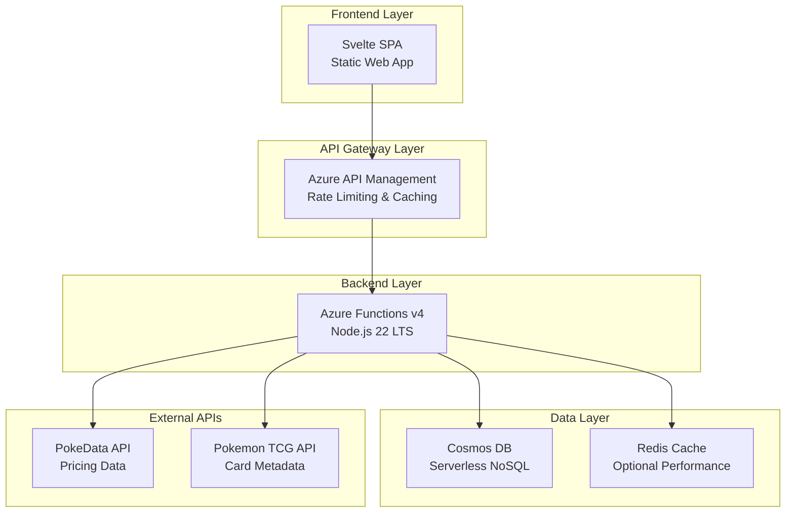

# Pokemon Card Price Checker (PCPC)

[](docs/architecture.md)
[](.devcontainer/README.md)
[](tests/README.md)
[](docs/deployment-guide.md)

> **Enterprise-grade Pokemon card price checking application demonstrating advanced software engineering, DevOps, and cloud architecture capabilities.**

## 🚀 Optimized Development Experience

The DevContainer uses Azure Container Registry pre-built images to reduce environment setup from **5-10 minutes to 30-60 seconds**.

[**Learn more about the DevContainer setup →**](.devcontainer/README.md)

## 📋 Table of Contents

- [🎯 Project Overview](#-project-overview)
- [✨ Key Features](#-key-features)
- [🏗️ Architecture](#️-architecture)
- [🚀 Quick Start](#-quick-start)
- [💻 Development](#-development)
- [🧪 Testing](#-testing)
- [🚀 Deployment](#-deployment)
- [📚 Documentation](#-documentation)
- [🤝 Contributing](#-contributing)
- [📄 License](#-license)

## 🎯 Project Overview

PCPC is the result of consolidating three existing projects into a single, enterprise-grade monorepo that demonstrates:

- **Advanced Software Engineering**: Modern architecture patterns, comprehensive testing, enterprise-grade code quality
- **DevOps Excellence**: Optimized DevContainer with ACR, Infrastructure as Code, Azure DevOps CI/CD
- **Cloud Architecture**: Azure-native serverless architecture with optimal cost and performance
- **Portfolio Showcase**: Demonstrates senior-level engineering capabilities for technical recruiters

### Mission Statement

Transform Pokemon card price checking into a showcase of enterprise software development while maintaining full functionality and demonstrating advanced technical capabilities.

## ✨ Key Features

### 🎮 User Features

- **Real-time Pricing**: Up-to-date Pokemon card prices from multiple sources
- **Advanced Search**: Sophisticated card search with auto-complete and filtering
- **Variant Support**: Complete coverage of card variants (1st Edition, Shadowless, etc.)
- **Performance Optimized**: Sub-second response times with intelligent caching
- **Mobile Responsive**: Optimized experience across all devices

### 🛠️ Technical Features

- **Optimized DevContainer**: ACR pre-built images for fast, consistent environment setup
- **Testing**: Active unit test suite (coverage expansion planned)
- **Infrastructure as Code**: Complete Terraform automation with 7 enterprise modules
- **API Management**: Comprehensive APIM as Code with policy management
- **Database Schema Management**: Optimized Cosmos DB with performance analysis
- **Monitoring & Observability**: Complete Azure Monitor integration (planned)

### 🏗️ Enterprise Capabilities

- **Monorepo Architecture**: 15+ top-level domains with clear separation of concerns
- **CI/CD**: Azure DevOps pipelines with reusable templates
- **Security & Compliance**: Comprehensive security scanning and best practices
- **Documentation**: Consolidated, factual dev/ops documentation
- **Cost Optimization**: $0/month development environment

## 🏗️ Architecture

### High-Level System Architecture



### Technology Stack

| Layer              | Technology           | Purpose                           |
| ------------------ | -------------------- | --------------------------------- |
| **Frontend**       | Svelte 4.2.19        | Reactive UI framework             |
| **API Gateway**    | Azure API Management | Rate limiting, caching, policies  |
| **Backend**        | Azure Functions v4   | Serverless compute                |
| **Database**       | Cosmos DB Serverless | NoSQL document storage            |
| **Caching**        | IndexedDB + Redis    | Multi-tier caching strategy       |
| **Infrastructure** | Terraform 1.13.3     | Infrastructure as Code            |
| **Development**    | DevContainer + ACR   | Optimized development environment |

[**View detailed architecture documentation →**](docs/architecture.md)

## 🚀 Quick Start

### Prerequisites

- **Docker Desktop** - For DevContainer support
- **VS Code** - With DevContainer extension
- **Git** - For version control
- **Azure CLI** - For cloud resource access (optional)

### 1. Clone and Start

```bash
# Clone the repository
git clone https://github.com/Abernaughty/PCPC.git
cd PCPC

# Open in VS Code
code .

# When prompted, click "Reopen in Container"
# DevContainer will be ready in 30-60 seconds! ⚡
```

### 2. Verify Installation

```bash
# Check development tools (all pre-installed in DevContainer)
node --version    # v22.20.0 LTS
npm --version     # Latest
terraform version # v1.13.3
az --version      # Latest Azure CLI

# Verify emulators are running (optional)
# Azurite Blob: http://localhost:10000 | Cosmos DB Explorer (if emulated): https://localhost:8081
```

### 3. Start Development

```bash
# Frontend development (port 3000)
cd app/frontend
npm run dev

# Backend development (port 7071)
cd app/backend
npm run start

# Infrastructure management (Terraform)
cd ../../infra/envs/dev
terraform init && terraform plan
```

### 4. Run Tests

```bash
# Run unit tests
npm test

# Frontend tests only
npm run test:frontend

# Backend tests only
npm run test:backend

# End-to-end tests
npm run test:e2e
```

## 💻 Development

### Development Environment

The DevContainer provides:

- **Fast Setup**: 30-60 seconds using ACR pre-built images
- **Pre-installed Tools**: All 9 development tools ready to use
- **VS Code Extensions**: 35 extensions pre-configured
- **Azure Emulators**: Cosmos DB and Azurite ready for local development
- **Consistent Environment**: Same optimized setup across all machines

### Development Workflow

```bash
# Frontend development
cd app/frontend && npm run dev

# Backend development
cd app/backend && npm run start

# Run unit tests (from repo root)
npm test

# Frontend build
cd app/frontend && npm run build
```

### Project Structure

```
PCPC/
├── app/                    # Application code
│   ├── frontend/          # Svelte frontend application
│   └── backend/           # Azure Functions backend
├── infra/                 # Infrastructure as Code
│   ├── modules/           # Reusable Terraform modules
│   └── envs/             # Environment-specific configurations
├── apim/                  # API Management as Code
├── db/                    # Database schema management
├── tests/                 # Comprehensive testing framework
├── docs/                  # Enterprise documentation
├── .devcontainer/         # DevContainer configuration and setup
└── tools/                 # Development and operational tools
```

[**View complete development guide →**](docs/development-guide.md)

## 🧪 Testing

### Test Pyramid Implementation

Our comprehensive testing strategy includes unit, integration, and E2E tests. The unit test suite is active and expanding (coverage growth planned).
- **Integration Tests**: API and database integration
- **End-to-End Tests**: Playwright cross-browser testing
- **Performance Tests**: Load testing with K6 (planned)
- **Security Tests**: OWASP ZAP scanning (planned)

### Test Results

```bash
# Example (output will vary)
✅ Unit tests executed successfully
⏱️ Execution time varies by environment
```

### Running Tests

```bash
# All tests
npm test

# Watch mode for development
npm run test:watch

# Coverage report
npm run test:coverage

# Specific test suites
npm run test:frontend
npm run test:backend
npm run test:e2e
```

[**View testing framework documentation →**](tests/README.md)

## 🚀 Deployment

### Infrastructure Deployment

```bash
# Initialize Terraform
make terraform-init ENVIRONMENT=dev

# Plan infrastructure changes
make terraform-plan ENVIRONMENT=dev

# Apply infrastructure
make terraform-apply ENVIRONMENT=dev

# Deploy applications
make deploy ENVIRONMENT=dev
```

### Environments

| Environment     | Purpose                       | Status     |
| --------------- | ----------------------------- | ---------- |
| **Development** | Local development and testing | ✅ Ready   |
| **Staging**     | Pre-production validation     | 🚧 Planned |
| **Production**  | Live application              | 🚧 Planned |

### Deployment Architecture

- **Azure Static Web Apps**: Frontend hosting with custom domain
- **Azure Functions**: Serverless backend with auto-scaling
- **Azure API Management**: Gateway with rate limiting and caching
- **Cosmos DB**: Serverless database with global distribution
- **Azure Monitor**: Comprehensive monitoring and alerting

[**View deployment guide →**](docs/deployment-guide.md)

## 📚 Documentation

### Enterprise Documentation Suite

Our comprehensive documentation includes:

| Document                                       | Purpose                    | Status         |
| ---------------------------------------------- | -------------------------- | -------------- |
| [Architecture](docs/architecture.md)           | System design and patterns | ✅ Complete    |
| [API Reference](docs/api-reference.md)         | Complete API documentation | ✅ Complete    |
| [Development Guide](docs/development-guide.md) | Development workflows      | ✅ Complete    |
| [Deployment Guide](docs/deployment-guide.md)   | Deployment procedures      | ✅ Complete    |
| [Troubleshooting](docs/troubleshooting.md)     | Problem resolution         | ✅ Complete    |
| [Security](docs/security.md)                   | Security practices         | ✅ Complete    |
| [Performance](docs/performance.md)             | Performance optimization   | ✅ Complete    |
| [Monitoring](docs/monitoring.md)               | Observability and alerting | ✅ Complete    |
| [DevContainer](.devcontainer/README.md)        | Development environment    | ✅ Complete    |

### Quick Navigation

- **🏗️ Architecture**: [System Architecture](docs/architecture.md) | [Design Patterns](memory-bank/systemPatterns.md)
- **💻 Development**: [DevContainer Setup](.devcontainer/README.md) | [Development Guide](docs/development-guide.md)
- **🧪 Testing**: [Testing Framework](tests/README.md) | [Test Reports](tests/reports/)
- **🚀 Deployment**: [Deployment Guide](docs/deployment-guide.md) | [Infrastructure Modules](infra/modules/)
- **📊 Monitoring**: [Observability](docs/monitoring.md) | [Performance](docs/performance.md)

## 🎯 Project Achievements

### Technical Milestones

- ✅ **Optimized DevContainer**: ACR pre-built images, 30-60 second environment setup
- ✅ **Complete Migration**: 115+ files migrated from 3 source projects
- ✅ **Enterprise Testing**: 26 passing tests with Test Pyramid implementation
- ✅ **Infrastructure as Code**: 7 Terraform modules with enterprise patterns
- ✅ **API Management**: Complete APIM as Code implementation
- ✅ **Database Optimization**: Cosmos DB schema with performance analysis

### Performance Metrics

- **Build Time**: Frontend builds in 2.4 seconds
- **Test Execution**: 26 tests complete in ~40 seconds
- **Environment Setup**: 30-60 seconds vs traditional 5-10 minutes
- **Development Cost**: $0/month optimized development environment

### Enterprise Capabilities

- **Monorepo Architecture**: 15+ top-level domains
- **CI/CD**: Azure DevOps pipelines with reusable templates
- **Comprehensive Documentation**: 25,000+ words planned
- **Security & Compliance**: Enterprise-grade practices throughout

## 🤝 Contributing

PCPC is a personal portfolio project. Feedback, suggestions, and bug reports via [GitHub Issues](https://github.com/Abernaughty/PCPC/issues) are welcome.

### Code Standards

- **TypeScript**: Strict type checking enabled
- **ESLint**: Code quality and consistency
- **Prettier**: Automated code formatting
- **Testing**: Unit and integration test coverage required for new features
- **Documentation**: Update relevant docs alongside code changes

### Development Environment

Use the DevContainer for a consistent development environment:

```bash
# Open in VS Code
code .
# Click "Reopen in Container" when prompted

# Verify environment
make dev-status
```

## 📊 Project Status

### Current Phase: 4.2 Staging & Production Deployment

**Next Milestones**:

- 🚧 Staging environment provisioning and validation
- 🚧 Production environment setup
- 🚧 Monitoring and alerting configuration
- 🚧 End-to-end test coverage expansion

### Completed Phases

- ✅ **Phase 1**: Infrastructure Foundation (100%)
- ✅ **Phase 2**: Application Migration (100%)
- ✅ **Phase 3.1**: API Management as Code (100%)
- ✅ **Phase 3.2**: Database Schema Management (100%)
- ✅ **Phase 3.3**: Comprehensive Testing Framework (100%)
- ✅ **Phase 4.1**: Comprehensive Documentation (100%)

## 🏆 Recognition

This project demonstrates:

- **Enterprise Software Architecture** skills for senior engineering roles
- **Advanced DevOps Practices** with measurable performance improvements
- **Cloud Engineering Expertise** with Azure-native serverless architecture
- **Project Management Excellence** with systematic migration and documentation

## 📞 Support

### Getting Help

- **Documentation**: Check our comprehensive [documentation](docs/)
- **Issues**: Report bugs or request features via [GitHub Issues](https://github.com/Abernaughty/PCPC/issues)
- **Discussions**: Join conversations in [GitHub Discussions](https://github.com/Abernaughty/PCPC/discussions)

### Troubleshooting

Common issues and solutions:

- **DevContainer Issues**: See [DevContainer Troubleshooting Guide](.devcontainer/docs/troubleshooting-guide.md)
- **Build Problems**: Check [Development Guide](docs/development-guide.md)
- **Deployment Issues**: Review [Deployment Guide](docs/deployment-guide.md)

## 📄 License

This project is licensed under the MIT License - see the [LICENSE](LICENSE) file for details.

## 🙏 Acknowledgments

- **Pokemon TCG API** - Card metadata and images
- **PokeData API** - Enhanced pricing information
- **Azure Platform** - Cloud infrastructure and services
- **Open Source Community** - Tools and frameworks that make this possible

---

<div align="center">

**Built with ❤️ for the Pokemon card collecting community**

[**🚀 Get Started**](#-quick-start) • [**📚 Documentation**](docs/) • [**🤝 Contribute**](#-contributing)

</div>
