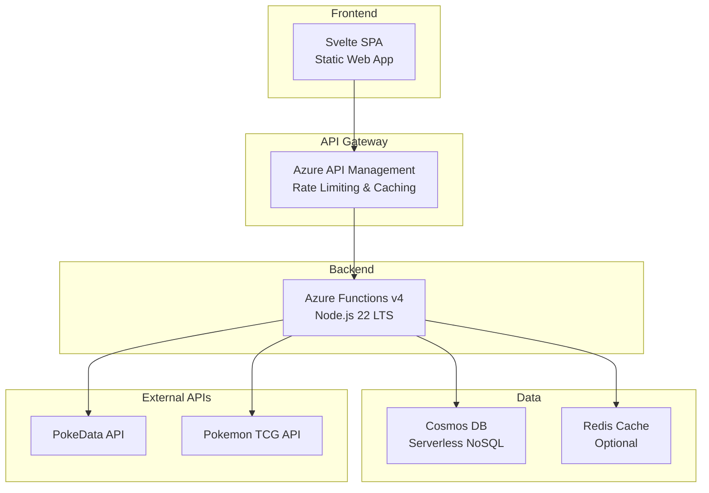

# Pokemon Card Price Checker (PCPC)

[](infra/README.md)
[](.devcontainer/README.md)

A full-stack web application for looking up Pokémon card pricing data, built on Azure serverless
architecture with a Svelte frontend, Azure Functions backend, Cosmos DB, and fully automated
infrastructure via Terraform.

> This is a monorepo consolidation of three prior projects into a single production-ready codebase.

## Table of Contents

- [Features](#features)
- [Architecture](#architecture)
- [Quick Start](#quick-start)
- [Development](#development)
- [Testing](#testing)
- [Deployment](#deployment)
- [Infrastructure](#infrastructure)
- [Contributing](#contributing)
- [License](#license)

## Features

- **Real-time Pricing** — Up-to-date Pokémon card prices from multiple sources
- **Advanced Search** — Card search with auto-complete and filtering by set, variant, and edition
- **Variant Support** — Full coverage of card variants (1st Edition, Shadowless, Unlimited, etc.)
- **Fast DevContainer** — Pre-built Azure Container Registry image reduces environment setup to ~60 seconds
- **Mobile Responsive** — Optimized across all devices

## Architecture


```mermaid
graph TB
    subgraph "Frontend"
        SPA[Svelte SPA<br/>Static Web App]
    end
    subgraph "API Gateway"
        APIM[Azure API Management<br/>Rate Limiting & Caching]
    end
    subgraph "Backend"
        AF[Azure Functions v4<br/>Node.js 22 LTS]
    end
    subgraph "Data"
        COSMOS[Cosmos DB<br/>Serverless NoSQL]
        REDIS[Redis Cache<br/>Optional]
    end
    subgraph "External APIs"
        POKEDATA[PokeData API]
        POKEMONTCG[Pokemon TCG API]
    end
    SPA --> APIM
    APIM --> AF
    AF --> COSMOS
    AF --> REDIS
    AF --> POKEDATA
    AF --> POKEMONTCG
```

### Technology Stack

| Layer | Technology | Purpose |
|---|---|---|
| **Frontend** | Svelte 4 | Reactive UI framework |
| **API Gateway** | Azure API Management | Rate limiting, caching, policies |
| **Backend** | Azure Functions v4 (Node.js 22 LTS) | Serverless compute |
| **Database** | Cosmos DB Serverless | NoSQL document storage |
| **Caching** | IndexedDB + Redis | Multi-tier caching |
| **Infrastructure** | Terraform | Infrastructure as Code |
| **Dev Environment** | DevContainer + ACR | Consistent, fast setup |

## Quick Start

### Prerequisites

- Docker Desktop
- VS Code with the Dev Containers extension
- Git

### 1. Clone and open

```bash
git clone https://github.com/Abernaughty/PCPC.git
cd PCPC
code .
```

When prompted by VS Code, click **"Reopen in Container"**. The DevContainer will be ready in ~60 seconds.

### 2. Verify the environment

```bash
node --version    # v22.x LTS
terraform version # Latest
az --version      # Latest Azure CLI
```

### 3. Start development

```bash
# Frontend (port 3000)
cd app/frontend && npm run dev

# Backend (port 7071)
cd app/backend && npm run start
```

### 4. Run tests

```bash
npm test
```

## Development

### Project Structure

```
PCPC/
├── app/
│   ├── frontend/        # Svelte application
│   └── backend/         # Azure Functions
├── infra/               # Terraform modules (7 modules)
│   ├── modules/
│   └── envs/
├── apim/                # API Management as Code
├── db/                  # Cosmos DB schema management
├── tests/               # Test suite
├── docs/                # Documentation
├── .devcontainer/       # DevContainer configuration
└── .ado/                # Azure DevOps CI/CD pipelines
```

### Development Workflow

```bash
cd app/frontend && npm run dev     # Frontend with hot reload
cd app/backend && npm run start    # Azure Functions locally
npm test                           # Run test suite
```

## Testing

```bash
npm test                  # All tests
npm run test:frontend     # Frontend only
npm run test:backend      # Backend only
npm run test:coverage     # With coverage report
```

## Deployment

### Infrastructure

```bash
# Initialize and plan
make terraform-init ENVIRONMENT=dev
make terraform-plan ENVIRONMENT=dev

# Apply
make terraform-apply ENVIRONMENT=dev
```

### Environments

| Environment | Purpose | Status |
|---|---|---|
| Development | Local development | ✅ Ready |
| Staging | Pre-production validation | 🚧 Planned |
| Production | Live application | 🚧 Planned |

## Infrastructure

The infrastructure is fully managed as code using Terraform with 7 modular configurations:

- **Azure Static Web Apps** — Frontend hosting
- **Azure Functions** — Serverless backend with auto-scaling
- **Azure API Management** — Gateway with rate limiting and caching
- **Cosmos DB** — Serverless database
- **Azure Container Registry** — Pre-built DevContainer images
- **Azure Monitor** — Monitoring and alerting (planned)

See [`infra/README.md`](infra/README.md) for full details.

## Contributing

1. Fork the repository
2. Create a feature branch: `git checkout -b feature/your-feature`
3. Commit your changes: `git commit -m 'Add your feature'`
4. Push and open a Pull Request

### Code Standards

- TypeScript with strict type checking
- ESLint + Prettier for formatting
- Tests required for new features

## License

MIT — see [LICENSE](LICENSE) for details.

---

*Built for the Pokémon card collecting community and as a demonstration of Azure serverless architecture.*
