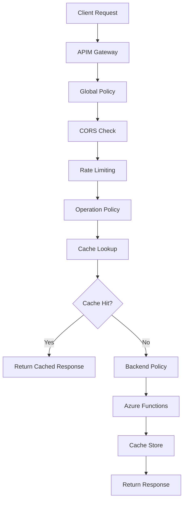

# PCPC API Management as Code

## Overview

This directory contains a complete Infrastructure as Code (IaC) implementation for the Pokemon Card Price Checker (PCPC) API Management configuration. It provides automated deployment, policy management, and monitoring for the PCPC API across multiple environments.

## 🚀 Quick Start

### Prerequisites

- **Terraform** >= 1.13.0
- **Azure CLI** (latest)
- **jq** (for JSON processing)
- **curl** (for API testing)

### Environment Setup

1. **Set Environment Variables**:

   ```bash
   export ARM_CLIENT_ID="your-service-principal-client-id"
   export ARM_CLIENT_SECRET="your-service-principal-client-secret"
   export ARM_SUBSCRIPTION_ID="your-azure-subscription-id"
   export ARM_TENANT_ID="your-azure-tenant-id"
   export TF_VAR_function_app_key="your-function-app-key"
   ```

2. **Initialize Development Environment**:

   ```bash
   cd apim
   make init-dev
   ```

3. **Deploy to Development**:
   ```bash
   make deploy-dev
   ```

## 📁 Directory Structure

```
apim/
├── specs/                          # OpenAPI specifications
│   └── pcpc-api-v1.yaml           # Complete API specification
├── policies/                       # APIM policy management
│   ├── extracted/                  # Current working policies
│   ├── templates/                  # Environment-aware policy templates
│   └── generated/                  # Rendered policies (auto-generated)
├── terraform/                      # Core Terraform configuration
│   ├── main.tf                     # Main configuration and policy rendering
│   ├── variables.tf                # Variable definitions with validation
│   ├── apis.tf                     # API definitions and operations
│   ├── policies.tf                 # Policy assignments and products
│   └── outputs.tf                  # Comprehensive outputs
├── environments/                   # Environment-specific configurations
│   ├── dev/                        # Development environment
│   ├── staging/                    # Staging environment (future)
│   └── prod/                       # Production environment (future)
├── scripts/                        # Deployment automation
│   ├── deploy.sh                   # Main deployment script
│   ├── validate.sh                 # Configuration validation
│   └── test-apis.sh                # API endpoint testing
├── docs/                          # Documentation
│   ├── README.md                   # This file
│   ├── deployment-guide.md         # Detailed deployment procedures
│   └── api-reference.md            # API endpoint documentation
└── Makefile                       # Unified command interface
```

## 🔧 Configuration

### API Management Resources

The implementation manages the following APIM resources:

- **API Definition**: Complete OpenAPI 3.0 specification with 3 endpoints
- **Operations**: GET /sets, GET /sets/{setCode}/cards, GET /sets/{setId}/cards/{cardId}
- **Policies**: CORS, rate limiting, caching, backend integration
- **Products**: Starter and Premium tiers with different limits
- **Backend**: Azure Functions integration with authentication
- **Monitoring**: Application Insights integration with detailed logging

### Environment Configuration

#### Development Environment

- **API Management**: `maber-apim-test`
- **Resource Group**: `pokedata-dev-rg`
- **Function App**: `pokedata-func-dev`
- **CORS Origins**: Includes localhost and development URLs
- **Rate Limiting**: 300 calls per 60 seconds
- **Caching**: Short durations for faster testing (5-15 minutes)

#### Staging Environment (Future)

- **API Management**: `maber-apim-staging`
- **Resource Group**: `pokedata-staging-rg`
- **Function App**: `pokedata-func-staging`
- **CORS Origins**: Staging-specific URLs only
- **Rate Limiting**: Production-like limits
- **Caching**: Medium durations (15-30 minutes)

#### Production Environment (Future)

- **API Management**: `maber-apim-prod`
- **Resource Group**: `pokedata-prod-rg`
- **Function App**: `pokedata-func-prod`
- **CORS Origins**: Production URLs only
- **Rate Limiting**: 300 calls per 60 seconds
- **Caching**: Longer durations for performance (30-60 minutes)

## 🛠️ Available Commands

### Validation Commands

```bash
make validate                # Validate all configurations
make validate-openapi        # Validate OpenAPI specification only
make validate-terraform      # Validate Terraform configurations only
```

### Deployment Commands

```bash
make deploy-dev             # Deploy to development
make deploy-staging         # Deploy to staging
make deploy-prod            # Deploy to production (with confirmation)
```

### Testing Commands

```bash
make test                   # Test development API endpoints
make test-dev               # Test development API endpoints
make test-staging           # Test staging API endpoints
make test-prod              # Test production API endpoints
```

### Utility Commands

```bash
make format                 # Format Terraform and configuration files
make lint                   # Lint configuration files
make clean                  # Clean up temporary files
make status                 # Show deployment status for all environments
make outputs                # Show Terraform outputs for all environments
```

### Development Commands

```bash
make init-dev               # Initialize development environment
make plan-dev               # Show Terraform plan for development
make check-prereqs          # Check if required tools are installed
make check-env              # Check if environment variables are set
```

### Full Deployment Commands

```bash
make full-deploy-dev        # Complete development deployment with all checks
make full-deploy-staging    # Complete staging deployment with all checks
make full-deploy-prod       # Complete production deployment with all checks
```

## 📋 API Endpoints

### Base URLs

- **Development**: `https://maber-apim-test.azure-api.net/pokedata-api/api/v1`
- **Staging**: `https://maber-apim-staging.azure-api.net/pokedata-api/api/v1`
- **Production**: `https://maber-apim-prod.azure-api.net/pokedata-api/api/v1`

### Available Endpoints

#### GET /sets

Retrieve Pokemon card sets with pagination and filtering.

**Parameters:**

- `language` (optional): ENGLISH, JAPANESE, or ALL (default: ENGLISH)
- `page` (optional): Page number (default: 1)
- `pageSize` (optional): Items per page, 1-100 (default: 100)
- `all` (optional): Return all sets without pagination (default: false)
- `forceRefresh` (optional): Force refresh of cached data (default: false)

**Example:**

```bash
curl -H "Ocp-Apim-Subscription-Key: YOUR_KEY" \
     "https://maber-apim-test.azure-api.net/pokedata-api/api/v1/sets?language=ENGLISH&pageSize=10"
```

#### GET /sets/{setCode}/cards

Retrieve cards for a specific Pokemon card set.

**Parameters:**

- `setCode` (required): Set code (e.g., 'sv8', 'base1')
- `page` (optional): Page number (default: 1)
- `pageSize` (optional): Cards per page, 1-100 (default: 50)
- `forceRefresh` (optional): Force refresh of cached data (default: false)

**Example:**

```bash
curl -H "Ocp-Apim-Subscription-Key: YOUR_KEY" \
     "https://maber-apim-test.azure-api.net/pokedata-api/api/v1/sets/sv8/cards?pageSize=20"
```

#### GET /sets/{setId}/cards/{cardId}

Retrieve detailed information for a specific Pokemon card.

**Parameters:**

- `setId` (required): Set identifier
- `cardId` (required): Card identifier within the set
- `forceRefresh` (optional): Force refresh of cached pricing data (default: false)

**Example:**

```bash
curl -H "Ocp-Apim-Subscription-Key: YOUR_KEY" \
     "https://maber-apim-test.azure-api.net/pokedata-api/api/v1/sets/sv8/cards/001"
```

## 🔐 Authentication

All API endpoints require authentication using API subscription keys:

- **Header**: `Ocp-Apim-Subscription-Key: YOUR_SUBSCRIPTION_KEY`
- **Query Parameter**: `subscription-key=YOUR_SUBSCRIPTION_KEY`

## 🏗️ Architecture

### Policy Architecture



### Infrastructure Components

- **API Management**: Central gateway with policy enforcement
- **Azure Functions**: Backend service with business logic
- **Application Insights**: Monitoring and logging
- **Terraform**: Infrastructure as Code management
- **GitHub Actions**: CI/CD pipeline automation

## 📊 Monitoring and Observability

### Application Insights Integration

When enabled, the configuration provides:

- **Request/Response Logging**: Detailed HTTP transaction logs
- **Performance Metrics**: Response times, throughput, error rates
- **Custom Dashboards**: Pre-configured monitoring dashboards
- **Alerting**: Automated alerts for performance and error thresholds

### Key Metrics Tracked

- **API Response Times**: Average, 95th percentile, maximum
- **Error Rates**: 4xx and 5xx error percentages
- **Rate Limiting**: Throttling events and patterns
- **Cache Performance**: Hit rates and cache effectiveness
- **Backend Health**: Function app availability and performance

## 🔄 Deployment Workflow

### Development Workflow

1. **Make Changes**: Update OpenAPI specs, policies, or Terraform configuration
2. **Validate**: `make validate` to check all configurations
3. **Plan**: `make plan-dev` to review changes
4. **Deploy**: `make deploy-dev` to apply changes
5. **Test**: `make test-dev` to verify functionality

### Production Workflow

1. **Development Testing**: Complete testing in dev environment
2. **Staging Deployment**: Deploy and test in staging environment
3. **Production Validation**: `make validate` and `make plan-prod`
4. **Production Deployment**: `make deploy-prod` with confirmation
5. **Production Testing**: `make test-prod` to verify functionality

## 🚨 Troubleshooting

### Common Issues

#### Terraform Errors

**Issue**: "No declaration found for variable"
**Solution**: Ensure all required variables are defined in `variables.tf`

**Issue**: "Backend configuration not found"
**Solution**: Run `terraform init` to initialize backend configuration

#### Authentication Errors

**Issue**: "Authentication failed"
**Solution**: Verify Azure service principal credentials and permissions

**Issue**: "Function app key invalid"
**Solution**: Update `TF_VAR_function_app_key` with current function app key

#### API Testing Failures

**Issue**: "API endpoints not responding"
**Solution**: Check function app status and APIM configuration

**Issue**: "CORS errors in browser"
**Solution**: Verify CORS origins in environment configuration

### Debug Commands

```bash
# Check Terraform state
cd environments/dev && terraform show

# View rendered policies
cat policies/generated/global-policy-dev.xml

# Test API endpoints manually
curl -v -H "Ocp-Apim-Subscription-Key: YOUR_KEY" \
     "https://maber-apim-test.azure-api.net/pokedata-api/api/v1/sets?pageSize=1"

# Check Azure resources
az apim api list --service-name maber-apim-test --resource-group pokedata-dev-rg
```

## 🔧 Customization

### Adding New Environments

1. Create new environment directory: `environments/new-env/`
2. Copy and modify configuration from existing environment
3. Update Makefile with new environment targets
4. Add environment-specific variables and policies

### Adding New Policies

1. Create policy template in `policies/templates/`
2. Add template rendering in `terraform/main.tf`
3. Apply policy in `terraform/policies.tf`
4. Test and validate policy behavior

### Modifying API Operations

1. Update OpenAPI specification in `specs/pcpc-api-v1.yaml`
2. Update Terraform operations in `terraform/apis.tf`
3. Add operation-specific policies if needed
4. Deploy and test changes

## 📈 Performance Optimization

### Caching Strategy

- **Sets Endpoint**: 5-60 minutes (environment-dependent)
- **Cards Endpoint**: 10-30 minutes (environment-dependent)
- **Card Info Endpoint**: 15-60 minutes (environment-dependent)

### Rate Limiting

- **Development**: 300 calls per 60 seconds
- **Staging**: 300 calls per 60 seconds
- **Production**: 300 calls per 60 seconds

### Backend Optimization

- **Timeout Configuration**: 30 seconds default
- **Connection Pooling**: Managed by Azure Functions
- **Error Handling**: Comprehensive error responses with correlation IDs

## 🔒 Security

### Authentication

- API subscription key authentication
- Function app key for backend communication
- Managed identity for Azure service integration

### Network Security

- CORS policy enforcement
- HTTPS-only communication
- Rate limiting protection

### Data Protection

- No sensitive data in logs (when detailed logging disabled)
- Function app keys stored securely
- Correlation IDs for request tracing

## 📚 Additional Resources

- [Deployment Guide](deployment-guide.md) - Detailed deployment procedures
- [API Reference](api-reference.md) - Complete API endpoint documentation
- [OpenAPI Specification](../specs/pcpc-api-v1.yaml) - Machine-readable API definition
- [Policy Templates](../policies/templates/) - Reusable policy configurations

## 🤝 Contributing

### Making Changes

1. Create feature branch from `main`
2. Make changes to specifications, policies, or Terraform configuration
3. Run `make validate` to ensure configuration is valid
4. Test changes in development environment
5. Create pull request with detailed description

### Code Standards

- **Terraform**: Use consistent formatting (`terraform fmt`)
- **YAML**: Follow OpenAPI 3.0 specification standards
- **Policies**: Use clear, documented policy templates
- **Documentation**: Keep README and guides up to date

## 📞 Support

For issues or questions:

1. Check [Troubleshooting](#-troubleshooting) section
2. Review Terraform and Azure CLI documentation
3. Check Azure API Management documentation
4. Create GitHub issue with detailed error information

---

**Last Updated**: September 28, 2025  
**Version**: 1.0.0  
**Terraform Version**: >= 1.13.0  
**Azure Provider Version**: ~> 3.60
