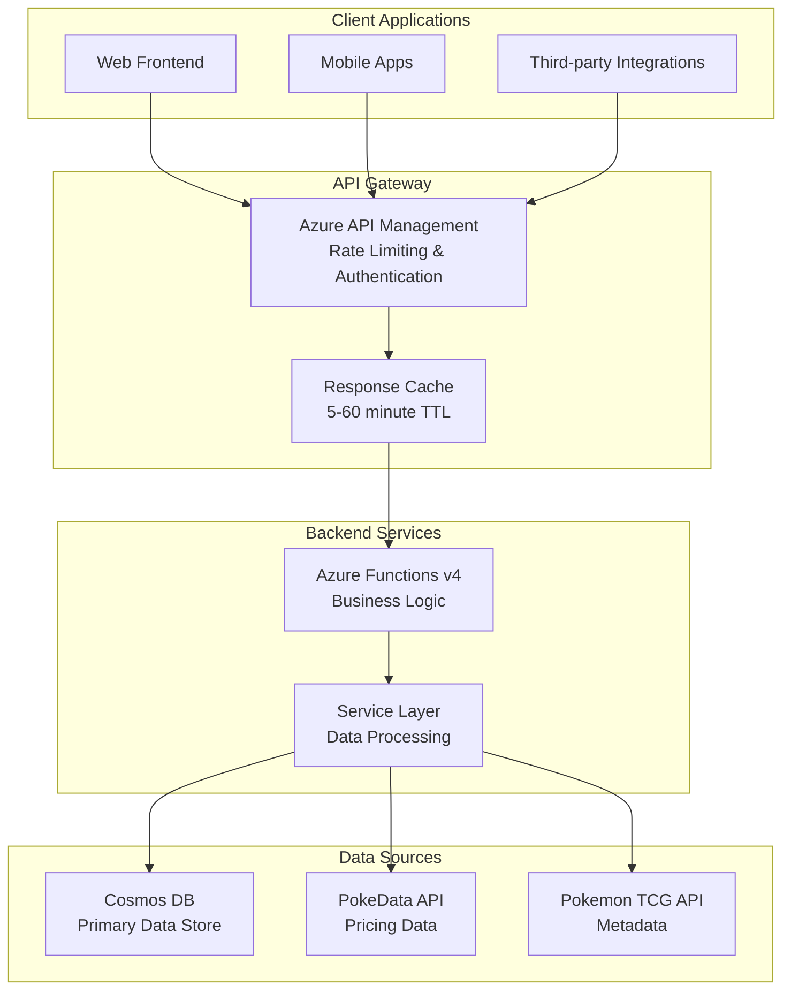

# PCPC API Reference

> **Comprehensive API documentation for the Pokemon Card Price Checker enterprise application**

## Table of Contents

- [API Overview](#api-overview)
- [Authentication](#authentication)
- [Base URLs](#base-urls)
- [API Endpoints](#api-endpoints)
- [Data Models](#data-models)
- [Error Handling](#error-handling)
- [Rate Limiting](#rate-limiting)
- [Caching](#caching)
- [Examples](#examples)
- [SDKs and Tools](#sdks-and-tools)

## API Overview

The PCPC API provides RESTful endpoints for accessing Pokemon card data, pricing information, and set metadata. The API is built on Azure Functions v4 with Node.js 22 LTS and follows OpenAPI 3.0 specifications.

### API Features

- **RESTful Design**: Standard HTTP methods and status codes
- **JSON Responses**: All responses in JSON format with consistent structure
- **Comprehensive Data**: Card metadata, pricing, images, and set information
- **Performance Optimized**: Multi-tier caching for sub-second response times
- **Error Handling**: Detailed error responses with actionable information
- **Rate Limiting**: Fair usage policies with clear limits
- **Versioning**: API versioning for backward compatibility

### API Architecture



## Authentication

### Subscription Key Authentication

The PCPC API uses subscription key authentication through Azure API Management. All requests must include a valid subscription key.

#### Header Authentication (Recommended)

```http
GET /api/sets
Host: api.pcpc.example.com
Ocp-Apim-Subscription-Key: your-subscription-key-here
```

#### Query Parameter Authentication

```http
GET /api/sets?subscription-key=your-subscription-key-here
Host: api.pcpc.example.com
```

### Obtaining API Keys

1. **Starter Product**: Basic access with standard rate limits

   - **Rate Limit**: 300 calls per 60 seconds
   - **Features**: All public endpoints
   - **Cost**: Free

2. **Premium Product**: Enhanced access with higher limits
   - **Rate Limit**: 1000 calls per 60 seconds
   - **Features**: All endpoints + priority support
   - **Cost**: Contact for pricing

### Future Authentication Methods

- **OAuth 2.0**: User authentication for personalized features
- **JWT Tokens**: Stateless authentication for mobile apps
- **Certificate-based**: High-security scenarios

## Base URLs

### Production Environment

```
https://api.pcpc.example.com/api/v1
```

### Development Environment

```
https://api-dev.pcpc.example.com/api/v1
```

### Local Development

```
http://localhost:7071/api
```

## API Endpoints

### Sets Endpoints

#### Get All Sets

Retrieve a paginated list of Pokemon card sets with optional filtering.

```http
GET /sets
```

**Query Parameters:**

| Parameter | Type    | Required | Default | Description                        |
| --------- | ------- | -------- | ------- | ---------------------------------- |
| `page`    | integer | No       | 1       | Page number for pagination         |
| `limit`   | integer | No       | 20      | Number of sets per page (max 100)  |
| `series`  | string  | No       | -       | Filter by series name              |
| `recent`  | boolean | No       | false   | Show only recent sets              |
| `all`     | boolean | No       | false   | Return all sets without pagination |

**Example Request:**

```http
GET /sets?page=1&limit=10&series=Base
Ocp-Apim-Subscription-Key: your-key-here
```

**Example Response:**

```json
{
  "success": true,
  "data": {
    "sets": [
      {
        "id": "base1",
        "series": "Base",
        "name": "Base Set",
        "releaseDate": "1999-01-09",
        "totalCards": 102,
        "symbolUrl": "https://images.pokemontcg.io/base1/symbol.png",
        "logoUrl": "https://images.pokemontcg.io/base1/logo.png",
        "isRecent": false,
        "metadata": {
          "source": "pokemontcg",
          "lastUpdated": "2025-09-28T21:00:00Z"
        }
      }
    ],
    "pagination": {
      "currentPage": 1,
      "totalPages": 15,
      "totalSets": 142,
      "hasNext": true,
      "hasPrevious": false
    }
  },
  "timestamp": "2025-09-28T21:00:00Z",
  "version": "1.0.0"
}
```

**Response Codes:**

- `200 OK`: Successful response
- `400 Bad Request`: Invalid query parameters
- `401 Unauthorized`: Missing or invalid API key
- `429 Too Many Requests`: Rate limit exceeded
- `500 Internal Server Error`: Server error

#### Get Set by ID

Retrieve detailed information about a specific Pokemon card set.

```http
GET /sets/{setId}
```

**Path Parameters:**

| Parameter | Type   | Required | Description                   |
| --------- | ------ | -------- | ----------------------------- |
| `setId`   | string | Yes      | Unique identifier for the set |

**Example Request:**

```http
GET /sets/base1
Ocp-Apim-Subscription-Key: your-key-here
```

**Example Response:**

```json
{
  "success": true,
  "data": {
    "id": "base1",
    "series": "Base",
    "name": "Base Set",
    "releaseDate": "1999-01-09",
    "totalCards": 102,
    "symbolUrl": "https://images.pokemontcg.io/base1/symbol.png",
    "logoUrl": "https://images.pokemontcg.io/base1/logo.png",
    "isRecent": false,
    "cards": {
      "total": 102,
      "breakdown": {
        "Common": 32,
        "Uncommon": 32,
        "Rare": 16,
        "Rare Holo": 16,
        "Energy": 6
      }
    },
    "metadata": {
      "source": "pokemontcg",
      "lastUpdated": "2025-09-28T21:00:00Z"
    }
  },
  "timestamp": "2025-09-28T21:00:00Z",
  "version": "1.0.0"
}
```

### Cards Endpoints

#### Get Cards by Set

Retrieve all cards from a specific Pokemon card set with optional filtering and pagination.

```http
GET /sets/{setId}/cards
```

**Path Parameters:**

| Parameter | Type   | Required | Description                   |
| --------- | ------ | -------- | ----------------------------- |
| `setId`   | string | Yes      | Unique identifier for the set |

**Query Parameters:**

| Parameter        | Type    | Required | Default | Description                         |
| ---------------- | ------- | -------- | ------- | ----------------------------------- |
| `page`           | integer | No       | 1       | Page number for pagination          |
| `limit`          | integer | No       | 20      | Number of cards per page (max 100)  |
| `rarity`         | string  | No       | -       | Filter by card rarity               |
| `name`           | string  | No       | -       | Search by card name (partial match) |
| `includePricing` | boolean | No       | true    | Include pricing information         |

**Example Request:**

```http
GET /sets/base1/cards?page=1&limit=5&rarity=Rare%20Holo
Ocp-Apim-Subscription-Key: your-key-here
```

**Example Response:**

```json
{
  "success": true,
  "data": {
    "setId": "base1",
    "setName": "Base Set",
    "cards": [
      {
        "id": "base1-1",
        "cardNumber": "1",
        "name": "Alakazam",
        "rarity": "Rare Holo",
        "images": {
          "small": "https://images.pokemontcg.io/base1/1.png",
          "large": "https://images.pokemontcg.io/base1/1_hires.png"
        },
        "pricing": {
          "market": 45.5,
          "low": 35.0,
          "mid": 45.5,
          "high": 65.0,
          "lastUpdated": "2025-09-28T20:30:00Z"
        },
        "metadata": {
          "tcgSetId": "base1",
          "pokeDataId": "base-set-alakazam-1",
          "lastSync": "2025-09-28T21:00:00Z"
        }
      }
    ],
    "pagination": {
      "currentPage": 1,
      "totalPages": 4,
      "totalCards": 16,
      "hasNext": true,
      "hasPrevious": false
    }
  },
  "timestamp": "2025-09-28T21:00:00Z",
  "version": "1.0.0"
}
```

#### Get Card Details

Retrieve detailed information about a specific Pokemon card including pricing and variants.

```http
GET /sets/{setId}/cards/{cardId}
```

**Path Parameters:**

| Parameter | Type   | Required | Description                    |
| --------- | ------ | -------- | ------------------------------ |
| `setId`   | string | Yes      | Unique identifier for the set  |
| `cardId`  | string | Yes      | Unique identifier for the card |

**Query Parameters:**

| Parameter         | Type    | Required | Default | Description                               |
| ----------------- | ------- | -------- | ------- | ----------------------------------------- |
| `includePricing`  | boolean | No       | true    | Include detailed pricing information      |
| `includeVariants` | boolean | No       | false   | Include card variants (1st Edition, etc.) |
| `priceHistory`    | boolean | No       | false   | Include price history data                |

**Example Request:**

```http
GET /sets/base1/cards/base1-1?includePricing=true&includeVariants=true
Ocp-Apim-Subscription-Key: your-key-here
```

**Example Response:**

```json
{
  "success": true,
  "data": {
    "id": "base1-1",
    "setId": "base1",
    "setName": "Base Set",
    "cardNumber": "1",
    "name": "Alakazam",
    "rarity": "Rare Holo",
    "type": "Psychic",
    "hp": 80,
    "images": {
      "small": "https://images.pokemontcg.io/base1/1.png",
      "large": "https://images.pokemontcg.io/base1/1_hires.png"
    },
    "pricing": {
      "normal": {
        "market": 45.5,
        "low": 35.0,
        "mid": 45.5,
        "high": 65.0,
        "lastUpdated": "2025-09-28T20:30:00Z"
      },
      "holofoil": {
        "market": 85.0,
        "low": 70.0,
        "mid": 85.0,
        "high": 120.0,
        "lastUpdated": "2025-09-28T20:30:00Z"
      }
    },
    "variants": [
      {
        "type": "1st Edition",
        "available": false,
        "reason": "Not available for Base Set"
      },
      {
        "type": "Shadowless",
        "available": true,
        "pricing": {
          "market": 125.0,
          "low": 100.0,
          "mid": 125.0,
          "high": 180.0
        }
      }
    ],
    "metadata": {
      "tcgSetId": "base1",
      "pokeDataId": "base-set-alakazam-1",
      "lastSync": "2025-09-28T21:00:00Z"
    }
  },
  "timestamp": "2025-09-28T21:00:00Z",
  "version": "1.0.0"
}
```

### Search Endpoints

#### Search Cards

Search for Pokemon cards across all sets with advanced filtering options.

```http
GET /search/cards
```

**Query Parameters:**

| Parameter   | Type    | Required | Default   | Description                           |
| ----------- | ------- | -------- | --------- | ------------------------------------- |
| `q`         | string  | Yes      | -         | Search query (card name, set, etc.)   |
| `page`      | integer | No       | 1         | Page number for pagination            |
| `limit`     | integer | No       | 20        | Number of results per page (max 100)  |
| `rarity`    | string  | No       | -         | Filter by rarity                      |
| `series`    | string  | No       | -         | Filter by series                      |
| `type`      | string  | No       | -         | Filter by Pokemon type                |
| `minPrice`  | number  | No       | -         | Minimum price filter                  |
| `maxPrice`  | number  | No       | -         | Maximum price filter                  |
| `sortBy`    | string  | No       | relevance | Sort by: relevance, name, price, date |
| `sortOrder` | string  | No       | asc       | Sort order: asc, desc                 |

**Example Request:**

```http
GET /search/cards?q=Charizard&rarity=Rare%20Holo&minPrice=50&sortBy=price&sortOrder=desc
Ocp-Apim-Subscription-Key: your-key-here
```

**Example Response:**

```json
{
  "success": true,
  "data": {
    "query": "Charizard",
    "filters": {
      "rarity": "Rare Holo",
      "minPrice": 50
    },
    "results": [
      {
        "id": "base1-4",
        "setId": "base1",
        "setName": "Base Set",
        "cardNumber": "4",
        "name": "Charizard",
        "rarity": "Rare Holo",
        "images": {
          "small": "https://images.pokemontcg.io/base1/4.png",
          "large": "https://images.pokemontcg.io/base1/4_hires.png"
        },
        "pricing": {
          "market": 350.0,
          "low": 280.0,
          "mid": 350.0,
          "high": 450.0,
          "lastUpdated": "2025-09-28T20:30:00Z"
        },
        "relevanceScore": 0.95
      }
    ],
    "pagination": {
      "currentPage": 1,
      "totalPages": 3,
      "totalResults": 25,
      "hasNext": true,
      "hasPrevious": false
    }
  },
  "timestamp": "2025-09-28T21:00:00Z",
  "version": "1.0.0"
}
```

### Health and Status Endpoints

#### API Health Check

Check the health and status of the API and its dependencies.

```http
GET /health
```

**Example Response:**

```json
{
  "success": true,
  "data": {
    "status": "healthy",
    "version": "1.0.0",
    "timestamp": "2025-09-28T21:00:00Z",
    "dependencies": {
      "cosmosDb": {
        "status": "healthy",
        "responseTime": "45ms"
      },
      "pokeDataApi": {
        "status": "healthy",
        "responseTime": "120ms"
      },
      "pokemonTcgApi": {
        "status": "healthy",
        "responseTime": "95ms"
      },
      "redisCache": {
        "status": "optional",
        "responseTime": "N/A"
      }
    }
  }
}
```

#### API Statistics

Get usage statistics and performance metrics for the API.

```http
GET /stats
```

**Example Response:**

```json
{
  "success": true,
  "data": {
    "requests": {
      "total": 1250000,
      "today": 15000,
      "lastHour": 850
    },
    "performance": {
      "averageResponseTime": "245ms",
      "p95ResponseTime": "450ms",
      "p99ResponseTime": "850ms"
    },
    "cacheHitRate": 0.85,
    "errorRate": 0.002,
    "uptime": "99.95%"
  },
  "timestamp": "2025-09-28T21:00:00Z",
  "version": "1.0.0"
}
```

## Data Models

### Set Model

```json
{
  "id": "string",
  "series": "string",
  "name": "string",
  "releaseDate": "string (ISO 8601)",
  "totalCards": "integer",
  "symbolUrl": "string (URL)",
  "logoUrl": "string (URL)",
  "isRecent": "boolean",
  "metadata": {
    "source": "string",
    "lastUpdated": "string (ISO 8601)"
  }
}
```

### Card Model

```json
{
  "id": "string",
  "setId": "string",
  "cardNumber": "string",
  "name": "string",
  "rarity": "string",
  "type": "string",
  "hp": "integer",
  "images": {
    "small": "string (URL)",
    "large": "string (URL)"
  },
  "pricing": {
    "market": "number",
    "low": "number",
    "mid": "number",
    "high": "number",
    "lastUpdated": "string (ISO 8601)"
  },
  "metadata": {
    "tcgSetId": "string",
    "pokeDataId": "string",
    "lastSync": "string (ISO 8601)"
  }
}
```

### Pricing Model

```json
{
  "market": "number",
  "low": "number",
  "mid": "number",
  "high": "number",
  "currency": "string (default: USD)",
  "condition": "string (default: Near Mint)",
  "lastUpdated": "string (ISO 8601)",
  "source": "string"
}
```

### Error Model

```json
{
  "success": false,
  "error": {
    "code": "string",
    "message": "string",
    "details": "string",
    "timestamp": "string (ISO 8601)",
    "requestId": "string"
  }
}
```

### Pagination Model

```json
{
  "currentPage": "integer",
  "totalPages": "integer",
  "totalResults": "integer",
  "hasNext": "boolean",
  "hasPrevious": "boolean",
  "nextPage": "string (URL)",
  "previousPage": "string (URL)"
}
```

## Error Handling

### Error Response Format

All API errors follow a consistent format with detailed information for debugging and user feedback.

```json
{
  "success": false,
  "error": {
    "code": "INVALID_SET_ID",
    "message": "The specified set ID does not exist",
    "details": "Set ID 'invalid-set' was not found in the database",
    "timestamp": "2025-09-28T21:00:00Z",
    "requestId": "req-12345-67890"
  }
}
```

### Common Error Codes

| HTTP Status | Error Code                 | Description                        | Resolution                                   |
| ----------- | -------------------------- | ---------------------------------- | -------------------------------------------- |
| 400         | `INVALID_PARAMETER`        | Invalid query parameter            | Check parameter format and values            |
| 400         | `MISSING_PARAMETER`        | Required parameter missing         | Include all required parameters              |
| 401         | `INVALID_API_KEY`          | API key is invalid or missing      | Verify subscription key                      |
| 403         | `INSUFFICIENT_PERMISSIONS` | API key lacks required permissions | Upgrade to appropriate product tier          |
| 404         | `SET_NOT_FOUND`            | Specified set does not exist       | Verify set ID exists                         |
| 404         | `CARD_NOT_FOUND`           | Specified card does not exist      | Verify card ID exists in set                 |
| 429         | `RATE_LIMIT_EXCEEDED`      | Too many requests                  | Wait before making more requests             |
| 500         | `INTERNAL_ERROR`           | Server error occurred              | Retry request, contact support if persistent |
| 502         | `EXTERNAL_API_ERROR`       | External service unavailable       | Retry request, may return cached data        |
| 503         | `SERVICE_UNAVAILABLE`      | API temporarily unavailable        | Retry with exponential backoff               |

### Error Handling Best Practices

1. **Check HTTP Status Codes**: Always check the HTTP status code first
2. **Parse Error Response**: Extract error code and message for specific handling
3. **Implement Retry Logic**: Use exponential backoff for transient errors
4. **Log Request IDs**: Include request ID in support requests
5. **Handle Rate Limits**: Implement proper rate limiting in client applications

## Rate Limiting

### Rate Limit Headers

All API responses include rate limiting headers:

```http
X-RateLimit-Limit: 300
X-RateLimit-Remaining: 299
X-RateLimit-Reset: 1640995200
X-RateLimit-Reset-After: 60
```

### Rate Limit Tiers

| Product Tier   | Requests per Minute | Burst Limit | Reset Window |
| -------------- | ------------------- | ----------- | ------------ |
| **Starter**    | 300                 | 50          | 60 seconds   |
| **Premium**    | 1000                | 200         | 60 seconds   |
| **Enterprise** | Custom              | Custom      | Custom       |

### Rate Limit Exceeded Response

```json
{
  "success": false,
  "error": {
    "code": "RATE_LIMIT_EXCEEDED",
    "message": "Rate limit exceeded",
    "details": "You have exceeded the rate limit of 300 requests per minute",
    "retryAfter": 45,
    "timestamp": "2025-09-28T21:00:00Z",
    "requestId": "req-12345-67890"
  }
}
```

## Caching

### Cache Headers

API responses include caching headers to optimize performance:

```http
Cache-Control: public, max-age=3600
ETag: "abc123def456"
Last-Modified: Sat, 28 Sep 2025 21:00:00 GMT
Vary: Accept-Encoding
```

### Cache Strategies by Endpoint

| Endpoint                | Cache Duration | Strategy                             |
| ----------------------- | -------------- | ------------------------------------ |
| `/sets`                 | 60 minutes     | Public cache, stale-while-revalidate |
| `/sets/{id}`            | 60 minutes     | Public cache, immutable for old sets |
| `/sets/{id}/cards`      | 30 minutes     | Public cache, conditional requests   |
| `/sets/{id}/cards/{id}` | 30 minutes     | Public cache, ETag validation        |
| `/search/cards`         | 15 minutes     | Private cache, vary by query         |
| `/health`               | 5 minutes      | Public cache, short TTL              |

### Client-Side Caching

Recommended client-side caching strategies:

1. **HTTP Caching**: Respect cache headers for automatic caching
2. **Application Cache**: Cache frequently accessed data locally
3. **Conditional Requests**: Use ETag and Last-Modified headers
4. **Background Refresh**: Update cache in background for better UX

## Examples

### JavaScript/Node.js

```javascript
const axios = require("axios");

class PCPCApiClient {
  constructor(apiKey, baseUrl = "https://api.pcpc.example.com/api/v1") {
    this.apiKey = apiKey;
    this.baseUrl = baseUrl;
    this.client = axios.create({
      baseURL: baseUrl,
      headers: {
        "Ocp-Apim-Subscription-Key": apiKey,
        "Content-Type": "application/json",
      },
    });
  }

  async getSets(options = {}) {
    const { page = 1, limit = 20, series, recent } = options;
    const params = { page, limit };
    if (series) params.series = series;
    if (recent) params.recent = recent;

    try {
      const response = await this.client.get("/sets", { params });
      return response.data;
    } catch (error) {
      throw this.handleError(error);
    }
  }

  async getCardsBySet(setId, options = {}) {
    const { page = 1, limit = 20, rarity, includePricing = true } = options;
    const params = { page, limit, includePricing };
    if (rarity) params.rarity = rarity;

    try {
      const response = await this.client.get(`/sets/${setId}/cards`, {
        params,
      });
      return response.data;
    } catch (error) {
      throw this.handleError(error);
    }
  }

  async getCard(setId, cardId, options = {}) {
    const { includePricing = true, includeVariants = false } = options;
    const params = { includePricing, includeVariants };

    try {
      const response = await this.client.get(`/sets/${setId}/cards/${cardId}`, {
        params,
      });
      return response.data;
    } catch (error) {
      throw this.handleError(error);
    }
  }

  async searchCards(query, options = {}) {
    const {
      page = 1,
      limit = 20,
      rarity,
      minPrice,
      maxPrice,
      sortBy = "relevance",
    } = options;
    const params = { q: query, page, limit, sortBy };
    if (rarity) params.rarity = rarity;
    if (minPrice) params.minPrice = minPrice;
    if (maxPrice) params.maxPrice = maxPrice;

    try {
      const response = await this.client.get("/search/cards", { params });
      return response.data;
    } catch (error) {
      throw this.handleError(error);
    }
  }

  handleError(error) {
    if (error.response) {
      const { status, data } = error.response;
      const apiError = new Error(data.error?.message || "API Error");
      apiError.code = data.error?.code;
      apiError.status = status;
      apiError.requestId = data.error?.requestId;
      return apiError;
    }
    return error;
  }
}

// Usage Example
const client = new PCPCApiClient("your-api-key-here");

async function example() {
  try {
    // Get all sets
    const sets = await client.getSets({ page: 1, limit: 10 });
    console.log("Sets:", sets.data.sets);

    // Get cards from Base Set
    const cards = await client.getCardsBySet("base1", {
      rarity: "Rare Holo",
      includePricing: true,
    });
    console.log("Cards:", cards.data.cards);

    // Get specific card details
    const card = await client.getCard("base1", "base1-4", {
      includePricing: true,
      includeVariants: true,
    });
    console.log("Card:", card.data);

    // Search for Charizard cards
    const searchResults = await client.searchCards("Charizard", {
      rarity: "Rare Holo",
      minPrice: 100,
      sortBy: "price",
      sortOrder: "desc",
    });
    console.log("Search Results:", searchResults.data.results);
  } catch (error) {
    console.error("API Error:", error.message);
    console.error("Error Code:", error.code);
    console.error("Request ID:", error.requestId);
  }
}

example();
```

### Python

```python
import requests
from typing import Optional, Dict, Any
import time

class PCPCApiClient:
    def __init__(self, api_key: str, base_url: str = "https://api.pcpc.example.com/api/v1"):
        self.api_key = api_key
        self.base_url = base_url
        self.session = requests.Session()
        self.session.headers.update({
            'Ocp-Apim-Subscription-Key': api_key,
            'Content-Type': 'application/json'
        })

    def _make_request(self, method: str, endpoint: str, params: Optional[Dict] = None) -> Dict[str, Any]:
        url = f"{self.base_url}{endpoint}"

        try:
            response = self.session.request(method, url, params=params)
            response.raise_for_status()
            return response.json()
        except requests.exceptions.HTTPError as e:
            if e.response.status_code == 429:
                # Handle rate limiting with exponential backoff
                retry_after = int(e.response.headers.get('Retry-After', 60))
                time.sleep(retry_after)
                return self._make_request(method, endpoint, params)
            else:
                error_data = e.response.json() if e.response.content else {}
                raise APIError(
                    message=error_data.get('error', {}).get('message', str(e)),
                    code=error_data.get('error', {}).get('code'),
                    status_code=e.response.status_code,
                    request_id=error_data.get('error', {}).get('requestId')
                )

    def get_sets(self, page: int = 1, limit: int = 20, series: Optional[str] = None,
                 recent: Optional[bool] = None) -> Dict[str, Any]:
        params = {'page': page, 'limit': limit}
        if series:
            params['series'] = series
        if recent is not None:
            params['recent'] = recent

        return self._make_request('GET', '/sets', params)

    def get_cards_by_set(self, set_id: str, page: int = 1, limit: int = 20,
                        rarity: Optional[str] = None, include_pricing: bool = True) -> Dict[str, Any]:
        params = {'page': page, 'limit': limit, 'includePricing': include_pricing}
        if rarity:
            params['rarity'] = rarity

        return self._make_request('GET', f'/sets/{set_id}/cards', params)

    def get_card(self, set_id: str, card_id: str, include_pricing: bool = True,
                 include_variants: bool = False) -> Dict[str, Any]:
        params = {'includePricing': include_pricing, 'includeVariants': include_variants}
        return self._make_request('GET', f'/sets/{set_id}/cards/{card_id}', params)

    def search_cards(self, query: str, page: int = 1, limit: int = 20,
                    rarity: Optional[str] = None, min_price: Optional[float] = None,
                    max_price: Optional[float] = None, sort_by: str = "relevance") -> Dict[str, Any]:
        params = {'q': query, 'page': page, 'limit': limit, 'sortBy': sort_by}
        if rarity:
            params['rarity'] = rarity
        if min_price:
            params['minPrice'] = min_price
        if max_price:
            params['maxPrice'] = max_price

        return self._make_request('GET', '/search/cards', params)


class APIError(Exception):
    """Custom exception for API errors"""
    def __init__(self, message: str, code: Optional[str] = None,
                 status_code: Optional[int] = None, request_id: Optional[str] = None):
        super().__init__(message)
        self.code = code
        self.status_code = status_code
        self.request_id = request_id


# Usage Example
client = PCPCApiClient("your-api-key-here")

try:
    # Get all sets
    sets = client.get_sets(page=1, limit=10)
    print("Sets:", sets['data']['sets'])

    # Get cards from Base Set
    cards = client.get_cards_by_set("base1", rarity="Rare Holo", include_pricing=True)
    print("Cards:", cards['data']['cards'])

    # Get specific card details
    card = client.get_card("base1", "base1-4", include_pricing=True, include_variants=True)
    print("Card:", card['data'])

    # Search for Charizard cards
    search_results = client.search_cards("Charizard", rarity="Rare Holo",
                                       min_price=100, sort_by="price")
    print("Search Results:", search_results['data']['results'])

except APIError as e:
    print(f"API Error: {e}")
    print(f"Error Code: {e.code}")
    print(f"Status Code: {e.status_code}")
    print(f"Request ID: {e.request_id}")
```

### cURL Examples

#### Get All Sets

```bash
curl -X GET "https://api.pcpc.example.com/api/v1/sets?page=1&limit=10" \
  -H "Ocp-Apim-Subscription-Key: your-api-key-here" \
  -H "Content-Type: application/json"
```

#### Get Cards by Set

```bash
curl -X GET "https://api.pcpc.example.com/api/v1/sets/base1/cards?rarity=Rare%20Holo" \
  -H "Ocp-Apim-Subscription-Key: your-api-key-here" \
  -H "Content-Type: application/json"
```

#### Search Cards

```bash
curl -X GET "https://api.pcpc.example.com/api/v1/search/cards?q=Charizard&minPrice=100" \
  -H "Ocp-Apim-Subscription-Key: your-api-key-here" \
  -H "Content-Type: application/json"
```

## SDKs and Tools

### Official SDKs

- **JavaScript/Node.js**: Available via npm (`npm install pcpc-api-client`)
- **Python**: Available via pip (`pip install pcpc-api-client`)
- **C#/.NET**: Available via NuGet (`Install-Package PCPC.ApiClient`)
- **Go**: Available via go get (`go get github.com/pcpc/go-client`)

### Third-Party Tools

- **Postman Collection**: Import our comprehensive API collection
- **OpenAPI Specification**: Available at `/api/v1/openapi.json`
- **Swagger UI**: Interactive documentation at `/docs`
- **Insomnia Collection**: REST client collection available

### Development Tools

#### API Testing

```bash
# Test API health
curl -X GET "https://api.pcpc.example.com/api/v1/health" \
  -H "Ocp-Apim-Subscription-Key: your-key"

# Validate API key
curl -X GET "https://api.pcpc.example.com/api/v1/sets?limit=1" \
  -H "Ocp-Apim-Subscription-Key: your-key"
```

#### Rate Limit Testing

```bash
# Check current rate limit status
curl -I -X GET "https://api.pcpc.example.com/api/v1/health" \
  -H "Ocp-Apim-Subscription-Key: your-key"
```

### Integration Examples

#### Webhook Integration

```javascript
// Example webhook handler for real-time price updates
app.post("/webhook/price-updates", (req, res) => {
  const { cardId, oldPrice, newPrice, timestamp } = req.body;

  // Process price update
  console.log(`Price update for ${cardId}: ${oldPrice} -> ${newPrice}`);

  res.status(200).json({ received: true });
});
```

#### Batch Processing

```python
import asyncio
import aiohttp

async def fetch_multiple_cards(session, card_ids):
    tasks = []
    for card_id in card_ids:
        task = fetch_card_details(session, card_id)
        tasks.append(task)

    results = await asyncio.gather(*tasks)
    return results

async def fetch_card_details(session, card_id):
    url = f"https://api.pcpc.example.com/api/v1/sets/{card_id.split('-')[0]}/cards/{card_id}"
    headers = {'Ocp-Apim-Subscription-Key': 'your-key'}

    async with session.get(url, headers=headers) as response:
        return await response.json()
```

---

## Support and Resources

### Documentation

- **API Reference**: This document
- **Getting Started Guide**: [Quick start tutorial](../README.md#quick-start)
- **Architecture Overview**: [System architecture](architecture.md)
- **Best Practices**: [Development best practices](development-guide.md)

### Community

- **GitHub Repository**: [https://github.com/Abernaughty/PCPC](https://github.com/Abernaughty/PCPC)
- **Issue Tracker**: Report bugs and request features
- **Discussions**: Community Q&A and feature discussions

### Support Channels

- **Documentation**: Comprehensive guides and references
- **Community Support**: GitHub Discussions and Issues
- **Premium Support**: Available for Premium and Enterprise tiers

### Status and Updates

- **API Status**: [https://status.pcpc.example.com](https://status.pcpc.example.com)
- **Changelog**: [API version history and updates](../CHANGELOG.md)
- **Announcements**: Follow our GitHub repository for updates

---

**Last Updated**: September 28, 2025  
**API Version**: 1.0.0  
**Documentation Version**: 1.0.0

```

```
