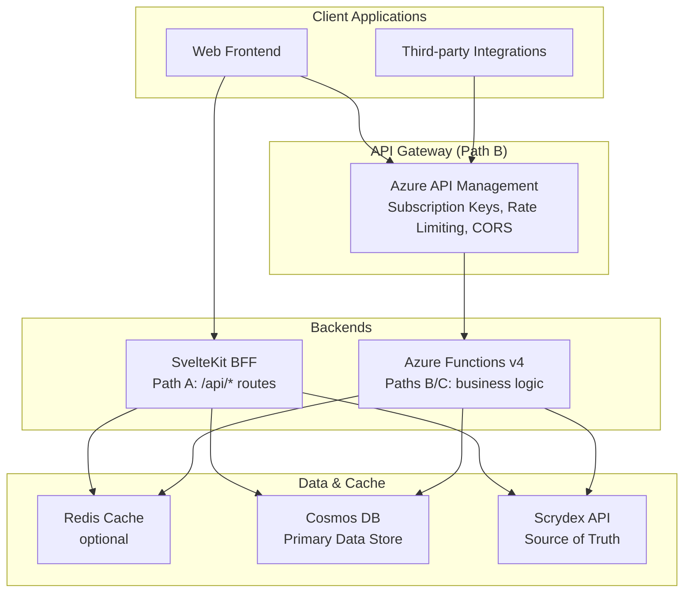

# PCPC API Reference

> **Comprehensive API documentation for the Pokemon Card Price Checker enterprise application**

## Table of Contents

- [API Overview](#api-overview)
- [Authentication](#authentication)
- [Base URLs](#base-urls)
- [API Endpoints](#api-endpoints)
- [Data Models](#data-models)
- [Error Handling](#error-handling)
- [Rate Limiting](#rate-limiting)
- [Caching](#caching)
- [Examples](#examples)
- [SDKs and Tools](#sdks-and-tools)

## API Overview

The PCPC API provides RESTful endpoints for accessing Pokemon card data, pricing information, and set metadata. All card, set, and pricing data originates from the [Scrydex](https://scrydex.com) API and is persisted in Cosmos DB and (optionally) cached in Redis. The HTTP API is implemented as Azure Functions v4 on Node.js 22 LTS and is described by an OpenAPI 3.0 contract published through Azure API Management (APIM).

### API Features

- **RESTful Design**: Standard HTTP methods (read-only `GET`) and status codes
- **JSON Responses**: All responses use a single consistent envelope
- **Scrydex-native Data**: Card metadata, multi-condition/graded pricing, images, and set information sourced from Scrydex
- **Performance Optimized**: Redis + Cosmos DB caching with a 12-hour background refresh timer
- **Error Handling**: Flat, consistent error envelope
- **Gateway Rate Limiting**: Fair usage enforced at the APIM gateway

### API Architecture


```mermaid
graph TB
    subgraph "Client Applications"
        WEB[Web Frontend]
        THIRD_PARTY[Third-party Integrations]
    end

    subgraph "API Gateway (Path B)"
        APIM[Azure API Management<br/>Subscription Keys, Rate Limiting, CORS]
    end

    subgraph "Backends"
        SVELTE[SvelteKit BFF<br/>Path A: /api/* routes]
        FUNCTIONS[Azure Functions v4<br/>Paths B/C: business logic]
    end

    subgraph "Data & Cache"
        REDIS[Redis Cache<br/>optional]
        COSMOS[Cosmos DB<br/>Primary Data Store]
        SCRYDEX[Scrydex API<br/>Source of Truth]
    end

    WEB --> SVELTE
    WEB --> APIM
    THIRD_PARTY --> APIM

    APIM --> FUNCTIONS
    SVELTE --> REDIS
    SVELTE --> COSMOS
    SVELTE --> SCRYDEX
    FUNCTIONS --> REDIS
    FUNCTIONS --> COSMOS
    FUNCTIONS --> SCRYDEX
```

### Request paths

The same logical endpoints are served by more than one runtime:

- **Path A — SvelteKit BFF**: server routes under `/api/*` in the frontend app. Calls Scrydex/Cosmos/Redis directly.
- **Path B — Azure Functions behind APIM**: served at `pcpc-apim-{env}.azure-api.net/pcpc-api/{version}` (e.g. `https://pcpc-apim-dev.azure-api.net/pcpc-api/v1`). APIM provides rate limiting, the developer portal, and observability. The API and its `starter` product are deployed with `subscription_required = false`, so the public demo path needs no key (see [Authentication](#authentication)).
- **Path C — Azure Functions on Azure Container Apps**: the same Functions code, fronted by ACA ingress (CORS) instead of APIM.

The Azure Functions host registers its routes with the `api` route prefix (`backend/functions/host.json`), so all Functions endpoints live under `/api`. The Functions read endpoints use `authLevel: "anonymous"` — authentication is enforced at the gateway, not the function host.

Response shapes are nearly identical across paths; the only meaningful difference is the health endpoint envelope (see [Health Check](#health-check)).

## Authentication

The Azure Functions HTTP triggers are registered with `authLevel: "anonymous"` (`backend/functions/src/index.ts`); there is no function-key check at the host. Access control is delegated to the gateway in front of them.

### Path B (APIM) — subscription keys are optional, tier-dependent

The PCPC API and its `starter` product are deployed with `subscription_required = false` (`apim/terraform/apis.tf`, `apim/terraform/variables.tf`), so the **public demo path requires no subscription key** — the frontend Path B client calls APIM without one (`frontend/src/lib/backends/path-b-azure.ts`). A subscription key is only required for the `premium` and `unlimited` products (`subscription_required = true`), which apply tighter rate limits/quotas for trusted consumers.

When a key *is* required (premium/unlimited tiers), supply it as a header (recommended) or a query parameter:

#### Header (recommended)

```http
GET /pcpc-api/v1/sets
Host: pcpc-apim-dev.azure-api.net
Ocp-Apim-Subscription-Key: your-subscription-key-here
```

#### Query parameter

```http
GET /pcpc-api/v1/sets?subscription-key=your-subscription-key-here
Host: pcpc-apim-dev.azure-api.net
```

> Both schemes are defined in the OpenAPI contract (`apim/specs/pcpc-api-v1.yaml`): `apiKeyHeader` (`Ocp-Apim-Subscription-Key`) and `apiKeyQuery` (`subscription-key`).

When calling the Azure Functions host directly (local development, or Path C via ACA ingress), no subscription key is required because the function endpoints are anonymous. CORS and rate limiting are then handled by the relevant gateway/ingress rather than the function code.

## Base URLs

### APIM Gateway (Path B)

The APIM API path is `pcpc-api/{version}` (set in `apim/terraform/apis.tf` as `path = "pcpc-api/${var.api_version}"`; `api_version` defaults to `v1`). Custom domains (`api.pcpc.maber.io`) are deferred per [ADR-012](adr/ADR-012-apim-managed-cert-suspension.md), so the working base URL is the per-environment APIM hostname:

```
https://pcpc-apim-dev.azure-api.net/pcpc-api/v1      (development)
https://pcpc-apim-staging.azure-api.net/pcpc-api/v1  (staging)
https://pcpc-apim-prod.azure-api.net/pcpc-api/v1     (production)
```

The frontend Path B client reads this from the `PUBLIC_AZURE_API_BASE_URL` env var and falls back to the dev URL above (`frontend/src/lib/backends/path-b-azure.ts`).

### Azure Functions (local development)

Functions run locally with the `api` route prefix:

```
http://localhost:7071/api
```

### SvelteKit BFF (Path A)

Served from the frontend application origin under `/api`, e.g. `https://<frontend-host>/api`.

> Endpoint paths below are written relative to the chosen base URL (e.g. `/sets` is `https://pcpc-apim-dev.azure-api.net/pcpc-api/v1/sets` via APIM, or `http://localhost:7071/api/sets` locally).

## API Endpoints

All endpoints are `GET` only. There are exactly four:

| Method | Path                            | Description                       |
| ------ | ------------------------------- | --------------------------------- |
| GET    | `/sets`                         | List Pokemon card sets            |
| GET    | `/sets/{setId}/cards`           | List cards for a set              |
| GET    | `/sets/{setId}/cards/{cardId}`  | Get a single card with pricing    |
| GET    | `/health`                       | Service and dependency health     |

### Response Envelope

Every successful response uses the same envelope (`ApiResponse<T>` in `backend/shared/src/types/envelopes.ts`, produced by `apiSuccess` in `frontend/src/lib/server/utils/errors.ts`):

```json
{
  "status": 200,
  "data": {  },
  "timestamp": "2025-06-16T10:30:00.000Z",
  "cached": true,
  "cacheAge": 300
}
```

| Field       | Type    | Notes                                                          |
| ----------- | ------- | -------------------------------------------------------------- |
| `status`    | integer | HTTP status code, mirrored in the body                         |
| `data`      | object  | Endpoint-specific payload                                      |
| `timestamp` | string  | ISO 8601 response time                                         |
| `cached`    | boolean | Whether the payload was served from cache                      |
| `cacheAge`  | integer | Age of cached data in seconds (present only on cache hits)     |

> There is **no** top-level `success` field and **no** `version` field on data responses.

---

### Get Set List

Retrieve a list of Pokemon card sets. Results are sorted by release date (newest first) and annotated with `releaseYear` and `isRecent`.

```http
GET /sets
```

**Query Parameters:**

| Parameter  | Type    | Required | Default | Description                                                            |
| ---------- | ------- | -------- | ------- | ---------------------------------------------------------------------- |
| `language` | string  | No       | `en`    | Language code used to query Scrydex expansions (lowercased)            |
| `all`      | boolean | No       | `false` | When `true`, return all sets without pagination                        |
| `page`     | integer | No       | `1`     | Page number for pagination                                             |
| `pageSize` | integer | No       | `100`   | Number of sets per page                                                |

> There is no client-controllable cache-bypass parameter. Freshness comes from language-keyed cache keys, the 12-hour `RefreshData` timer, and the Redis TTL.

**Example Request:**

```http
GET /sets?page=1&pageSize=2&language=en
Ocp-Apim-Subscription-Key: your-key-here
```

**Example Response:**

```json
{
  "status": 200,
  "data": {
    "sets": [
      {
        "id": "sv8",
        "code": "sv8",
        "name": "Surging Sparks",
        "series": "Scarlet & Violet",
        "releaseDate": "2024-11-08",
        "total": 252,
        "printedTotal": 191,
        "language": "English",
        "languageCode": "EN",
        "isOnlineOnly": false,
        "logo": "https://images.scrydex.com/sv8/logo",
        "symbol": "https://images.scrydex.com/sv8/symbol",
        "cardCount": 252,
        "isCurrent": true,
        "lastUpdated": "2025-06-16T09:00:00.000Z",
        "releaseYear": 2024,
        "isRecent": true
      }
    ],
    "pagination": {
      "page": 1,
      "pageSize": 2,
      "totalCount": 150,
      "totalPages": 75
    }
  },
  "timestamp": "2025-06-16T10:30:00.000Z",
  "cached": true,
  "cacheAge": 300
}
```

**Response Codes:** `200` OK, `404` no sets found for the language, `500` server error. (Through APIM: `401` for a missing/invalid subscription key, `429` when rate-limited.)

---

### Get Cards By Set

Retrieve the cards belonging to a set, with pricing. Results are paginated in-memory after the full set is loaded from cache/Cosmos/Scrydex.

```http
GET /sets/{setId}/cards
```

**Path Parameters:**

| Parameter | Type   | Required | Description                  |
| --------- | ------ | -------- | ---------------------------- |
| `setId`   | string | Yes      | Set identifier (e.g. `sv8`)  |

> The published OpenAPI contract names this path segment `setCode`; the Azure Functions route binds it as `setId`. They refer to the same value.

**Query Parameters:**

| Parameter  | Type    | Required | Default | Description                                       |
| ---------- | ------- | -------- | ------- | ------------------------------------------------- |
| `page`     | integer | No       | `1`     | Page number (must be `>= 1`)                      |
| `pageSize` | integer | No       | `500`   | Cards per page, capped at `500` (must be `>= 1`)  |

> No other query parameters are supported (no `rarity`, `name`, `includePricing`, etc.). There is no client-controllable cache-bypass parameter.

**Example Request:**

```http
GET /sets/sv8/cards?page=1&pageSize=2
Ocp-Apim-Subscription-Key: your-key-here
```

**Example Response:**

```json
{
  "status": 200,
  "data": {
    "cards": [
      {
        "id": "sv8-001",
        "name": "Exeggcute",
        "number": "1",
        "cardNumber": "1",
        "printedNumber": "001",
        "rarity": "Common",
        "rarityCode": "C",
        "artist": "Sumiyoshi Kizuki",
        "images": [
          {
            "type": "front",
            "small": "https://images.scrydex.com/sv8/sv8-001/small",
            "medium": "https://images.scrydex.com/sv8/sv8-001/medium",
            "large": "https://images.scrydex.com/sv8/sv8-001/large"
          }
        ],
        "variants": [
          {
            "name": "Normal",
            "prices": [
              {
                "condition": "NM",
                "type": "raw",
                "isPerfect": false,
                "isError": false,
                "isSigned": false,
                "low": 0.05,
                "mid": 0.12,
                "high": 0.5,
                "market": 0.1,
                "currency": "USD",
                "trends": {
                  "days7": { "priceChange": -0.01, "percentChange": -9.1 },
                  "days30": { "priceChange": 0.02, "percentChange": 25.0 }
                }
              }
            ]
          }
        ],
        "setCode": "sv8",
        "setId": "sv8",
        "setName": "Surging Sparks",
        "pricingLastUpdated": "2025-06-16T09:00:00.000Z"
      }
    ],
    "pagination": {
      "page": 1,
      "pageSize": 2,
      "totalCount": 252,
      "totalPages": 126
    }
  },
  "timestamp": "2025-06-16T10:30:00.000Z",
  "cached": false
}
```

**Response Codes:** `200` OK, `400` missing/invalid `setId` or pagination params, `404` no cards for the set, `500` server error.

---

### Get Card Info

Retrieve a single card by set and card identifier, including its variants and pricing. If the cached/stored card lacks pricing, the service re-fetches it from Scrydex with prices.

```http
GET /sets/{setId}/cards/{cardId}
```

**Path Parameters:**

| Parameter | Type   | Required | Description                    |
| --------- | ------ | -------- | ------------------------------ |
| `setId`   | string | Yes      | Set identifier (e.g. `sv8`)    |
| `cardId`  | string | Yes      | Card identifier (e.g. `sv8-001`) |

**Query Parameters:** None.

**Example Request:**

```http
GET /sets/sv8/cards/sv8-001
Ocp-Apim-Subscription-Key: your-key-here
```

**Example Response:**

```json
{
  "status": 200,
  "data": {
    "id": "sv8-001",
    "name": "Exeggcute",
    "number": "1",
    "cardNumber": "1",
    "printedNumber": "001",
    "rarity": "Common",
    "rarityCode": "C",
    "artist": "Sumiyoshi Kizuki",
    "images": [
      {
        "type": "front",
        "small": "https://images.scrydex.com/sv8/sv8-001/small",
        "medium": "https://images.scrydex.com/sv8/sv8-001/medium",
        "large": "https://images.scrydex.com/sv8/sv8-001/large"
      }
    ],
    "variants": [
      {
        "name": "Normal",
        "prices": [
          {
            "condition": "NM",
            "type": "raw",
            "isPerfect": false,
            "isError": false,
            "isSigned": false,
            "low": 0.05,
            "mid": 0.12,
            "high": 0.5,
            "market": 0.1,
            "currency": "USD"
          },
          {
            "condition": "Graded",
            "type": "graded",
            "company": "PSA",
            "grade": "10",
            "isPerfect": true,
            "isError": false,
            "isSigned": false,
            "low": 20.0,
            "mid": 28.5,
            "high": 40.0,
            "market": 30.0,
            "currency": "USD"
          }
        ]
      }
    ],
    "setCode": "sv8",
    "setId": "sv8",
    "setName": "Surging Sparks",
    "pricingLastUpdated": "2025-06-16T09:00:00.000Z"
  },
  "timestamp": "2025-06-16T10:30:00.000Z",
  "cached": false
}
```

**Response Codes:** `200` OK, `400` missing/empty identifiers, `404` card not found, `500` server error.

---

### Health Check

Check the health of the service and its runtime dependencies.

```http
GET /health
```

**Status codes:** `200` (all healthy), `207` (one or more components degraded), `503` (a component is unhealthy).

The dependencies reported are `runtime`, `cosmosdb` (when a Cosmos connection string is configured), `scrydexApi` (when a Scrydex API key is configured), and `redis` (reported as `disabled` when Redis caching is off).

> **Path difference:** the health endpoint is the one place the envelope differs between runtimes. The Azure Functions response (Paths B/C) nests components under `checks` and includes `version` and `environment`. The SvelteKit BFF (Path A) nests them under `components` and omits `version`/`environment`. The health endpoint does **not** use the standard `ApiResponse` envelope.

**Example Response (Azure Functions — Paths B/C):**

```json
{
  "status": "healthy",
  "timestamp": "2025-06-16T10:30:00.000Z",
  "checks": {
    "runtime": {
      "status": "healthy",
      "responseTime": 0,
      "message": "Function runtime operational",
      "lastChecked": "2025-06-16T10:30:00.000Z"
    },
    "cosmosdb": {
      "status": "healthy",
      "responseTime": 45,
      "message": "Cosmos DB connection successful",
      "lastChecked": "2025-06-16T10:30:00.000Z"
    },
    "scrydexApi": {
      "status": "healthy",
      "responseTime": 120,
      "message": "Scrydex API accessible",
      "lastChecked": "2025-06-16T10:30:00.000Z"
    },
    "redis": {
      "status": "disabled",
      "message": "Redis caching is disabled"
    }
  },
  "version": "1.0.0",
  "environment": "production"
}
```

**Example Response (SvelteKit BFF — Path A):**

```json
{
  "status": "healthy",
  "timestamp": "2025-06-16T10:30:00.000Z",
  "components": {
    "runtime": { "status": "healthy", "latency": 0, "message": "Function runtime operational" },
    "cosmosdb": { "status": "healthy", "latency": 45, "message": "Cosmos DB connection successful" },
    "scrydexApi": { "status": "healthy", "latency": 120, "message": "Scrydex API accessible" },
    "redis": { "status": "disabled", "message": "Redis caching is disabled" }
  }
}
```

Component `status` values are `healthy`, `degraded`, `unhealthy`, or `disabled`.

## Data Models

All models below are camelCase canonical shapes mapped from Scrydex at the service boundary (`backend/functions/src/utils/scrydexToCosmos.ts`). The on-wire card shape is produced by `cardToApiResponse` (`backend/functions/src/utils/cardToApiResponse.ts`); the SvelteKit BFF applies the same mapping (`cardToFrontend`).

### Set Model

```json
{
  "id": "string",
  "code": "string",
  "name": "string",
  "series": "string",
  "releaseDate": "string (ISO date, optional)",
  "total": "integer (optional)",
  "printedTotal": "integer (optional)",
  "language": "string (optional)",
  "languageCode": "string (optional, e.g. EN, JP)",
  "isOnlineOnly": "boolean (optional)",
  "logo": "string URL (optional)",
  "symbol": "string URL (optional)",
  "cardCount": "integer (optional)",
  "isCurrent": "boolean (optional)",
  "lastUpdated": "string (ISO 8601, optional)"
}
```

The `/sets` endpoint additionally annotates each set with `releaseYear` (integer) and `isRecent` (boolean).

> Note: image fields are `symbol` and `logo` (not `symbolUrl`/`logoUrl`); the card count fields are `total`/`cardCount` (not `totalCards`). There is no `metadata.source` field.

### Card Model (on-wire)

```json
{
  "id": "string",
  "name": "string",
  "number": "string",
  "cardNumber": "string",
  "printedNumber": "string (optional)",
  "rarity": "string",
  "rarityCode": "string (optional)",
  "artist": "string (optional)",
  "images": "CardImage[] (optional)",
  "variants": "CardVariant[] (optional)",
  "setCode": "string",
  "setId": "string",
  "setName": "string",
  "pricingLastUpdated": "string (ISO 8601, optional)"
}
```

> `number` and `cardNumber` carry the same value (kept for compatibility). There is no `type`, `hp`, `pokeDataId`, `tcgSetId`, or `metadata` field. Pricing is **not** a flat object — it lives inside `variants[].prices[]`.

### Image Model

Images are an **array** of `CardImage` objects:

```json
{
  "type": "string",
  "small": "string URL",
  "medium": "string URL",
  "large": "string URL"
}
```

### Variant Model

```json
{
  "name": "string",
  "images": "CardImage[] (optional)",
  "prices": "VariantPrice[]"
}
```

### Pricing Model (`VariantPrice`)

Pricing is per-variant and per-condition/grade. Each entry in `variants[].prices[]`:

```json
{
  "condition": "string",
  "type": "raw | graded",
  "company": "string (optional, e.g. PSA, for graded)",
  "grade": "string (optional, e.g. 10, for graded)",
  "isPerfect": "boolean",
  "isError": "boolean",
  "isSigned": "boolean",
  "low": "number",
  "mid": "number (optional)",
  "high": "number (optional)",
  "market": "number",
  "currency": "string",
  "trends": "PriceTrends (optional)"
}
```

### Price Trends Model

```json
{
  "days1": { "priceChange": "number", "percentChange": "number" },
  "days7": { "priceChange": "number", "percentChange": "number" },
  "days14": { "priceChange": "number", "percentChange": "number" },
  "days30": { "priceChange": "number", "percentChange": "number" },
  "days90": { "priceChange": "number", "percentChange": "number" },
  "days180": { "priceChange": "number", "percentChange": "number" }
}
```

All `daysN` keys are optional, and each `TrendData` value has `priceChange` and `percentChange`.

### Pagination Model

```json
{
  "page": "integer",
  "pageSize": "integer",
  "totalCount": "integer",
  "totalPages": "integer"
}
```

### Error Model

See [Error Handling](#error-handling).

## Error Handling

### Error Response Format

Errors use a **flat** envelope (no nested `error` object, no `success` field). The exact fields depend on the runtime:

**SvelteKit BFF (Path A)** — `apiError` in `frontend/src/lib/server/utils/errors.ts`:

```json
{
  "status": 404,
  "error": "Card sv8-999 not found",
  "timestamp": "2025-06-16T10:30:00.000Z"
}
```

**Azure Functions (Paths B/C)** — `createErrorResponse`/`handleError` in `backend/functions/src/utils/errorUtils.ts`:

```json
{
  "error": "Card not found: sv8-999",
  "status": 404,
  "timestamp": "2025-06-16T10:30:00.000Z",
  "path": "GetCardInfo",
  "details": null
}
```

| Field         | Type    | Notes                                                                 |
| ------------- | ------- | --------------------------------------------------------------------- |
| `status`      | integer | HTTP status code                                                      |
| `error`       | string  | Human-readable error message                                          |
| `timestamp`   | string  | ISO 8601                                                              |
| `path`        | string  | Functions only — the originating function/context name                |
| `details`     | any     | Functions only — optional extra context (stack trace in development)  |
| `correlationId` | string | Documented in the OpenAPI contract for debugging; not emitted by the current handler code |

### Common Status Codes

| HTTP Status | When                                                                 |
| ----------- | -------------------------------------------------------------------- |
| 200         | Successful response                                                  |
| 207         | Health check: at least one component degraded                       |
| 400         | Missing/invalid path or query parameters                            |
| 401         | APIM: missing or invalid subscription key                           |
| 404         | Set or card not found                                               |
| 429         | APIM: rate limit exceeded                                           |
| 500         | Server error                                                        |
| 503         | Health check: a component is unhealthy                              |

### Error Handling Best Practices

1. **Check HTTP Status Codes**: Always check the HTTP status code first.
2. **Read the `error` string**: It contains the human-readable reason.
3. **Implement Retry Logic**: Use exponential backoff for `429`/`5xx`.
4. **Handle Rate Limits**: Respect APIM rate-limit responses in client applications.

## Rate Limiting

Rate limiting is enforced at the APIM gateway (Path B), not in the Functions code. Limits are configured per APIM product/subscription. When a limit is exceeded, APIM returns `429 Too Many Requests`; clients should back off and retry. The Functions host itself applies concurrency throttling via `host.json` (`maxConcurrentRequests`, `maxOutstandingRequests`, `dynamicThrottlesEnabled`) rather than per-subscription rate limits.

## Caching

Responses indicate cache state via the `cached` and `cacheAge` envelope fields. Card and cards-by-set responses also set a `Cache-Control: public, max-age=<ttl>` header.

### Server-side cache flow

For each request the backend tries, in order: Redis (when `ENABLE_REDIS_CACHE=true`) → Cosmos DB → Scrydex API. Fresh Scrydex results are written back to Cosmos and Redis. Cards-by-set additionally performs staleness checks (expected card count vs. stored count, and presence of pricing) before serving stored data.

Default TTLs (overridable via environment variables):

| Data           | Env var            | Default            |
| -------------- | ------------------ | ------------------ |
| Set list       | `CACHE_TTL_SETS`   | 604800s (7 days)   |
| Cards          | `CACHE_TTL_CARDS`  | 3600s–86400s\*     |

\* Card detail defaults to 3600s; cards-by-set defaults to 86400s in the Functions handler.

Background refresh is handled by the `RefreshData` timer trigger (every 12 hours) and `MonitorScrydexUsage` (every 6 hours).

### Client-Side Caching

1. **HTTP Caching**: Respect `Cache-Control` headers where present.
2. **Application Cache**: Cache frequently accessed data locally.
3. **Background Refresh**: Update local caches in the background for better UX.

## Examples

### JavaScript/Node.js

```javascript
const axios = require("axios");

class PCPCApiClient {
  constructor(
    { baseUrl = "https://pcpc-apim-dev.azure-api.net/pcpc-api/v1", apiKey } = {}
  ) {
    this.client = axios.create({
      baseURL: baseUrl,
      headers: {
        "Content-Type": "application/json",
        // The starter (demo) product needs no key; only the premium/unlimited
        // products set subscription_required = true.
        ...(apiKey ? { "Ocp-Apim-Subscription-Key": apiKey } : {}),
      },
    });
  }

  async getSets({ page = 1, pageSize = 100, language = "en", all = false } = {}) {
    const params = { page, pageSize, language };
    if (all) params.all = true;
    const { data } = await this.client.get("/sets", { params });
    return data; // { status, data: { sets, pagination }, timestamp, cached, cacheAge }
  }

  async getCardsBySet(setId, { page = 1, pageSize = 500 } = {}) {
    const { data } = await this.client.get(`/sets/${setId}/cards`, {
      params: { page, pageSize },
    });
    return data; // { status, data: { cards, pagination }, ... }
  }

  async getCard(setId, cardId) {
    const { data } = await this.client.get(`/sets/${setId}/cards/${cardId}`);
    return data; // { status, data: <card>, ... }
  }

  async health() {
    const { data } = await this.client.get("/health");
    return data;
  }
}

// Usage — no key needed for the public demo path
const client = new PCPCApiClient();

async function example() {
  try {
    const sets = await client.getSets({ pageSize: 10 });
    console.log("Sets:", sets.data.sets);

    const cards = await client.getCardsBySet("sv8", { pageSize: 50 });
    console.log("Cards:", cards.data.cards);

    const card = await client.getCard("sv8", "sv8-001");
    console.log("Card:", card.data);
    console.log("First price:", card.data.variants?.[0]?.prices?.[0]);
  } catch (error) {
    const body = error.response?.data;
    console.error("API Error:", body?.error || error.message);
    console.error("Status:", body?.status);
  }
}

example();
```

### Python

```python
import requests
import time
from typing import Optional, Dict, Any


class APIError(Exception):
    def __init__(self, message: str, status: Optional[int] = None):
        super().__init__(message)
        self.status = status


class PCPCApiClient:
    def __init__(self, base_url: str = "https://pcpc-apim-dev.azure-api.net/pcpc-api/v1",
                 api_key: Optional[str] = None):
        self.base_url = base_url
        self.session = requests.Session()
        self.session.headers.update({"Content-Type": "application/json"})
        # The starter (demo) product needs no key; only premium/unlimited do.
        if api_key:
            self.session.headers["Ocp-Apim-Subscription-Key"] = api_key

    def _get(self, endpoint: str, params: Optional[Dict] = None) -> Dict[str, Any]:
        resp = self.session.get(f"{self.base_url}{endpoint}", params=params)
        if resp.status_code == 429:
            retry_after = int(resp.headers.get("Retry-After", 60))
            time.sleep(retry_after)
            return self._get(endpoint, params)
        if not resp.ok:
            body = resp.json() if resp.content else {}
            raise APIError(body.get("error", resp.reason), resp.status_code)
        return resp.json()

    def get_sets(self, page: int = 1, page_size: int = 100,
                 language: str = "en", all: bool = False) -> Dict[str, Any]:
        params = {"page": page, "pageSize": page_size, "language": language}
        if all:
            params["all"] = "true"
        return self._get("/sets", params)

    def get_cards_by_set(self, set_id: str, page: int = 1,
                         page_size: int = 500) -> Dict[str, Any]:
        return self._get(f"/sets/{set_id}/cards",
                         {"page": page, "pageSize": page_size})

    def get_card(self, set_id: str, card_id: str) -> Dict[str, Any]:
        return self._get(f"/sets/{set_id}/cards/{card_id}")

    def health(self) -> Dict[str, Any]:
        return self._get("/health")


# Usage — no key needed for the public demo path
client = PCPCApiClient()

try:
    sets = client.get_sets(page_size=10)
    print("Sets:", sets["data"]["sets"])

    cards = client.get_cards_by_set("sv8", page_size=50)
    print("Cards:", cards["data"]["cards"])

    card = client.get_card("sv8", "sv8-001")
    print("Card:", card["data"]["name"])
    variants = card["data"].get("variants", [])
    if variants and variants[0].get("prices"):
        print("First price:", variants[0]["prices"][0])
except APIError as e:
    print(f"API Error ({e.status}): {e}")
```

### cURL Examples

The public demo path (starter product) requires no subscription key:

#### Get Set List

```bash
curl -X GET "https://pcpc-apim-dev.azure-api.net/pcpc-api/v1/sets?page=1&pageSize=10"
```

#### Get Cards by Set

```bash
curl -X GET "https://pcpc-apim-dev.azure-api.net/pcpc-api/v1/sets/sv8/cards?pageSize=50"
```

#### Get Card Info

```bash
curl -X GET "https://pcpc-apim-dev.azure-api.net/pcpc-api/v1/sets/sv8/cards/sv8-001"
```

> For the `premium`/`unlimited` products (which set `subscription_required = true`), add `-H "Ocp-Apim-Subscription-Key: your-key"`.

#### Local Development (Azure Functions, no subscription key)

```bash
curl -X GET "http://localhost:7071/api/sets?pageSize=10"
curl -X GET "http://localhost:7071/api/health"
```

## SDKs and Tools

### OpenAPI Specification

The authoritative HTTP contract is published at `apim/specs/pcpc-api-v1.yaml` (OpenAPI 3.0.1) and surfaced through the APIM developer portal. Use it to generate clients or import into API tooling.

### Recommended Tooling

- **Postman / Insomnia**: Import the OpenAPI spec to generate a collection.
- **APIM Developer Portal**: Interactive try-it console with subscription-key management.

### Development Tools

```bash
# Health check (local Functions)
curl -X GET "http://localhost:7071/api/health"

# Through APIM (demo path — no key required)
curl -X GET "https://pcpc-apim-dev.azure-api.net/pcpc-api/v1/sets?pageSize=1"

# With a subscription key (premium/unlimited products)
curl -X GET "https://pcpc-apim-dev.azure-api.net/pcpc-api/v1/sets?pageSize=1" \
  -H "Ocp-Apim-Subscription-Key: your-key"
```

---

## Support and Resources

### Documentation

- **API Reference**: This document
- **Getting Started Guide**: [Quick start tutorial](../README.md#quick-start)
- **Architecture Overview**: [System architecture](architecture.md)
- **Best Practices**: [Development best practices](development-guide.md)

### Community

- **GitHub Repository**: [https://github.com/Abernaughty/PCPC](https://github.com/Abernaughty/PCPC)
- **Issue Tracker**: Report bugs and request features
- **Discussions**: Community Q&A and feature discussions

---

**Data Source**: Scrydex
**API Contract**: `apim/specs/pcpc-api-v1.yaml` (OpenAPI 3.0.1, version 1.0)
