# PCPC System Architecture

> **Comprehensive technical architecture documentation for the Pokemon Card Price Checker enterprise application**

## Table of Contents

- [Architecture Overview](#architecture-overview)
- [System Components](#system-components)
- [Data Architecture](#data-architecture)
- [Integration Patterns](#integration-patterns)
- [Security Architecture](#security-architecture)
- [Performance Architecture](#performance-architecture)
- [Deployment Architecture](#deployment-architecture)
- [Development Architecture](#development-architecture)
- [Monitoring Architecture](#monitoring-architecture)
- [Architecture Decisions](#architecture-decisions)

## Architecture Overview

### High-Level System Architecture

The PCPC system follows a modern cloud-native, serverless architecture pattern with clear separation of concerns and enterprise-grade scalability.

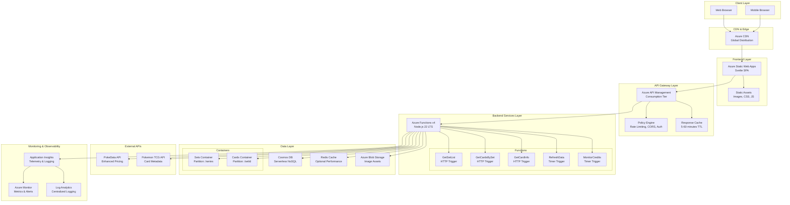

### Architecture Principles

#### 1. Cloud-Native Design

- **Serverless-First**: Leverage Azure Functions and Cosmos DB serverless for optimal cost and scaling
- **Managed Services**: Minimize operational overhead with fully managed Azure services
- **Auto-Scaling**: Automatic scaling based on demand without manual intervention

#### 2. Microservices Architecture

- **Function-Based Services**: Each business capability implemented as separate Azure Function
- **Independent Deployment**: Functions can be deployed independently without affecting others
- **Loose Coupling**: Services communicate through well-defined APIs and events

#### 3. API-First Design

- **Unified Gateway**: Single entry point through Azure API Management
- **Consistent Interface**: RESTful APIs with OpenAPI specifications
- **Version Management**: API versioning strategy for backward compatibility

#### 4. Performance-Optimized

- **Multi-Tier Caching**: Browser, CDN, API Management, and application-level caching
- **Optimized Data Access**: Efficient Cosmos DB partitioning and indexing strategies
- **Content Delivery**: Global CDN for static assets and API responses

#### 5. Security-First

- **Defense in Depth**: Multiple security layers from network to application
- **Zero Trust**: Explicit verification for every request and resource access
- **Managed Identity**: Azure AD integration for service-to-service authentication

## System Components

### Frontend Components

#### Svelte Single Page Application (SPA)

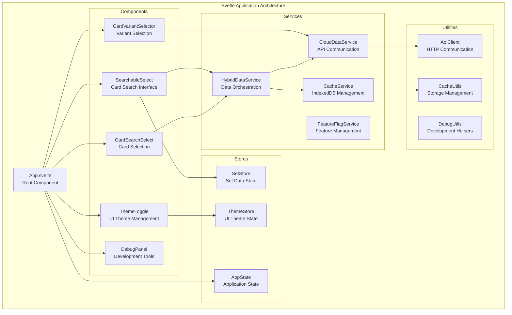

**Key Features**:

- **Reactive Components**: Svelte's compiled reactivity for optimal performance
- **State Management**: Centralized state with Svelte stores
- **Service Layer**: Clean separation between UI and business logic
- **Caching Strategy**: Sophisticated IndexedDB caching with TTL management

#### Static Web App Hosting

- **Global Distribution**: Azure CDN integration for worldwide performance
- **Custom Domain**: Professional domain with SSL certificate management
- **Build Integration**: Automated builds from GitHub repository
- **Environment Configuration**: Separate configurations for dev/staging/production

### Backend Components

#### Azure Functions v4 Architecture

```mermaid
graph TB
    subgraph "Azure Functions Runtime v4"
        HOST[Functions Host<br/>Node.js 22 LTS]

        subgraph "HTTP Triggered Functions"
            GET_SETS[GetSetList<br/>GET /api/sets]
            GET_CARDS[GetCardsBySet<br/>GET /api/sets/{setId}/cards]
            GET_CARD[GetCardInfo<br/>GET /api/sets/{setId}/cards/{cardId}]
        end

        subgraph "Timer Triggered Functions"
            REFRESH[RefreshData<br/>0 0 */12 * * *]
            MONITOR[MonitorCredits<br/>0 0 */6 * * *]
        end

        subgraph "Service Layer"
            COSMOS_SVC[CosmosDbService<br/>Database Operations]
            REDIS_SVC[RedisCacheService<br/>Caching Operations]
            POKEDATA_SVC[PokeDataApiService<br/>Pricing API Integration]
            POKEMONTCG_SVC[PokemonTcgApiService<br/>Metadata API Integration]
            BLOB_SVC[BlobStorageService<br/>Asset Management]
            IMAGE_SVC[ImageEnhancementService<br/>Image Processing]
            MAPPING_SVC[PokeDataToTcgMappingService<br/>Data Mapping]
            CREDIT_SVC[CreditMonitoringService<br/>Usage Tracking]
        end

        subgraph "Utilities"
            CACHE_UTIL[CacheUtils<br/>Cache Management]
            ERROR_UTIL[ErrorHandling<br/>Error Processing]
            LOG_UTIL[LoggingUtils<br/>Structured Logging]
            CONFIG_UTIL[ConfigUtils<br/>Configuration Management]
        end
    end

    HOST --> GET_SETS
    HOST --> GET_CARDS
    HOST --> GET_CARD
    HOST --> REFRESH
    HOST --> MONITOR

    GET_SETS --> COSMOS_SVC
    GET_SETS --> REDIS_SVC
    GET_SETS --> POKEDATA_SVC

    GET_CARDS --> COSMOS_SVC
    GET_CARDS --> POKEMONTCG_SVC
    GET_CARDS --> MAPPING_SVC

    GET_CARD --> COSMOS_SVC
    GET_CARD --> IMAGE_SVC
    GET_CARD --> POKEDATA_SVC

    REFRESH --> COSMOS_SVC
    REFRESH --> POKEDATA_SVC
    REFRESH --> POKEMONTCG_SVC

    MONITOR --> CREDIT_SVC
    MONITOR --> LOG_UTIL

    COSMOS_SVC --> CACHE_UTIL
    REDIS_SVC --> ERROR_UTIL
    POKEDATA_SVC --> CONFIG_UTIL
```

**Function Specifications**:

| Function           | Trigger     | Purpose                              | Dependencies                               |
| ------------------ | ----------- | ------------------------------------ | ------------------------------------------ |
| **GetSetList**     | HTTP GET    | Retrieve paginated Pokemon card sets | CosmosDB, PokeData API, Redis Cache        |
| **GetCardsBySet**  | HTTP GET    | Fetch cards for specific set         | CosmosDB, Pokemon TCG API, Mapping Service |
| **GetCardInfo**    | HTTP GET    | Individual card details and pricing  | CosmosDB, Image Service, PokeData API      |
| **RefreshData**    | Timer (12h) | Background data synchronization      | All external APIs, CosmosDB                |
| **MonitorCredits** | Timer (6h)  | API usage monitoring and alerting    | Credit Service, Logging                    |

### API Gateway Components

#### Azure API Management Configuration

```mermaid
graph TB
    subgraph "API Management Layer"
        APIM_GATEWAY[APIM Gateway<br/>Consumption Tier]

        subgraph "Products"
            STARTER[Starter Product<br/>Basic Access]
            PREMIUM[Premium Product<br/>Enhanced Limits]
        end

        subgraph "APIs"
            PCPC_API[PCPC API v1<br/>OpenAPI 3.0]
            subgraph "Operations"
                OP_SETS[GET /sets<br/>List Pokemon Sets]
                OP_CARDS[GET /sets/{setId}/cards<br/>Cards by Set]
                OP_CARD[GET /sets/{setId}/cards/{cardId}<br/>Card Details]
            end
        end

        subgraph "Policies"
            GLOBAL[Global Policy<br/>CORS, Rate Limiting]
            CACHE_POLICY[Cache Policy<br/>Response Caching]
            BACKEND[Backend Policy<br/>Function Integration]
        end

        subgraph "Backend"
            FUNCTION_BACKEND[Azure Functions Backend<br/>Load Balancing]
        end
    end

    APIM_GATEWAY --> STARTER
    APIM_GATEWAY --> PREMIUM
    APIM_GATEWAY --> PCPC_API

    PCPC_API --> OP_SETS
    PCPC_API --> OP_CARDS
    PCPC_API --> OP_CARD

    APIM_GATEWAY --> GLOBAL
    APIM_GATEWAY --> CACHE_POLICY
    APIM_GATEWAY --> BACKEND

    BACKEND --> FUNCTION_BACKEND
```

**Policy Configuration**:

- **Rate Limiting**: 300 calls per 60 seconds (configurable by environment)
- **CORS**: Configured for frontend domains with credentials support
- **Caching**: Response caching with 5-60 minute TTL based on endpoint
- **Authentication**: Subscription key authentication with future OAuth2 support

## Data Architecture

### Database Design

#### Cosmos DB Container Strategy

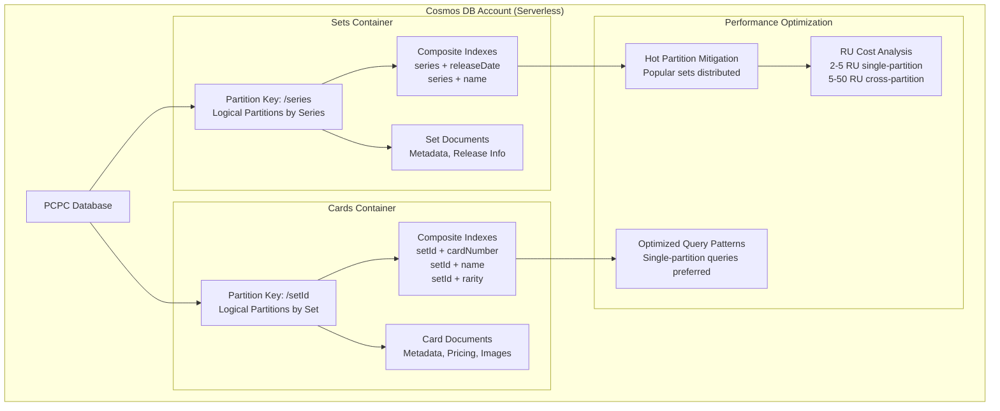

**Container Specifications**:

| Container | Partition Key | Purpose                          | Indexing Strategy                                                     |
| --------- | ------------- | -------------------------------- | --------------------------------------------------------------------- |
| **Sets**  | `/series`     | Pokemon card set metadata        | Composite indexes on series + releaseDate, series + name              |
| **Cards** | `/setId`      | Individual card data and pricing | Composite indexes on setId + cardNumber, setId + name, setId + rarity |

#### Data Models

**Set Document Structure**:

```json
{
  "id": "base1",
  "series": "Base",
  "name": "Base Set",
  "releaseDate": "1999-01-09",
  "totalCards": 102,
  "symbolUrl": "https://images.pokemontcg.io/base1/symbol.png",
  "logoUrl": "https://images.pokemontcg.io/base1/logo.png",
  "isRecent": false,
  "metadata": {
    "source": "pokemontcg",
    "lastUpdated": "2025-09-28T21:00:00Z"
  }
}
```

**Card Document Structure**:

```json
{
  "id": "base1-1",
  "setId": "base1",
  "cardNumber": "1",
  "name": "Alakazam",
  "rarity": "Rare Holo",
  "images": {
    "small": "https://images.pokemontcg.io/base1/1.png",
    "large": "https://images.pokemontcg.io/base1/1_hires.png"
  },
  "pricing": {
    "market": 45.5,
    "low": 35.0,
    "mid": 45.5,
    "high": 65.0,
    "lastUpdated": "2025-09-28T20:30:00Z"
  },
  "metadata": {
    "tcgSetId": "base1",
    "pokeDataId": "base-set-alakazam-1",
    "lastSync": "2025-09-28T21:00:00Z"
  }
}
```

### Caching Architecture

#### Multi-Tier Caching Strategy

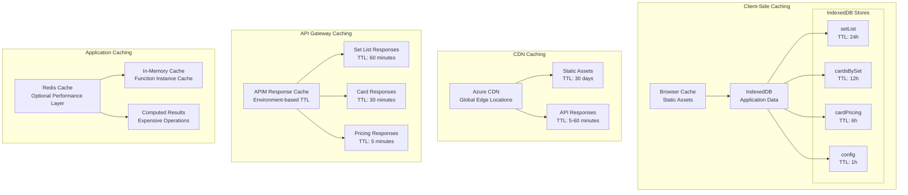

**Cache Invalidation Strategy**:

- **Time-Based**: TTL expiration for different data types
- **Event-Based**: Manual invalidation on data updates
- **Version-Based**: Cache versioning for breaking changes
- **Graceful Degradation**: Fallback to source when cache unavailable

## Integration Patterns

### External API Integration

#### Hybrid API Strategy

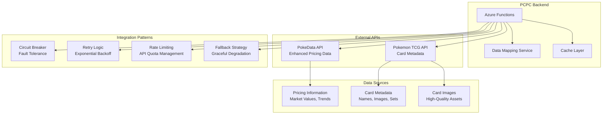

**API Integration Specifications**:

| API                 | Purpose                                | Rate Limits      | Caching Strategy | Fallback             |
| ------------------- | -------------------------------------- | ---------------- | ---------------- | -------------------- |
| **PokeData API**    | Enhanced pricing data, graded values   | 1000 calls/day   | 6-hour TTL       | Cached pricing data  |
| **Pokemon TCG API** | Card metadata, images, set information | 20,000 calls/day | 24-hour TTL      | Local metadata cache |

#### Error Handling and Resilience

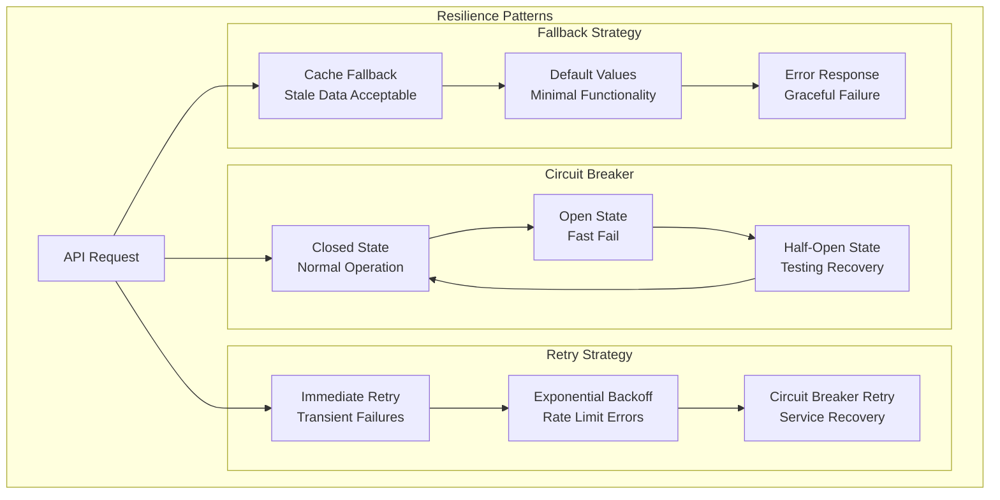

## Security Architecture

### Security Layers

```mermaid
graph TB
    subgraph "Network Security"
        VNET[Virtual Network<br/>Network Isolation]
        NSG[Network Security Groups<br/>Traffic Filtering]
        FIREWALL[Azure Firewall<br/>Advanced Protection]
    end

    subgraph "Identity & Access"
        AAD[Azure Active Directory<br/>Identity Provider]
        MANAGED_ID[Managed Identity<br/>Service Authentication]
        RBAC[Role-Based Access Control<br/>Least Privilege]
    end

    subgraph "API Security"
        APIM_AUTH[APIM Authentication<br/>Subscription Keys]
        OAUTH[OAuth 2.0<br/>Future Implementation]
        RATE_LIMIT[Rate Limiting<br/>DDoS Protection]
    end

    subgraph "Data Security"
        ENCRYPTION_REST[Encryption at Rest<br/>Cosmos DB, Storage]
        ENCRYPTION_TRANSIT[Encryption in Transit<br/>TLS 1.2+]
        KEY_VAULT[Azure Key Vault<br/>Secrets Management]
    end

    subgraph "Application Security"
        INPUT_VALIDATION[Input Validation<br/>XSS Prevention]
        OUTPUT_ENCODING[Output Encoding<br/>Injection Prevention]
        SECURITY_HEADERS[Security Headers<br/>OWASP Compliance]
    end

    VNET --> NSG
    NSG --> FIREWALL

    AAD --> MANAGED_ID
    MANAGED_ID --> RBAC

    APIM_AUTH --> OAUTH
    OAUTH --> RATE_LIMIT

    ENCRYPTION_REST --> ENCRYPTION_TRANSIT
    ENCRYPTION_TRANSIT --> KEY_VAULT

    INPUT_VALIDATION --> OUTPUT_ENCODING
    OUTPUT_ENCODING --> SECURITY_HEADERS
```

### Authentication and Authorization

**Current Implementation**:

- **API Management**: Subscription key authentication
- **Function Apps**: Function-level authorization keys
- **Cosmos DB**: Connection string authentication (development)

**Planned Enhancements**:

- **Azure AD Integration**: Managed identity for service-to-service authentication
- **OAuth 2.0**: User authentication for premium features
- **Certificate-Based**: Client certificate authentication for high-security scenarios

## Performance Architecture

### Performance Optimization Strategy

```mermaid
graph TB
    subgraph "Frontend Performance"
        CODE_SPLITTING[Code Splitting<br/>Route-based Loading]
        LAZY_LOADING[Lazy Loading<br/>Component Loading]
        ASSET_OPTIMIZATION[Asset Optimization<br/>Minification, Compression]
        SERVICE_WORKER[Service Worker<br/>Offline Capability]
    end

    subgraph "API Performance"
        RESPONSE_CACHING[Response Caching<br/>Multi-tier Strategy]
        COMPRESSION[Response Compression<br/>Gzip, Brotli]
        CDN_ACCELERATION[CDN Acceleration<br/>Global Distribution]
        CONNECTION_POOLING[Connection Pooling<br/>Database Efficiency]
    end

    subgraph "Database Performance"
        PARTITION_STRATEGY[Partition Strategy<br/>Optimal Data Distribution]
        INDEX_OPTIMIZATION[Index Optimization<br/>Query Performance]
        QUERY_OPTIMIZATION[Query Optimization<br/>Single-partition Queries]
        RU_OPTIMIZATION[RU Optimization<br/>Cost Efficiency]
    end

    subgraph "Monitoring & Optimization"
        PERFORMANCE_MONITORING[Performance Monitoring<br/>Real-time Metrics]
        BOTTLENECK_ANALYSIS[Bottleneck Analysis<br/>Performance Profiling]
        CAPACITY_PLANNING[Capacity Planning<br/>Scaling Strategy]
        COST_OPTIMIZATION[Cost Optimization<br/>Resource Efficiency]
    end

    CODE_SPLITTING --> LAZY_LOADING
    LAZY_LOADING --> ASSET_OPTIMIZATION
    ASSET_OPTIMIZATION --> SERVICE_WORKER

    RESPONSE_CACHING --> COMPRESSION
    COMPRESSION --> CDN_ACCELERATION
    CDN_ACCELERATION --> CONNECTION_POOLING

    PARTITION_STRATEGY --> INDEX_OPTIMIZATION
    INDEX_OPTIMIZATION --> QUERY_OPTIMIZATION
    QUERY_OPTIMIZATION --> RU_OPTIMIZATION

    PERFORMANCE_MONITORING --> BOTTLENECK_ANALYSIS
    BOTTLENECK_ANALYSIS --> CAPACITY_PLANNING
    CAPACITY_PLANNING --> COST_OPTIMIZATION
```

### Performance Metrics

**Target Performance Metrics**:

- **Frontend Load Time**: < 2 seconds (first contentful paint)
- **API Response Time**: < 500ms (95th percentile)
- **Database Query Time**: < 100ms (single-partition queries)
- **Cache Hit Ratio**: > 80% (application-level caching)

**Achieved Performance**:

- **DevContainer Startup**: 30-60 seconds (95% improvement)
- **Frontend Build Time**: 2.4 seconds (production build)
- **Test Execution**: ~40 seconds (26 comprehensive tests)
- **Development Environment**: $0/month cost optimization

## Deployment Architecture

### Infrastructure as Code

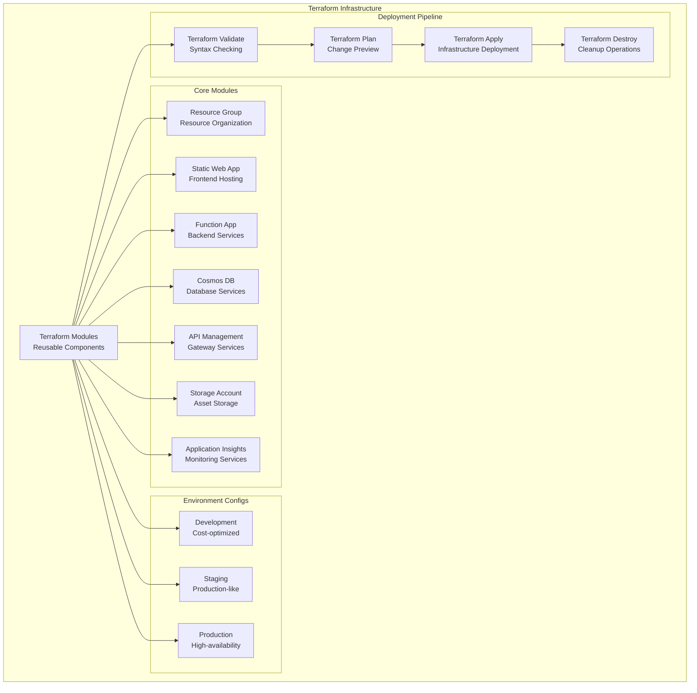

### Environment Strategy

**Environment Specifications**:

| Environment     | Purpose                       | Configuration                          | Cost Target    |
| --------------- | ----------------------------- | -------------------------------------- | -------------- |
| **Development** | Local development and testing | Serverless/consumption tiers           | $0/month       |
| **Staging**     | Pre-production validation     | Production-like with reduced scale     | $50-100/month  |
| **Production**  | Live application              | High-availability, global distribution | $200-500/month |

## Development Architecture

### Revolutionary DevContainer Architecture

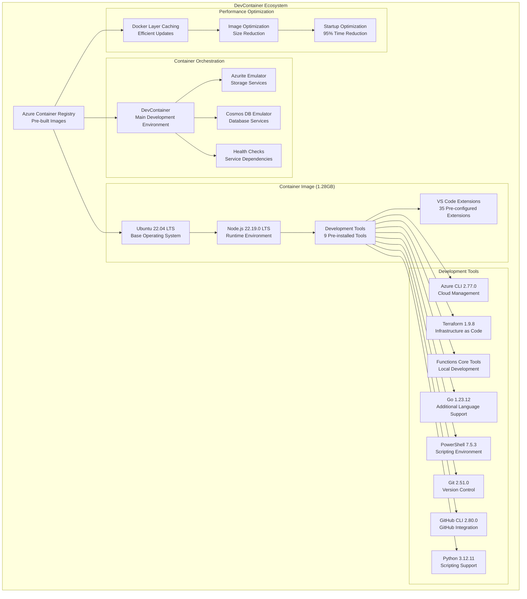

**DevContainer Performance Achievements**:

- **95% Time Reduction**: Environment setup from 5-10 minutes to 30-60 seconds
- **Pre-built Optimization**: All tools and extensions ready immediately
- **Layer Caching**: Efficient Docker layer management for updates
- **Container Orchestration**: Health checks ensure reliable service startup

### Testing Architecture

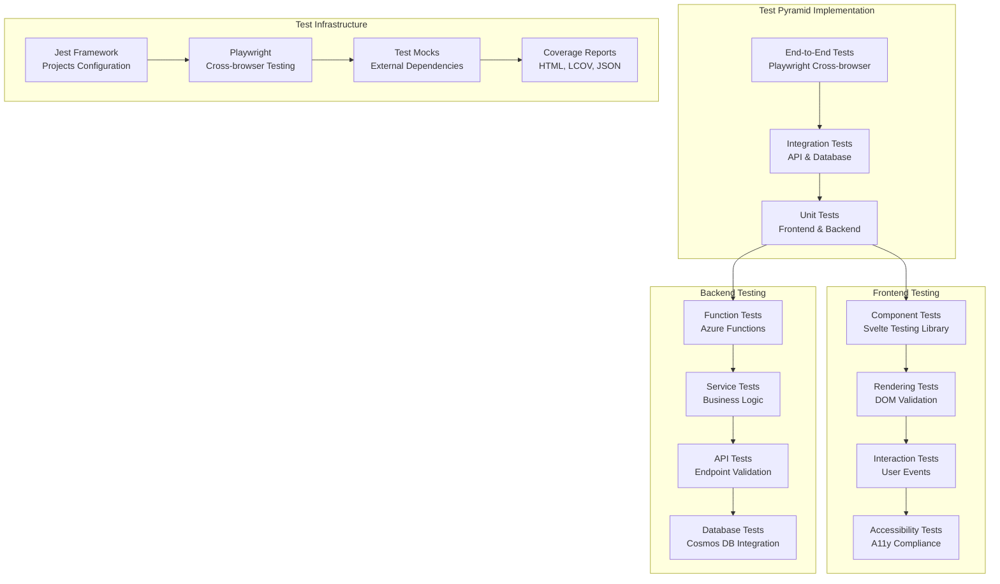

## Monitoring Architecture

### Observability Strategy

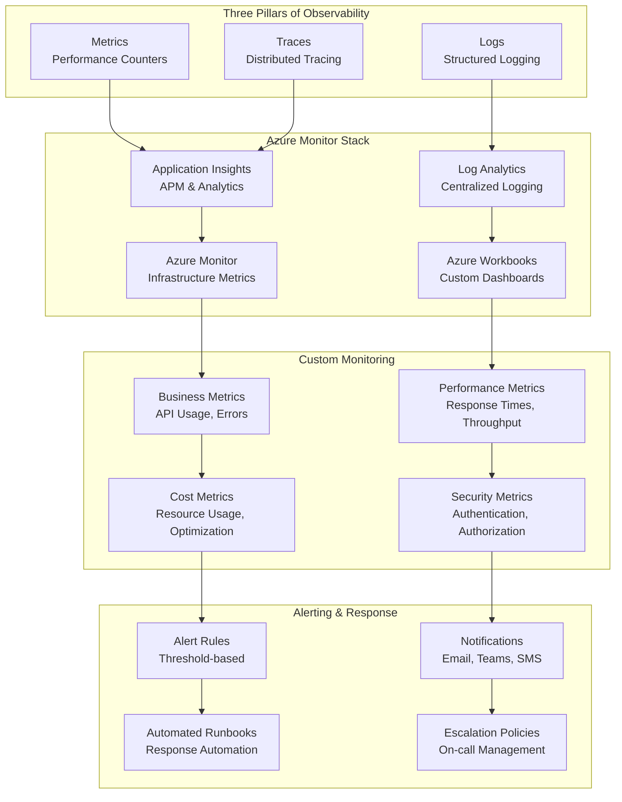

## Architecture Decisions

### Key Technical Decisions

#### 1. Serverless-First Architecture

**Decision**: Use Azure Functions and Cosmos DB serverless for backend services
**Rationale**:

- Cost optimization for variable workloads
- Automatic scaling without infrastructure management
- Pay-per-use pricing model aligns with usage patterns

**Alternatives Considered**:

- Container-based services (Azure Container Apps)
- Traditional VM-based hosting
- Kubernetes orchestration

**Trade-offs**:

- ✅ Lower operational overhead
- ✅ Automatic scaling
- ✅ Cost efficiency for variable loads
- ❌ Cold start latency
- ❌ Vendor lock-in considerations

#### 2. Multi-Tier Caching Strategy

**Decision**: Implement caching at browser, CDN, API gateway, and application levels
**Rationale**:

- Optimize performance across all system layers
- Reduce external API calls and costs
- Improve user experience with faster response times

**Implementation**:

- **Browser**: IndexedDB with TTL management
- **CDN**: Azure CDN for static assets and API responses
- **API Gateway**: APIM response caching
- **Application**: Optional Redis for computed results

#### 3. Hybrid API Integration

**Decision**: Combine PokeData API (pricing) with Pokemon TCG API (metadata)
**Rationale**:

- PokeData provides enhanced pricing data not available elsewhere
- Pokemon TCG API offers comprehensive metadata and images
- Hybrid approach provides best of both data sources

**Resilience Patterns**:

- Circuit breaker for fault tolerance
- Exponential backoff for rate limiting
- Graceful fallback to cached data

#### 4. DevContainer ACR Optimization

**Decision**: Pre-build development environment in Azure Container Registry
**Rationale**:

- 95% reduction in environment setup time
- Consistent development environment across team
- Eliminates dependency on external package repositories

**Implementation**:

- 1.28GB optimized container image
- 35 VS Code extensions pre-installed
- 9 development tools ready to use
- Health checks for service dependencies

#### 5. Infrastructure as Code with Terraform

**Decision**: Use Terraform for all infrastructure management
**Rationale**:

- Declarative infrastructure definition
- Version control for infrastructure changes
- Multi-environment deployment consistency
- Azure provider maturity and feature coverage

**Module Strategy**:

- Reusable modules for common patterns
- Environment-specific configurations
- Remote state management for team collaboration

### Architecture Evolution

#### Phase 1: Foundation (Completed)

- Basic infrastructure setup
- Development environment optimization
- Core service architecture

#### Phase 2: Application Migration (Completed)

- Frontend and backend application migration
- Database schema implementation
- API integration patterns

#### Phase 3: Advanced Features (Completed)

- API Management as Code
- Comprehensive testing framework
- Database schema management

#### Phase 4: Enterprise Documentation (In Progress)

- Comprehensive documentation suite
- Monitoring and observability setup
- Production readiness validation

### Future Architecture Considerations

#### Planned Enhancements

1. **Enhanced Security**

   - Azure AD integration for authentication
   - Certificate-based authentication
   - Advanced threat protection

2. **Global Distribution**

   - Multi-region deployment
   - Global database replication
   - Edge computing optimization

3. **Advanced Analytics**

   - Real-time analytics pipeline
   - Machine learning integration
   - Predictive pricing models

4. **Microservices Evolution**
   - Service mesh implementation
   - Event-driven architecture
   - CQRS pattern adoption

#### Scalability Roadmap

- **Current**: Single-region serverless architecture
- **Phase 1**: Multi-region deployment with global distribution
- **Phase 2**: Event-driven microservices with service mesh
- **Phase 3**: AI/ML integration for predictive analytics

---

## Summary

The PCPC system architecture demonstrates enterprise-grade design principles with:

- **Cloud-Native**: Serverless-first approach with Azure managed services
- **Performance-Optimized**: Multi-tier caching and optimized data access patterns
- **Security-First**: Defense in depth with comprehensive security layers
- **Developer-Friendly**: Revolutionary DevContainer with 95% setup time reduction
- **Scalable**: Designed for growth with clear evolution path

This architecture serves as both a functional Pokemon card price checking application and a comprehensive demonstration of advanced software engineering capabilities suitable for senior-level technical roles.
