# PCPC System Architecture

> **Comprehensive technical architecture documentation for the Pokemon Card Price Checker portfolio application**

> **Phase 2.2 (current).** PCPC ships one product three ways from one repo.
> A single SvelteKit frontend talks to three interchangeable backends —
> selected at runtime via `?backend=vercel|azure|aca`. The operational
> tradeoff story between the three paths lives in
> [architecture-comparison.md](./architecture-comparison.md); this document
> is the structural reference for the components that make up each path.

## Table of Contents

- [Architecture Overview](#architecture-overview)
- [The Three-Path Architecture](#the-three-path-architecture)
- [System Components](#system-components)
- [Data Architecture](#data-architecture)
- [Integration Patterns](#integration-patterns)
- [Security Architecture](#security-architecture)
- [Performance Architecture](#performance-architecture)
- [Deployment Architecture](#deployment-architecture)
- [Development Architecture](#development-architecture)
- [Monitoring Architecture](#monitoring-architecture)
- [Architecture Decisions](#architecture-decisions)

## Architecture Overview

### High-Level System Architecture

PCPC is a SvelteKit web application that fetches Pokemon card data and
pricing from a single upstream source (the **Scrydex API**), caches it in
**Cosmos DB** (with an optional **Redis** layer), and serves it to the
browser. The distinguishing feature is that the same product is reachable
through three architecturally different backend paths from one frontend.

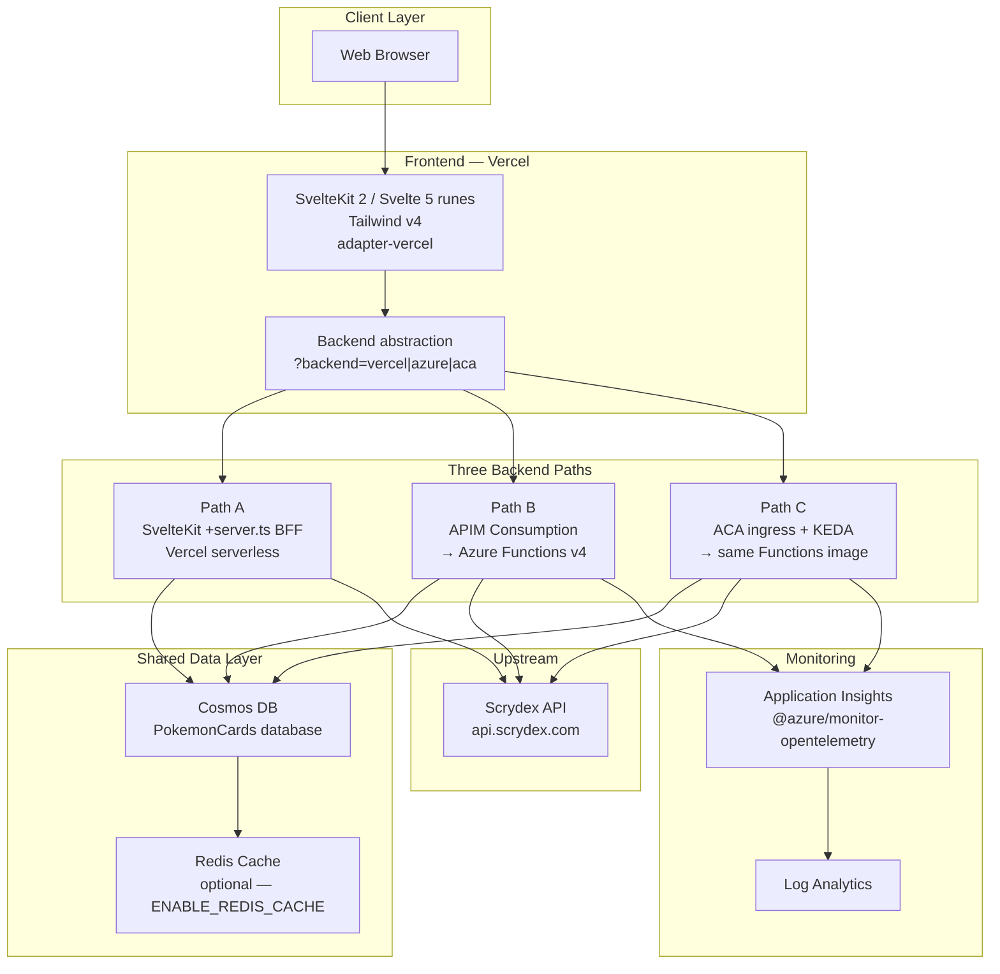
```mermaid
graph TB
    subgraph Client["Client Layer"]
        WEB[Web Browser]
    end

    subgraph Frontend["Frontend — Vercel"]
        SK[SvelteKit 2 / Svelte 5 runes<br/>Tailwind v4<br/>adapter-vercel]
        TOGGLE["Backend abstraction<br/>?backend=vercel|azure|aca"]
    end

    subgraph Paths["Three Backend Paths"]
        PA[Path A<br/>SvelteKit +server.ts BFF<br/>Vercel serverless]
        PB[Path B<br/>APIM Consumption<br/>→ Azure Functions v4]
        PC[Path C<br/>ACA ingress + KEDA<br/>→ same Functions image]
    end

    subgraph Data["Shared Data Layer"]
        COSMOS[Cosmos DB<br/>PokemonCards database]
        REDIS[Redis Cache<br/>optional — ENABLE_REDIS_CACHE]
    end

    subgraph Upstream["Upstream"]
        SCRYDEX[Scrydex API<br/>api.scrydex.com]
    end

    subgraph Obs["Monitoring"]
        APPINSIGHTS[Application Insights<br/>@azure/monitor-opentelemetry]
        LOGS[Log Analytics]
    end

    WEB --> SK
    SK --> TOGGLE
    TOGGLE --> PA
    TOGGLE --> PB
    TOGGLE --> PC

    PA --> COSMOS
    PB --> COSMOS
    PC --> COSMOS
    COSMOS --> REDIS
    PA --> SCRYDEX
    PB --> SCRYDEX
    PC --> SCRYDEX

    PB --> APPINSIGHTS
    PC --> APPINSIGHTS
    APPINSIGHTS --> LOGS
```

All three paths converge on the same Cosmos DB account and the same
Scrydex upstream, and Path B and Path C run byte-identical Azure Functions
code. The cache hierarchy is **Redis → Cosmos → Scrydex upstream**: a
cache miss falls through to Scrydex and writes back through the same
layers.

### Architecture Principles

#### 1. One product, multiple architectures

The repository deliberately ships the same application through three
backend topologies so the architectural comparison is *operational*, not
merely described. See [architecture-comparison.md](./architecture-comparison.md)
and [ADR-007 — API Architecture Spectrum](./adr/ADR-007-api-architecture-spectrum.md).

#### 2. Runtime-selectable backends with graceful degradation

The active backend is chosen at runtime and the frontend degrades
gracefully: a path that fails its healthcheck is hidden from the toggle
rather than producing user-visible errors. A visitor who never engages
the toggle always gets the default (Path A) experience.

#### 3. Shared data and types

All paths share one Cosmos DB account and the same TypeScript types via
`@pcpc/shared`. Path B and Path C ship the identical Functions source from
`backend/functions/src/`.

#### 4. Cloud-native, scale-to-zero

Each path is serverless or scale-to-zero capable: Vercel serverless
(Path A), APIM Consumption + Functions Consumption (Path B), and ACA with
KEDA-ready scaling (Path C).

#### 5. Security and observability at the gateway

Read endpoints are anonymous at the Functions layer; cross-cutting
concerns (CORS, rate limiting, telemetry) are owned by the gateway — APIM
on Path B, ACA ingress on Path C. Secrets are sourced from Key Vault /
Vercel env vars, and service-to-service auth uses managed identity.

## The Three-Path Architecture

This is the centerpiece of PCPC. The full operational, cost, and
security comparison is in
[architecture-comparison.md](./architecture-comparison.md); the summary
below is the structural view.

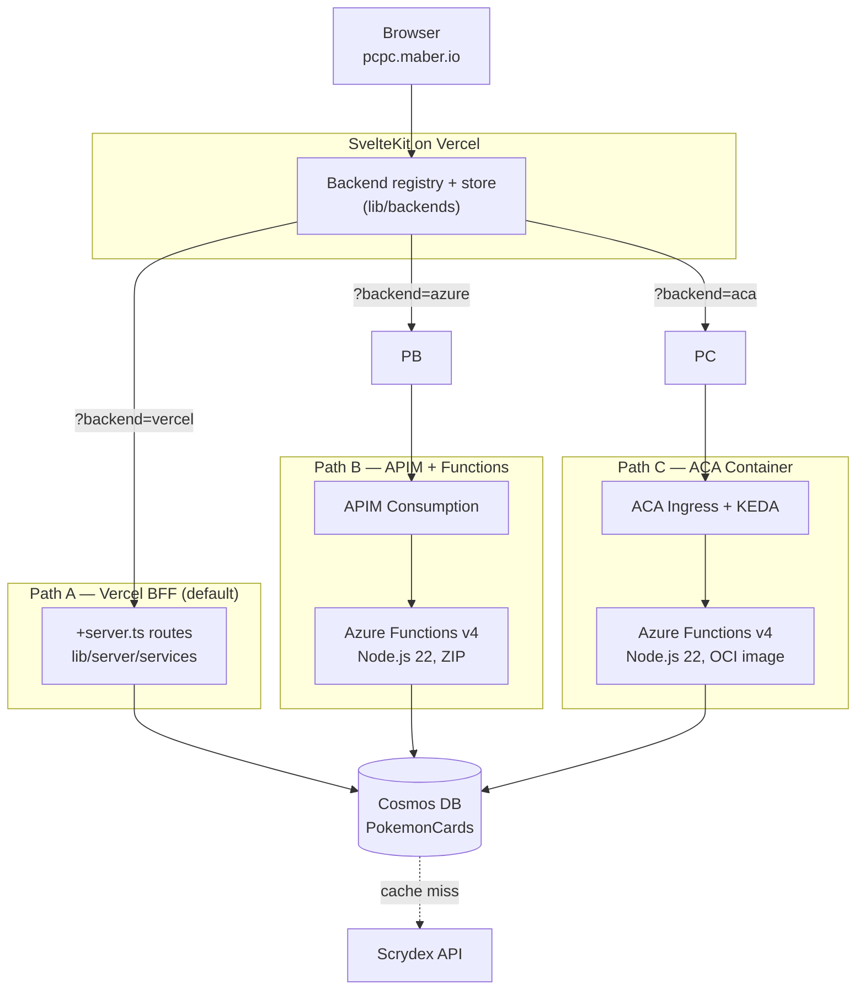
```mermaid
graph TB
    BROWSER[Browser<br/>pcpc.maber.io]

    subgraph FE["SvelteKit on Vercel"]
        ROUTER["Backend registry + store<br/>(lib/backends)"]
    end

    BROWSER --> ROUTER

    ROUTER -->|"?backend=vercel"| PA
    ROUTER -->|"?backend=azure"| PB
    ROUTER -->|"?backend=aca"| PC

    subgraph PathA["Path A — Vercel BFF (default)"]
        PA["+server.ts routes<br/>lib/server/services"]
    end

    subgraph PathB["Path B — APIM + Functions"]
        APIM[APIM Consumption]
        FUNC_B[Azure Functions v4<br/>Node.js 22, ZIP]
        APIM --> FUNC_B
    end

    subgraph PathC["Path C — ACA Container"]
        INGRESS[ACA Ingress + KEDA]
        FUNC_C[Azure Functions v4<br/>Node.js 22, OCI image]
        INGRESS --> FUNC_C
    end

    PB --> APIM
    PC --> INGRESS

    PA --> COSMOS[(Cosmos DB<br/>PokemonCards)]
    FUNC_B --> COSMOS
    FUNC_C --> COSMOS
    COSMOS -.->|cache miss| SCRYDEX[Scrydex API]
```

### Runtime backend selection

The active path is chosen by the `?backend=` URL parameter and persisted
in `localStorage`, with a corner badge showing the active backend and its
last healthcheck latency. The abstraction lives in
`frontend/src/lib/backends/`:

| File | Responsibility |
| --- | --- |
| `types.ts` | `BackendId` (`vercel \| azure \| aca`), `BackendDefinition`, `BackendFetcher`, `BackendHealth` |
| `store.svelte.ts` | Svelte 5 runes store; registry of the three backends, URL/localStorage sync, periodic health refresh, auto-fallback to default |
| `health.ts` | `probeHealth()` with `HEALTH_TIMEOUT_MS = 2000`; maps HTTP 200→healthy, 207→degraded, else→unhealthy |
| `path-a-vercel.ts` | Path A fetcher + healthcheck (`/api` prefix, same Vercel deployment) |
| `path-b-azure.ts` | Path B fetcher; base URL from `PUBLIC_AZURE_API_BASE_URL`, defaults to the dev APIM hostname |
| `path-c-aca.ts` | Path C fetcher; base URL from `PUBLIC_ACA_API_BASE_URL`, no fallback (unset ⇒ path hidden) |
| `index.ts` | Public re-exports; consumers import only from `$lib/backends` |

`lib/services/api.ts` delegates every request to `backendStore.active.fetcher`,
so swapping paths swaps the implementation while routes, stores, and
components stay unchanged.

### Health-probe graceful degradation

Each backend exposes a `/health` (or `/api/health`) endpoint returning
`200` healthy, `207` degraded, or `503` unhealthy. The store probes every
registered backend on init and on a 60s interval. `probeHealth` aborts
after `HEALTH_TIMEOUT_MS` (2000 ms) and never throws. If the active
backend goes unhealthy while the default (Path A / `vercel`) is still
healthy, the store automatically reverts to the default — so the user
experience never regresses below "Path A works." Path C is hidden from the
toggle entirely when `PUBLIC_ACA_API_BASE_URL` is unset.

### Path comparison (summary)

| | Path A — Vercel BFF | Path B — APIM + Functions | Path C — ACA Container |
| --- | --- | --- | --- |
| Ingress | SvelteKit `+server.ts` (same Vercel deploy) | APIM Consumption | ACA ingress (L7) |
| Business logic | SvelteKit server routes | Azure Functions v4 (ZIP) | Azure Functions v4 (OCI image) |
| Scaling | Vercel per-request | APIM + Functions Consumption (scale-to-zero) | ACA scale rules, KEDA-ready (`min_replicas=1` in PCPC) |
| IaC | None (Vercel project settings) | 9 base Terraform modules + APIM-as-code | + `container-app` module |
| Code | SvelteKit-native | Functions source | Byte-identical Functions source |

See [ADR-008 (APIM vs BFF gateway)](./adr/ADR-008-apim-vs-bff-gateway.md)
and [ADR-009 (Functions Consumption vs ACA)](./adr/ADR-009-functions-consumption-vs-container-apps.md)
for the decision narratives.

## System Components

### Frontend Components

The frontend is a **SvelteKit 2 / Svelte 5 (runes)** application styled
with **Tailwind CSS v4**, built with **Vite**, and deployed to **Vercel**
via `@sveltejs/adapter-vercel`. It is *not* an Azure Static Web App and
*not* a Rollup-bundled SPA.

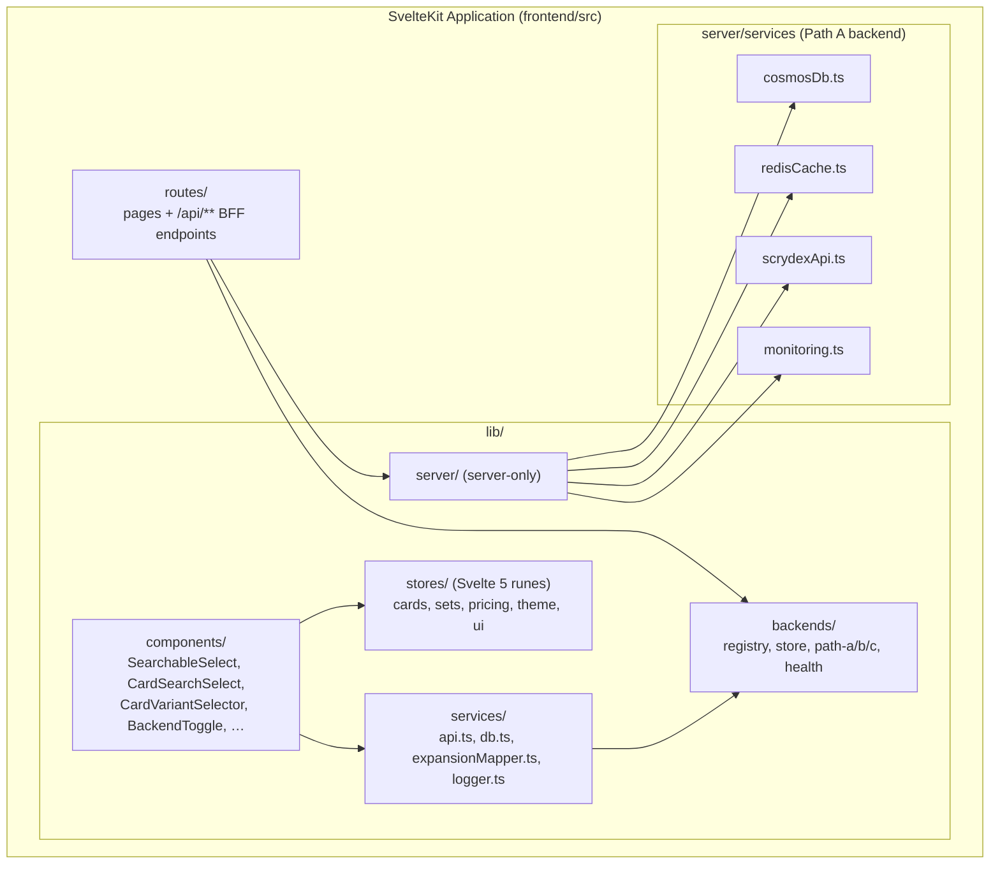
```mermaid
graph TB
    subgraph SK["SvelteKit Application (frontend/src)"]
        ROUTES["routes/<br/>pages + /api/** BFF endpoints"]

        subgraph Lib["lib/"]
            BACKENDS["backends/<br/>registry, store, path-a/b/c, health"]
            COMPONENTS["components/<br/>SearchableSelect, CardSearchSelect,<br/>CardVariantSelector, BackendToggle, …"]
            SERVICES["services/<br/>api.ts, db.ts, expansionMapper.ts, logger.ts"]
            STORES["stores/ (Svelte 5 runes)<br/>cards, sets, pricing, theme, ui"]
            SERVER["server/ (server-only)"]
        end

        subgraph ServerSvc["server/services (Path A backend)"]
            FE_COSMOS[cosmosDb.ts]
            FE_REDIS[redisCache.ts]
            FE_SCRYDEX[scrydexApi.ts]
            FE_MON[monitoring.ts]
        end
    end

    ROUTES --> BACKENDS
    ROUTES --> SERVER
    SERVER --> FE_COSMOS
    SERVER --> FE_REDIS
    SERVER --> FE_SCRYDEX
    SERVER --> FE_MON
    COMPONENTS --> SERVICES
    SERVICES --> BACKENDS
    COMPONENTS --> STORES
```

**Key structure**:

- **`lib/backends/`** — the runtime backend abstraction (registry/store,
  health probe, three path definitions) described above.
- **`routes/api/**/+server.ts`** — the Path A BFF endpoints (see below).
- **`lib/server/services/`** — server-only implementations used by the
  BFF: `cosmosDb.ts`, `redisCache.ts`, `scrydexApi.ts`, `monitoring.ts`
  (mirroring the backend Functions services so Path A serves identical
  Scrydex-shaped data).
- **`lib/server/utils/`** — `cache.ts`, `errors.ts`; **`lib/server/config.ts`**
  and **`lib/server/models/types.ts`**.
- **`lib/services/`** — client services: `api.ts` (delegates to the active
  backend), `db.ts`, `expansionMapper.ts`, `logger.ts`.
- **`lib/stores/`** — Svelte 5 runes stores (`*.svelte.ts`): `cards`,
  `sets`, `pricing`, `theme`, `ui`.
- **`lib/components/`** — UI components including `BackendToggle.svelte`
  (the path switcher), search/selection components, and pricing/chart
  components.

#### Path A BFF routes (`routes/api/**/+server.ts`)

| Route | Purpose |
| --- | --- |
| `GET /api/sets` | List Pokemon sets |
| `GET /api/sets/[set_id]/cards` | Cards for a set |
| `GET /api/sets/[set_id]/cards/[card_id]` | Individual card details and pricing |
| `GET /api/health` | Path A health probe (200/207/503) |

These run as Vercel serverless functions in the same deployment as the
page rendering, using `lib/server/services/*` to talk to Cosmos, Redis,
and Scrydex directly — no separate gateway.

#### Frontend Hosting

- **Hosting**: Vercel (via `@sveltejs/adapter-vercel`)
- **Custom domain**: `pcpc.maber.io` (Vercel + Cloudflare)
- **Build**: Vite (`vite build`); tests via Vitest

### Backend Components (Path B / Path C)

The backend is an **Azure Functions v4** app on **Node.js 22**, written in
TypeScript. The *same* compiled code runs in two envelopes: a ZIP on a
Consumption-plan Function App (Path B) and an OCI container image on Azure
Container Apps (Path C). Source: `backend/functions/src/`.

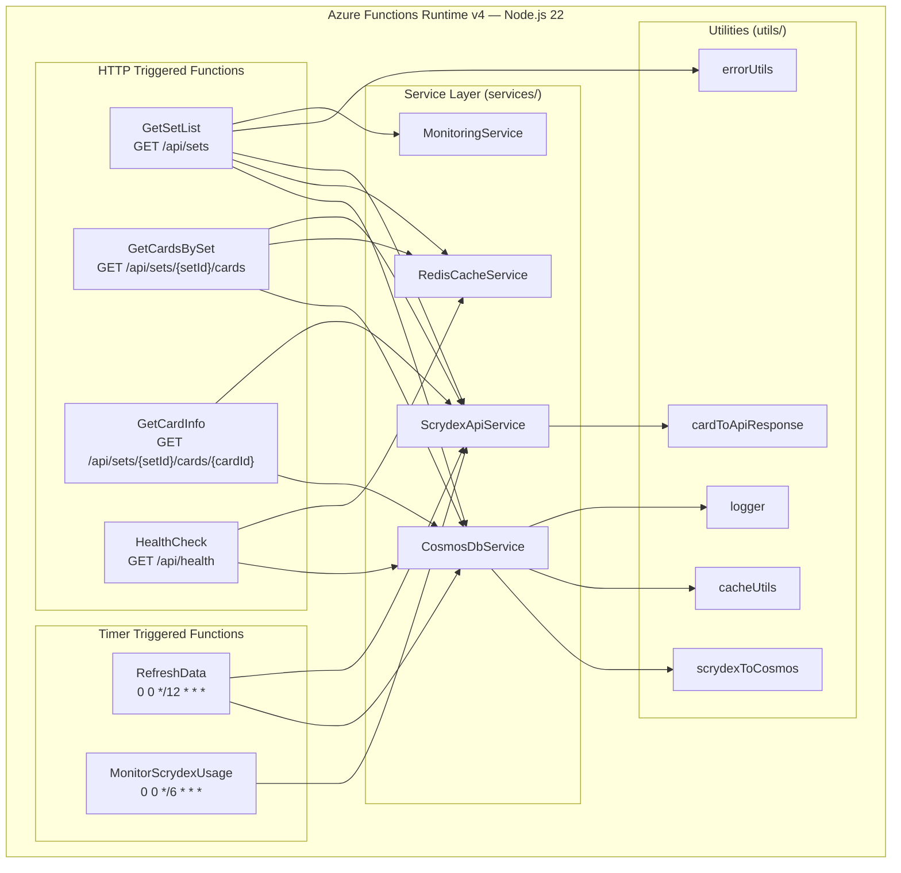
```mermaid
graph TB
    subgraph Host["Azure Functions Runtime v4 — Node.js 22"]
        subgraph HTTP["HTTP Triggered Functions"]
            GET_SETS["GetSetList<br/>GET /api/sets"]
            GET_CARDS["GetCardsBySet<br/>GET /api/sets/{setId}/cards"]
            GET_CARD["GetCardInfo<br/>GET /api/sets/{setId}/cards/{cardId}"]
            HEALTH["HealthCheck<br/>GET /api/health"]
        end

        subgraph Timer["Timer Triggered Functions"]
            REFRESH[RefreshData<br/>0 0 */12 * * *]
            MONITOR[MonitorScrydexUsage<br/>0 0 */6 * * *]
        end

        subgraph Services["Service Layer (services/)"]
            COSMOS_SVC[CosmosDbService]
            REDIS_SVC[RedisCacheService]
            SCRYDEX_SVC[ScrydexApiService]
            MON_SVC[MonitoringService]
        end

        subgraph Utils["Utilities (utils/)"]
            CACHE_UTIL[cacheUtils]
            CARD_UTIL[cardToApiResponse]
            ERR_UTIL[errorUtils]
            LOG_UTIL[logger]
            SCRY_UTIL[scrydexToCosmos]
        end
    end

    GET_SETS --> COSMOS_SVC
    GET_SETS --> REDIS_SVC
    GET_SETS --> SCRYDEX_SVC
    GET_CARDS --> COSMOS_SVC
    GET_CARDS --> REDIS_SVC
    GET_CARDS --> SCRYDEX_SVC
    GET_CARD --> COSMOS_SVC
    GET_CARD --> SCRYDEX_SVC
    REFRESH --> COSMOS_SVC
    REFRESH --> SCRYDEX_SVC
    MONITOR --> SCRYDEX_SVC
    HEALTH --> COSMOS_SVC
    HEALTH --> REDIS_SVC

    COSMOS_SVC --> SCRY_UTIL
    SCRYDEX_SVC --> CARD_UTIL
    COSMOS_SVC --> CACHE_UTIL
    GET_SETS --> ERR_UTIL
    COSMOS_SVC --> LOG_UTIL
    GET_SETS --> MON_SVC
```

**Services** (exactly four, instantiated in `backend/functions/src/index.ts`):

| Service | Purpose |
| --- | --- |
| `CosmosDbService` | Read/write Cards and Sets in Cosmos DB (`PokemonCards` database) |
| `RedisCacheService` | Optional cache layer, gated by `ENABLE_REDIS_CACHE` |
| `ScrydexApiService` | Pricing + metadata from `api.scrydex.com` (key + team id) |
| `MonitoringService` | Application Insights telemetry via `@azure/monitor-opentelemetry` (singleton) |

**Utilities** (`utils/`): `cacheUtils`, `cardToApiResponse`, `errorUtils`,
`logger`, `scrydexToCosmos`.

**Function Specifications**:

| Function | Trigger | Purpose | Dependencies |
| --- | --- | --- | --- |
| **GetSetList** | HTTP GET `sets` | List Pokemon sets | CosmosDbService, RedisCacheService, ScrydexApiService |
| **GetCardsBySet** | HTTP GET `sets/{setId}/cards` | Cards for a set | CosmosDbService, RedisCacheService, ScrydexApiService |
| **GetCardInfo** | HTTP GET `sets/{setId}/cards/{cardId}` | Card details + pricing | CosmosDbService, ScrydexApiService |
| **HealthCheck** | HTTP GET `health` | Dependency health, drives the toggle's degradation (200/207/503) | CosmosDbService, RedisCacheService |
| **RefreshData** | Timer `0 0 */12 * * *` | Background data sync from Scrydex into Cosmos | CosmosDbService, ScrydexApiService |
| **MonitorScrydexUsage** | Timer `0 0 */6 * * *` | Track Scrydex API usage / quota | ScrydexApiService, MonitoringService |

All HTTP triggers use `authLevel: "anonymous"` — auth lives at the gateway
layer (APIM on Path B, ACA ingress on Path C), which keeps the application
code byte-identical across both runtimes.

#### Containerization (Path C)

`backend/functions/Dockerfile` is a multi-stage build on
`mcr.microsoft.com/azure-functions/node:4-node22`:

- **Build stage**: copies `shared/` (so the `file:../shared` `@pcpc/shared`
  reference resolves), runs `npm ci`, then `tsc`.
- **Runtime stage**: copies only `dist/`, `host.json`, and the manifests
  onto the official Functions base image, runs `npm ci --omit=dev`
  (excluding the types-only `@pcpc/shared`), and applies Debian OS security
  patches to stay ahead of base-image CVE lag.
- No `HEALTHCHECK` and no `ENTRYPOINT`/`CMD` overrides — ACA's
  `ingress.health_probes` is the canonical probe and the base image's
  entrypoint launches the host.

Build context is `backend/`; the image is published to ACR as
`pcpc/functions:<tag>` and CVE-scanned (Trivy, HIGH+) before push.

### API Gateway Component (Path B)

Azure API Management on the **Consumption** tier fronts the Function App on
Path B. APIM imports the API from the OpenAPI spec and maps its front path
(`/pcpc-api/v1`) onto the backend `/api/*` routes. APIM provides CORS
(regex policy, see [ADR-013](./adr/ADR-013-cors-regex-policy.md)), rate
limiting (available, not currently configured), the developer portal, and
request-level observability. `subscription_required = false` for the demo.
Path C deliberately bypasses APIM and re-implements CORS at the ACA ingress
`cors` block — see [architecture-comparison.md](./architecture-comparison.md#current-known-limitations).

## Data Architecture

### Database Design

PCPC uses a single Cosmos DB account (serverless) with the **`PokemonCards`**
database. The `cosmos-db` Terraform module provisions three containers:

| Container | Purpose |
| --- | --- |
| **Cards** | Individual card documents (metadata + Scrydex pricing) |
| **Sets** | Pokemon set metadata |
| **set_mappings** | Set-code / id mapping records |

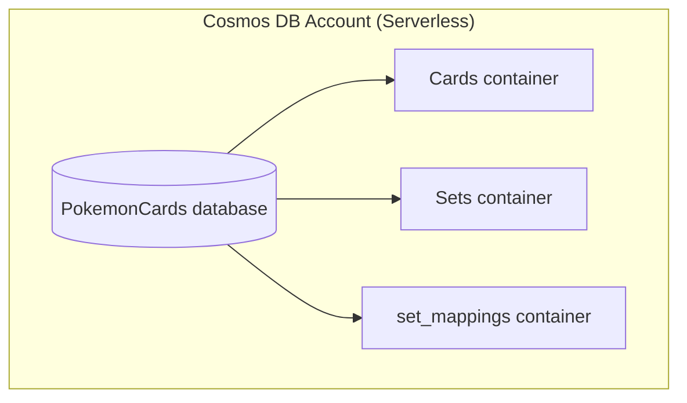
```mermaid
graph TB
    subgraph Account["Cosmos DB Account (Serverless)"]
        DB[(PokemonCards database)]
        CARDS[Cards container]
        SETS[Sets container]
        MAPPINGS[set_mappings container]
    end

    DB --> CARDS
    DB --> SETS
    DB --> MAPPINGS
```

Container, database, and partition-key names are configurable via Terraform
variables and the Functions `config` (`COSMOS_DB_DATABASE_NAME`,
`COSMOS_DB_CARDS_CONTAINER_NAME`, `COSMOS_DB_SETS_CONTAINER_NAME`).

All schema is **Scrydex-canonical** (post-Phase-2.1 cutover). The Functions
backend and the Path A BFF both emit canonical Scrydex-shaped envelopes
from `@pcpc/shared`, so no client-side reshape is needed on any path.

### Caching Architecture

The cache hierarchy is **Redis → Cosmos → Scrydex upstream**, shared by all
three paths (see [ADR-003](./adr/ADR-003-caching-architecture-design.md)).

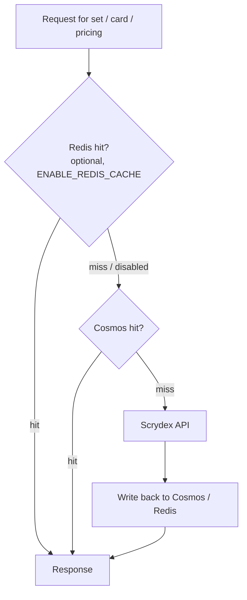
```mermaid
graph TB
    REQUEST[Request for set / card / pricing]
    REDIS{Redis hit?<br/>optional, ENABLE_REDIS_CACHE}
    COSMOS{Cosmos hit?}
    UPSTREAM[Scrydex API]

    REQUEST --> REDIS
    REDIS -->|miss / disabled| COSMOS
    REDIS -->|hit| RESPONSE[Response]
    COSMOS -->|hit| RESPONSE
    COSMOS -->|miss| UPSTREAM
    UPSTREAM --> WRITEBACK[Write back to Cosmos / Redis]
    WRITEBACK --> RESPONSE
```

- **Redis** is optional and gated by `ENABLE_REDIS_CACHE`; when disabled or
  unavailable the system degrades to Cosmos + upstream.
- **Cosmos** is the durable cache and source of truth for served data;
  `RefreshData` repopulates it on a 12-hour timer.
- **Graceful degradation**: a missing cache layer never fails the request;
  it falls through to the next layer.

## Integration Patterns

### Scrydex API integration

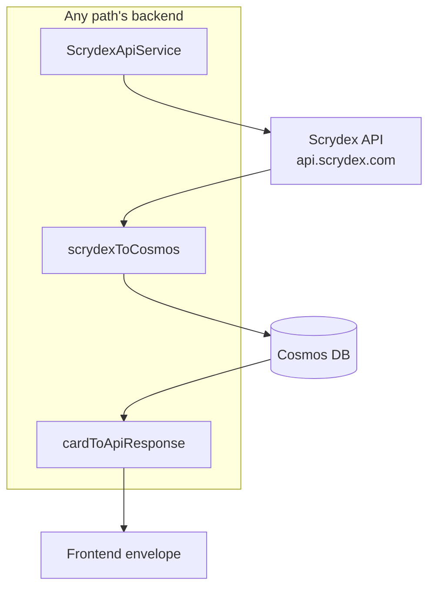
```mermaid
graph TB
    subgraph Backend["Any path's backend"]
        SCRYDEX_SVC[ScrydexApiService]
        TO_COSMOS[scrydexToCosmos]
        TO_API[cardToApiResponse]
    end

    SCRYDEX[Scrydex API<br/>api.scrydex.com]

    SCRYDEX_SVC --> SCRYDEX
    SCRYDEX --> TO_COSMOS
    TO_COSMOS --> COSMOS[(Cosmos DB)]
    COSMOS --> TO_API
    TO_API --> CLIENT[Frontend envelope]
```

Scrydex is the single upstream for both card metadata and pricing.
Responses are normalized into Cosmos documents (`scrydexToCosmos`) and
served to the frontend as canonical envelopes (`cardToApiResponse`). Usage
is tracked by the `MonitorScrydexUsage` timer.

### Resilience

- **Timeouts**: health probes abort at 2000 ms (`HEALTH_TIMEOUT_MS`);
  unhealthy paths degrade out of the toggle.
- **Cache fallthrough**: Redis → Cosmos → upstream means any single layer
  outage degrades rather than fails.
- **Auto-fallback**: the frontend reverts to the default backend when the
  active one is unhealthy.

## Security Architecture

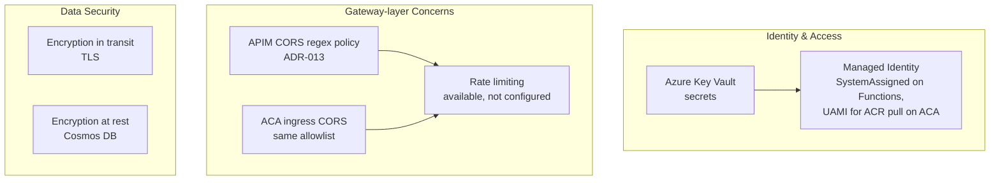
```mermaid
graph TB
    subgraph Identity["Identity & Access"]
        MI[Managed Identity<br/>SystemAssigned on Functions,<br/>UAMI for ACR pull on ACA]
        KV[Azure Key Vault<br/>secrets]
    end

    subgraph Gateway["Gateway-layer Concerns"]
        APIM_CORS[APIM CORS regex policy<br/>ADR-013]
        ACA_CORS[ACA ingress CORS<br/>same allowlist]
        RATE[Rate limiting<br/>available, not configured]
    end

    subgraph Data["Data Security"]
        TLS[Encryption in transit<br/>TLS]
        REST[Encryption at rest<br/>Cosmos DB]
    end

    KV --> MI
    APIM_CORS --> RATE
    ACA_CORS --> RATE
```

- **Authn/authz**: read endpoints are anonymous; the Functions host emits
  no CORS headers — the gateway is the single allowlist gate (APIM on
  Path B, ACA ingress on Path C). Path A is same-origin within SvelteKit.
- **Secrets**: Key Vault references resolved into Function App app-settings
  (Path B) / ACA `secret` blocks via managed identity (Path C); Vercel env
  vars (Path A).
- **Identity**: SystemAssigned managed identity on the Function App;
  user-assigned managed identity (UAMI) for ACR pull on ACA (no registry
  admin user).
- **Supply chain (Path C)**: digest-pinned image, Trivy HIGH+ CVE scan in
  CI, Debian patch layer in the Dockerfile.

See [architecture-comparison.md](./architecture-comparison.md#security-posture)
for the full per-path security comparison.

## Performance Architecture

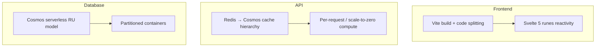
```mermaid
graph TB
    subgraph Frontend["Frontend"]
        VITE[Vite build + code splitting]
        RUNES[Svelte 5 runes reactivity]
    end

    subgraph API["API"]
        CACHE[Redis → Cosmos cache hierarchy]
        SCALE[Per-request / scale-to-zero compute]
    end

    subgraph DB["Database"]
        SERVERLESS[Cosmos serverless RU model]
        PART[Partitioned containers]
    end

    VITE --> RUNES
    CACHE --> SCALE
    SERVERLESS --> PART
```

**Notes**:

- Cold-start and cost profiles differ by path; the quantified comparison
  (Vercel ~50–150 ms, APIM+Functions cold ~500–1500 ms, ACA at
  `min_replicas=1` ~0 ms cold) is in
  [architecture-comparison.md](./architecture-comparison.md#scaling-and-cost).
- Caching at the Redis/Cosmos layers minimizes Scrydex upstream calls.
- Cosmos serverless keeps cost proportional to usage.

## Deployment Architecture

### Infrastructure as Code

Terraform composes the Azure footprint from modules under `infra/modules/`.
There are **9 base modules plus the `container-app` module** added for
Path C. There is no Static Web App module (the frontend deploys to Vercel,
not Azure).

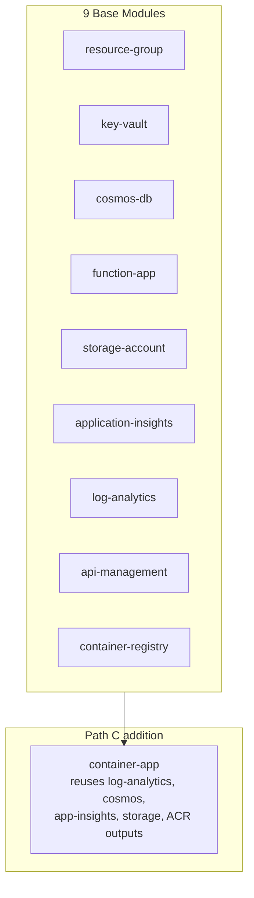
```mermaid
graph TB
    subgraph Base["9 Base Modules"]
        RG[resource-group]
        KV[key-vault]
        COSMOS[cosmos-db]
        FUNC[function-app]
        STORAGE[storage-account]
        AI[application-insights]
        LA[log-analytics]
        APIM[api-management]
        ACR[container-registry]
    end

    subgraph PathC["Path C addition"]
        CA[container-app<br/>reuses log-analytics, cosmos,<br/>app-insights, storage, ACR outputs]
    end

    Base --> CA
```

| Module | Role |
| --- | --- |
| `resource-group` | Resource container |
| `key-vault` | Secrets |
| `cosmos-db` | PokemonCards DB + Cards/Sets/set_mappings containers |
| `function-app` | Path B Functions host (Consumption) |
| `storage-account` | Functions storage / assets |
| `application-insights` | Telemetry sink |
| `log-analytics` | Centralized logs (shared by Path B and Path C) |
| `api-management` | Path B gateway (Consumption) |
| `container-registry` | ACR for the Path C image |
| `container-app` | Path C runtime (ACA + ingress + scale rules) |

The frontend (Path A) has no Terraform footprint — it is managed entirely
through Vercel project settings. APIM is additionally configured as code
under `apim/`.

### Environment & CI/CD (by path)

| | Path A | Path B | Path C |
| --- | --- | --- | --- |
| Deploy | Vercel auto-deploy on push, PR previews | Azure DevOps multi-stage; Functions ZIP deploy | Azure DevOps; Docker build → Trivy → ACR push → `az containerapp update` |
| Custom domain | `pcpc.maber.io` | deferred (`*.azure-api.net`) per [ADR-012](./adr/ADR-012-apim-managed-cert-suspension.md) | deferred (`*.azurecontainerapps.io`) |

## Development Architecture

### DevContainer

Development uses a pre-built DevContainer image hosted in Azure Container
Registry, with Node.js 22, Azure CLI, Terraform, Functions Core Tools, and
supporting tooling, plus local emulators (Azurite, Cosmos DB Emulator) for
offline backend development. Pre-building in ACR keeps environment setup to
seconds rather than minutes.

### Testing

- **Frontend**: Vitest (`npm run test` in `frontend/`), including the
  backend abstraction (`lib/backends/health.test.ts`,
  `path-*.ts` test helpers) and server utils.
- **Backend**: Jest for Functions services and utilities.
- **E2E**: Playwright for cross-browser flows.

## Monitoring Architecture

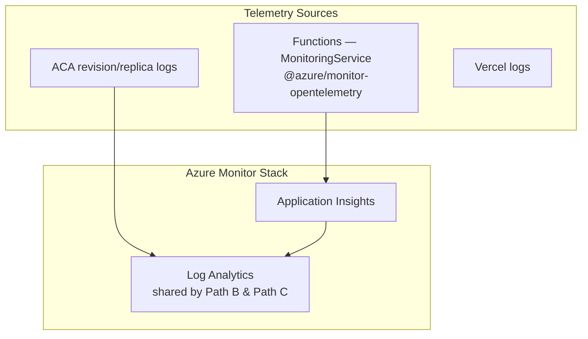
```mermaid
graph TB
    subgraph Sources["Telemetry Sources"]
        FUNC[Functions — MonitoringService<br/>@azure/monitor-opentelemetry]
        ACA_LOGS[ACA revision/replica logs]
        VERCEL[Vercel logs]
    end

    subgraph Azure["Azure Monitor Stack"]
        AI[Application Insights]
        LA[Log Analytics<br/>shared by Path B & Path C]
    end

    FUNC --> AI
    ACA_LOGS --> LA
    AI --> LA
```

- **Application Insights** receives Functions telemetry via
  `MonitoringService` (`@azure/monitor-opentelemetry`); Path B and Path C
  share the same App Insights + Log Analytics workspace.
- **Path C** additionally emits ACA-native revision/replica logs.
- **Path A** observability is Vercel logs + browser dev tools.

## Architecture Decisions

The decision narrative is captured in the ADRs; the most load-bearing for
this architecture:

- [ADR-003 — Caching Architecture](./adr/ADR-003-caching-architecture-design.md): Redis → Cosmos → upstream hierarchy
- [ADR-007 — API Architecture Spectrum](./adr/ADR-007-api-architecture-spectrum.md): why three paths exist
- [ADR-008 — APIM vs SvelteKit BFF](./adr/ADR-008-apim-vs-bff-gateway.md): Path A vs Path B gateway tradeoff
- [ADR-009 — Functions Consumption vs Container Apps](./adr/ADR-009-functions-consumption-vs-container-apps.md): Path B vs Path C runtime tradeoff
- [ADR-012 — APIM Managed-Cert Suspension](./adr/ADR-012-apim-managed-cert-suspension.md): why custom domains are deferred
- [ADR-013 — CORS Regex Policy](./adr/ADR-013-cors-regex-policy.md): gateway-owned CORS allowlist

### Key technical decisions (summary)

1. **Three interchangeable backends from one frontend** — make the
   architectural comparison operational, not theoretical.
2. **Gateway-owned cross-cutting concerns** — CORS/rate-limiting/telemetry
   live at APIM (Path B) or ACA ingress (Path C) so the Functions code is
   byte-identical across runtimes.
3. **Single Scrydex upstream + Cosmos cache** — one data source, one cache
   hierarchy, one set of shared types (`@pcpc/shared`).
4. **Scale-to-zero everywhere, container portability on Path C** — Path C's
   OCI image is the portable artifact (runs on AKS/ECS/GKE/local Docker)
   without paying AKS cost today.

---

## Summary

PCPC's architecture is defined by **one product served three ways**:

- **One SvelteKit frontend** (Svelte 5 runes, Tailwind v4) on **Vercel**,
  with a runtime backend toggle (`?backend=vercel|azure|aca`) and
  health-probe graceful degradation.
- **Three backend paths** — Vercel BFF (`+server.ts`), APIM + Azure
  Functions v4 (Consumption), and the same Functions image on Azure
  Container Apps with KEDA-ready scaling.
- **Shared data** — one Cosmos DB account (`PokemonCards`), optional Redis,
  and the **Scrydex** upstream — with App Insights / Log Analytics
  observability and Key Vault / managed-identity security.

The companion document,
[architecture-comparison.md](./architecture-comparison.md), carries the
full operational, cost, and security tradeoff analysis between the three
paths.
