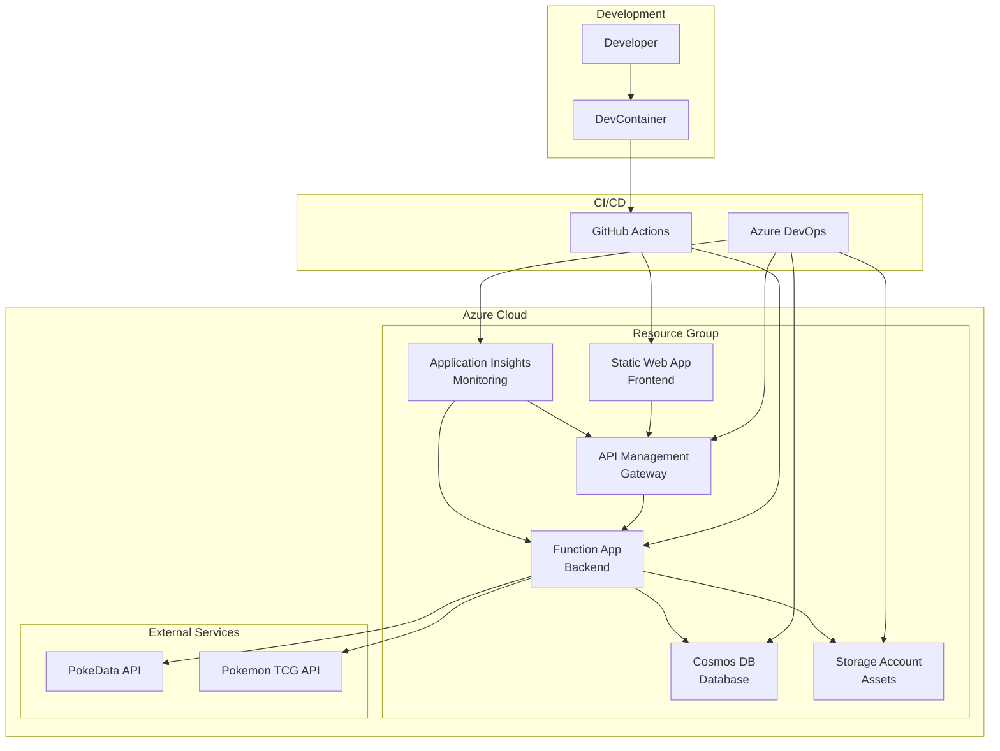
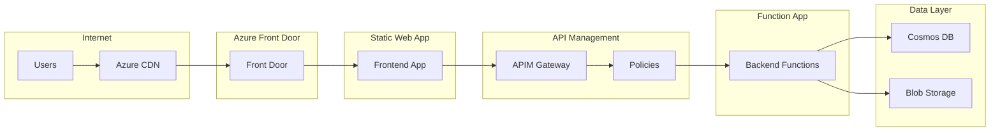

# PCPC Deployment Guide

## Table of Contents

- [Overview](#overview)
- [Infrastructure Overview](#infrastructure-overview)
- [Environment Setup](#environment-setup)
- [Terraform Deployment](#terraform-deployment)
- [Application Deployment](#application-deployment)
- [CI/CD Pipelines](#cicd-pipelines)
- [Environment Variables](#environment-variables)
- [Monitoring Setup](#monitoring-setup)
- [Rollback Procedures](#rollback-procedures)

## Overview

This deployment guide provides comprehensive instructions for deploying the PCPC (Pokemon Card Price Checker) application to Azure cloud infrastructure. The deployment follows Infrastructure as Code (IaC) principles using Terraform and supports multiple environments with automated CI/CD pipelines.

### Deployment Architecture

The PCPC deployment architecture consists of:



### Key Features

- **Infrastructure as Code**: Complete Terraform automation
- **Multi-Environment Support**: Dev, staging, and production environments
- **Zero-Downtime Deployment**: Blue-green deployment strategies
- **Automated Rollback**: Automatic rollback on deployment failures
- **Comprehensive Monitoring**: Application Insights integration
- **Security**: Azure Key Vault integration and RBAC

## Infrastructure Overview

### Azure Resources

The PCPC infrastructure consists of 7 core Azure resources managed through Terraform modules:

#### 1. Resource Group (`infra/modules/resource-group/`)

**Purpose**: Logical container for all PCPC resources
**Configuration**:

```hcl
# Example: infra/envs/dev/main.tf
module "resource_group" {
  source = "../../modules/resource-group"

  name     = "pokedata-dev-rg"
  location = "East US"

  tags = {
    Environment = "dev"
    Project     = "PCPC"
    Owner       = "DevTeam"
  }
}
```

#### 2. Static Web App (`infra/modules/static-web-app/`)

**Purpose**: Hosts the Svelte frontend application
**Features**:

- Custom domain support (pokedata.maber.io)
- GitHub integration for automatic deployments
- Global CDN distribution
- SSL certificate management

**Configuration**:

```hcl
module "static_web_app" {
  source = "../../modules/static-web-app"

  name                = "pokedata-dev"
  resource_group_name = module.resource_group.name
  location           = module.resource_group.location

  github_repo_url    = "https://github.com/Abernaughty/PCPC"
  github_branch      = "main"
  app_location       = "/app/frontend"
  output_location    = "public"

  tags = local.common_tags
}
```

#### 3. Function App (`infra/modules/function-app/`)

**Purpose**: Hosts the Azure Functions backend (5 functions)
**Features**:

- Node.js 22.x runtime
- Consumption plan for cost optimization
- Application Insights integration
- Environment variable management

**Configuration**:

```hcl
module "function_app" {
  source = "../../modules/function-app"

  name                = "pokedata-func-dev"
  resource_group_name = module.resource_group.name
  location           = module.resource_group.location

  storage_account_name = module.storage_account.name

  app_settings = {
    FUNCTIONS_WORKER_RUNTIME     = "node"
    FUNCTIONS_EXTENSION_VERSION  = "~4"
    WEBSITE_NODE_DEFAULT_VERSION = "~22"

    COSMOS_DB_CONNECTION_STRING = module.cosmos_db.connection_string
    COSMOS_DB_DATABASE_NAME     = "PokeData"

    POKEDATA_API_KEY     = "@Microsoft.KeyVault(SecretUri=${azurerm_key_vault_secret.pokedata_api_key.id})"
    POKEMON_TCG_API_KEY  = "@Microsoft.KeyVault(SecretUri=${azurerm_key_vault_secret.pokemon_tcg_api_key.id})"
  }

  tags = local.common_tags
}
```

#### 4. Cosmos DB (`infra/modules/cosmos-db/`)

**Purpose**: NoSQL database for cards and sets data
**Features**:

- Serverless mode for cost optimization
- SQL API compatibility
- Optimized partitioning strategy
- Automatic scaling

**Configuration**:

```hcl
module "cosmos_db" {
  source = "../../modules/cosmos-db"

  name                = "pokedata-cosmos-dev"
  resource_group_name = module.resource_group.name
  location           = module.resource_group.location

  database_name = "PokeData"

  containers = [
    {
      name           = "sets"
      partition_key  = "/series"
      max_throughput = 1000
    },
    {
      name           = "cards"
      partition_key  = "/setId"
      max_throughput = 4000
    }
  ]

  tags = local.common_tags
}
```

#### 5. API Management (`infra/modules/api-management/`)

**Purpose**: API gateway for backend functions
**Features**:

- Rate limiting and throttling
- Request/response transformation
- Authentication and authorization
- Caching and monitoring

**Configuration**:

```hcl
module "api_management" {
  source = "../../modules/api-management"

  name                = "pokedata-apim-dev"
  resource_group_name = module.resource_group.name
  location           = module.resource_group.location

  publisher_name  = "PCPC Team"
  publisher_email = "team@pcpc.dev"

  sku_name = "Consumption_0"

  tags = local.common_tags
}
```

#### 6. Storage Account (`infra/modules/storage-account/`)

**Purpose**: Blob storage for images and static assets
**Features**:

- Hot tier for frequently accessed data
- CDN integration
- Lifecycle management
- Secure access with SAS tokens

**Configuration**:

```hcl
module "storage_account" {
  source = "../../modules/storage-account"

  name                = "pokedatastoragedev"
  resource_group_name = module.resource_group.name
  location           = module.resource_group.location

  account_tier             = "Standard"
  account_replication_type = "LRS"

  containers = [
    {
      name        = "images"
      access_type = "blob"
    }
  ]

  tags = local.common_tags
}
```

#### 7. Application Insights (`infra/modules/application-insights/`)

**Purpose**: Application performance monitoring and logging
**Features**:

- Real-time metrics and alerts
- Distributed tracing
- Custom dashboards
- Log analytics integration

**Configuration**:

```hcl
module "application_insights" {
  source = "../../modules/application-insights"

  name                = "pokedata-insights-dev"
  resource_group_name = module.resource_group.name
  location           = module.resource_group.location

  application_type = "web"

  tags = local.common_tags
}
```

### Network Architecture



## Environment Setup

### Environment Strategy

PCPC supports three environments with progressive deployment:

1. **Development (dev)**: Feature development and testing
2. **Staging (staging)**: Pre-production validation
3. **Production (prod)**: Live user-facing environment

### Environment Configuration

Each environment has its own configuration directory:

```
infra/envs/
├── dev/
│   ├── main.tf
│   ├── variables.tf
│   ├── terraform.tfvars
│   └── outputs.tf
├── staging/
│   ├── main.tf
│   ├── variables.tf
│   ├── terraform.tfvars
│   └── outputs.tf
└── prod/
    ├── main.tf
    ├── variables.tf
    ├── terraform.tfvars
    └── outputs.tf
```

### Development Environment

**Purpose**: Local development and feature testing
**Characteristics**:

- Serverless/consumption tiers for cost optimization
- Relaxed security policies for development ease
- Debug logging enabled
- Direct database access for testing

**Configuration** (`infra/envs/dev/terraform.tfvars`):

```hcl
# Environment Configuration
environment = "dev"
location    = "East US"

# Resource Naming
resource_prefix = "pokedata"
resource_suffix = "dev"

# Cosmos DB Configuration
cosmos_db_consistency_level = "Session"
cosmos_db_max_throughput   = 1000

# Function App Configuration
function_app_plan_sku = "Y1"  # Consumption plan

# API Management Configuration
apim_sku_name = "Consumption_0"

# Storage Configuration
storage_account_tier = "Standard"
storage_replication  = "LRS"

# Feature Flags
enable_debug_logging    = true
enable_cors_all_origins = true
enable_public_access    = true
```

### Staging Environment

**Purpose**: Pre-production validation and integration testing
**Characteristics**:

- Production-like configuration
- Automated testing integration
- Performance monitoring
- Security validation

**Configuration** (`infra/envs/staging/terraform.tfvars`):

```hcl
# Environment Configuration
environment = "staging"
location    = "East US"

# Resource Naming
resource_prefix = "pokedata"
resource_suffix = "staging"

# Cosmos DB Configuration
cosmos_db_consistency_level = "BoundedStaleness"
cosmos_db_max_throughput   = 4000

# Function App Configuration
function_app_plan_sku = "EP1"  # Elastic Premium

# API Management Configuration
apim_sku_name = "Consumption_0"

# Storage Configuration
storage_account_tier = "Standard"
storage_replication  = "GRS"

# Feature Flags
enable_debug_logging    = false
enable_cors_all_origins = false
enable_public_access    = false
```

### Production Environment

**Purpose**: Live user-facing environment
**Characteristics**:

- High availability and performance
- Strict security policies
- Comprehensive monitoring
- Disaster recovery capabilities

**Configuration** (`infra/envs/prod/terraform.tfvars`):

```hcl
# Environment Configuration
environment = "prod"
location    = "East US"

# Resource Naming
resource_prefix = "pokedata"
resource_suffix = "prod"

# Cosmos DB Configuration
cosmos_db_consistency_level = "Strong"
cosmos_db_max_throughput   = 10000

# Function App Configuration
function_app_plan_sku = "EP2"  # Elastic Premium

# API Management Configuration
apim_sku_name = "Standard_1"

# Storage Configuration
storage_account_tier = "Premium"
storage_replication  = "GRS"

# Feature Flags
enable_debug_logging    = false
enable_cors_all_origins = false
enable_public_access    = false

# High Availability
enable_zone_redundancy = true
enable_backup         = true
```

## Terraform Deployment

### Prerequisites

Before deploying infrastructure, ensure you have:

1. **Azure CLI**: Authenticated with appropriate permissions
2. **Terraform**: Version 1.13.3 or later
3. **Azure Subscription**: With Contributor access
4. **Service Principal**: For automated deployments (optional)

### Authentication Setup

#### Option 1: Azure CLI Authentication (Development)

```bash
# Login to Azure
az login

# Set subscription
az account set --subscription "your-subscription-id"

# Verify authentication
az account show
```

#### Option 2: Service Principal (Production)

```bash
# Create service principal
az ad sp create-for-rbac --name "pcpc-terraform-sp" \
  --role="Contributor" \
  --scopes="/subscriptions/your-subscription-id"

# Set environment variables
export ARM_CLIENT_ID="service-principal-app-id"
export ARM_CLIENT_SECRET="service-principal-password"
export ARM_SUBSCRIPTION_ID="your-subscription-id"
export ARM_TENANT_ID="your-tenant-id"
```

### Deployment Process

#### 1. Initialize Terraform

```bash
# Navigate to environment directory
cd infra/envs/dev

# Initialize Terraform
terraform init

# Validate configuration
terraform validate

# Format configuration files
terraform fmt -recursive
```

#### 2. Plan Deployment

```bash
# Create execution plan
terraform plan -var-file="terraform.tfvars" -out="tfplan"

# Review planned changes
terraform show tfplan
```

#### 3. Apply Infrastructure

```bash
# Apply infrastructure changes
terraform apply tfplan

# Confirm deployment
terraform output
```

#### 4. Verify Deployment

```bash
# Check resource group
az group show --name "pokedata-dev-rg"

# List all resources
az resource list --resource-group "pokedata-dev-rg" --output table

# Test connectivity
curl -X GET "https://pokedata-apim-dev.azure-api.net/api/sets" \
  -H "Ocp-Apim-Subscription-Key: your-subscription-key"
```

### Terraform State Management

#### Remote State Configuration

```hcl
# backend.tf
terraform {
  backend "azurerm" {
    resource_group_name  = "terraform-state-rg"
    storage_account_name = "terraformstatestorage"
    container_name       = "tfstate"
    key                  = "pcpc/dev/terraform.tfstate"
  }
}
```

#### State Management Commands

```bash
# Initialize remote state
terraform init -backend-config="backend.hcl"

# Import existing resources
terraform import azurerm_resource_group.main /subscriptions/sub-id/resourceGroups/rg-name

# Refresh state
terraform refresh

# Show current state
terraform state list
terraform state show azurerm_resource_group.main
```

### Advanced Terraform Operations

#### Module Development

```bash
# Validate module
cd infra/modules/cosmos-db
terraform validate

# Test module with examples
cd examples/basic
terraform init
terraform plan
```

#### Workspace Management

```bash
# Create workspace
terraform workspace new staging

# Switch workspace
terraform workspace select dev

# List workspaces
terraform workspace list
```

## Application Deployment

### Frontend Deployment (Static Web App)

The frontend deployment is automated through GitHub Actions integration with Azure Static Web Apps.

#### Deployment Configuration

**GitHub Actions Workflow** (`.github/workflows/azure-static-web-apps.yml`):

```yaml
name: Azure Static Web Apps CI/CD

on:
  push:
    branches:
      - main
    paths:
      - "app/frontend/**"
  pull_request:
    types: [opened, synchronize, reopened, closed]
    branches:
      - main
    paths:
      - "app/frontend/**"

jobs:
  build_and_deploy_job:
    if: github.event_name == 'push' || (github.event_name == 'pull_request' && github.event.action != 'closed')
    runs-on: ubuntu-latest
    name: Build and Deploy Job
    steps:
      - uses: actions/checkout@v3
        with:
          submodules: true

      - name: Setup Node.js
        uses: actions/setup-node@v3
        with:
          node-version: "22"
          cache: "npm"
          cache-dependency-path: app/frontend/package-lock.json

      - name: Install dependencies
        run: |
          cd app/frontend
          npm ci

      - name: Build application
        run: |
          cd app/frontend
          npm run build
        env:
          VITE_API_BASE_URL: ${{ secrets.VITE_API_BASE_URL }}
          VITE_APIM_SUBSCRIPTION_KEY: ${{ secrets.VITE_APIM_SUBSCRIPTION_KEY }}

      - name: Deploy to Azure Static Web Apps
        id: builddeploy
        uses: Azure/static-web-apps-deploy@v1
        with:
          azure_static_web_apps_api_token: ${{ secrets.AZURE_STATIC_WEB_APPS_API_TOKEN }}
          repo_token: ${{ secrets.GITHUB_TOKEN }}
          action: "upload"
          app_location: "/app/frontend"
          output_location: "public"
```

#### Manual Deployment

```bash
# Build frontend locally
cd app/frontend
npm install
npm run build

# Deploy using Azure CLI
az staticwebapp deploy \
  --name "pokedata-dev" \
  --resource-group "pokedata-dev-rg" \
  --source-location "public"
```

### Backend Deployment (Azure Functions)

The backend deployment can be done through Azure DevOps pipelines or manual deployment.

#### Azure DevOps Pipeline

**Pipeline Configuration** (`pipelines/azure-functions-deploy.yml`):

```yaml
trigger:
  branches:
    include:
      - main
  paths:
    include:
      - app/backend/*

pool:
  vmImage: "ubuntu-latest"

variables:
  azureSubscription: "Azure-Service-Connection"
  functionAppName: "pokedata-func-dev"
  resourceGroupName: "pokedata-dev-rg"

stages:
  - stage: Build
    displayName: "Build Stage"
    jobs:
      - job: Build
        displayName: "Build Job"
        steps:
          - task: NodeTool@0
            inputs:
              versionSpec: "22.x"
            displayName: "Install Node.js"

          - script: |
              cd app/backend
              npm install
              npm run build
            displayName: "Install dependencies and build"

          - task: ArchiveFiles@2
            inputs:
              rootFolderOrFile: "app/backend"
              includeRootFolder: false
              archiveType: "zip"
              archiveFile: "$(Build.ArtifactStagingDirectory)/$(Build.BuildId).zip"
              replaceExistingArchive: true
            displayName: "Archive files"

          - task: PublishBuildArtifacts@1
            inputs:
              PathtoPublish: "$(Build.ArtifactStagingDirectory)"
              ArtifactName: "drop"
              publishLocation: "Container"
            displayName: "Publish artifacts"

  - stage: Deploy
    displayName: "Deploy Stage"
    dependsOn: Build
    condition: succeeded()
    jobs:
      - deployment: Deploy
        displayName: "Deploy Job"
        environment: "development"
        strategy:
          runOnce:
            deploy:
              steps:
                - task: AzureFunctionApp@1
                  inputs:
                    azureSubscription: "$(azureSubscription)"
                    appType: "functionApp"
                    appName: "$(functionAppName)"
                    resourceGroupName: "$(resourceGroupName)"
                    package: "$(Pipeline.Workspace)/drop/$(Build.BuildId).zip"
                    deploymentMethod: "auto"
                  displayName: "Deploy Azure Function"
```

#### Manual Deployment

```bash
# Build backend locally
cd app/backend
npm install
npm run build

# Create deployment package
zip -r deployment.zip . -x "node_modules/*" "*.git*" "*.vscode*"

# Deploy using Azure CLI
az functionapp deployment source config-zip \
  --resource-group "pokedata-dev-rg" \
  --name "pokedata-func-dev" \
  --src "deployment.zip"

# Verify deployment
az functionapp function list \
  --resource-group "pokedata-dev-rg" \
  --name "pokedata-func-dev"
```

### Database Deployment

#### Schema Deployment

```bash
# Deploy database schema using Cosmos DB Data Migration Tool
dt.exe /s:JsonFile /s.Files:db/schemas/containers/sets.json \
  /t:CosmosDB /t.ConnectionString:"AccountEndpoint=https://pokedata-cosmos-dev.documents.azure.com:443/;AccountKey=your-key;" \
  /t.Database:PokeData /t.Collection:sets

dt.exe /s:JsonFile /s.Files:db/schemas/containers/cards.json \
  /t:CosmosDB /t.ConnectionString:"AccountEndpoint=https://pokedata-cosmos-dev.documents.azure.com:443/;AccountKey=your-key;" \
  /t.Database:PokeData /t.Collection:cards
```

#### Index Management

```bash
# Apply indexing policies
az cosmosdb sql container update \
  --resource-group "pokedata-dev-rg" \
  --account-name "pokedata-cosmos-dev" \
  --database-name "PokeData" \
  --name "sets" \
  --idx @db/schemas/indexes/sets-indexes.json

az cosmosdb sql container update \
  --resource-group "pokedata-dev-rg" \
  --account-name "pokedata-cosmos-dev" \
  --database-name "PokeData" \
  --name "cards" \
  --idx @db/schemas/indexes/cards-indexes.json
```

## CI/CD Pipelines

### GitHub Actions (Primary)

#### Frontend Pipeline

**Triggers**:

- Push to main branch (app/frontend path)
- Pull request to main branch (app/frontend path)

**Steps**:

1. Checkout code
2. Setup Node.js 22.x
3. Install dependencies
4. Run tests
5. Build application
6. Deploy to Azure Static Web Apps

#### Backend Pipeline

**Triggers**:

- Push to main branch (app/backend path)
- Pull request to main branch (app/backend path)

**Steps**:

1. Checkout code
2. Setup Node.js 22.x
3. Install dependencies
4. Run tests
5. Build TypeScript
6. Create deployment package
7. Deploy to Azure Functions

### Azure DevOps (Secondary)

#### Infrastructure Pipeline

**Triggers**:

- Push to main branch (infra path)
- Manual trigger for production deployments

**Steps**:

1. Checkout code
2. Setup Terraform
3. Terraform init
4. Terraform plan
5. Manual approval (for production)
6. Terraform apply
7. Verify deployment

#### Multi-Environment Pipeline

```yaml
# azure-pipelines.yml
trigger:
  branches:
    include:
      - main
      - develop
  paths:
    include:
      - infra/*

variables:
  terraformVersion: "1.13.3"

stages:
  - stage: Plan
    displayName: "Terraform Plan"
    jobs:
      - job: Plan
        displayName: "Plan Infrastructure"
        pool:
          vmImage: "ubuntu-latest"
        steps:
          - task: TerraformInstaller@1
            inputs:
              terraformVersion: "$(terraformVersion)"

          - task: TerraformTaskV2@2
            inputs:
              provider: "azurerm"
              command: "init"
              workingDirectory: "infra/envs/dev"
              backendServiceArm: "Azure-Service-Connection"
              backendAzureRmResourceGroupName: "terraform-state-rg"
              backendAzureRmStorageAccountName: "terraformstatestorage"
              backendAzureRmContainerName: "tfstate"
              backendAzureRmKey: "pcpc/dev/terraform.tfstate"

          - task: TerraformTaskV2@2
            inputs:
              provider: "azurerm"
              command: "plan"
              workingDirectory: "infra/envs/dev"
              environmentServiceNameAzureRM: "Azure-Service-Connection"

  - stage: Deploy_Dev
    displayName: "Deploy to Development"
    dependsOn: Plan
    condition: and(succeeded(), eq(variables['Build.SourceBranch'], 'refs/heads/develop'))
    jobs:
      - deployment: Deploy
        displayName: "Deploy Infrastructure"
        environment: "development"
        pool:
          vmImage: "ubuntu-latest"
        strategy:
          runOnce:
            deploy:
              steps:
                - task: TerraformTaskV2@2
                  inputs:
                    provider: "azurerm"
                    command: "apply"
                    workingDirectory: "infra/envs/dev"
                    environmentServiceNameAzureRM: "Azure-Service-Connection"

  - stage: Deploy_Prod
    displayName: "Deploy to Production"
    dependsOn: Plan
    condition: and(succeeded(), eq(variables['Build.SourceBranch'], 'refs/heads/main'))
    jobs:
      - deployment: Deploy
        displayName: "Deploy Infrastructure"
        environment: "production"
        pool:
          vmImage: "ubuntu-latest"
        strategy:
          runOnce:
            deploy:
              steps:
                - task: TerraformTaskV2@2
                  inputs:
                    provider: "azurerm"
                    command: "apply"
                    workingDirectory: "infra/envs/prod"
                    environmentServiceNameAzureRM: "Azure-Service-Connection"
```

### Pipeline Security

#### Secret Management

**GitHub Secrets**:

```bash
# Set repository secrets
gh secret set AZURE_STATIC_WEB_APPS_API_TOKEN --body "your-token"
gh secret set VITE_API_BASE_URL --body "https://pokedata-apim-dev.azure-api.net/api"
gh secret set VITE_APIM_SUBSCRIPTION_KEY --body "your-subscription-key"
```

**Azure DevOps Variables**:

```yaml
variables:
  - group: "PCPC-Dev-Variables"
  - name: "azureSubscription"
    value: "Azure-Service-Connection"
```

#### Service Connections

```bash
# Create Azure service connection
az ad sp create-for-rbac --name "pcpc-devops-sp" \
  --role="Contributor" \
  --scopes="/subscriptions/your-subscription-id"
```

## Environment Variables

### Frontend Environment Variables

#### Development (`.env.development`)

```bash
# API Configuration
VITE_API_BASE_URL=http://localhost:7071/api
VITE_APIM_SUBSCRIPTION_KEY=local-development-key

# Feature Flags
VITE_ENABLE_DEBUG_PANEL=true
VITE_ENABLE_PERFORMANCE_MONITORING=true
VITE_ENABLE_CACHE_DEBUGGING=true

# External APIs
VITE_POKEDATA_API_BASE_URL=https://www.pokedata.io/v0
VITE_POKEMON_TCG_API_BASE_URL=https://api.pokemontcg.io/v2

# Development Settings
VITE_ENVIRONMENT=development
VITE_LOG_LEVEL=debug
VITE_CACHE_TTL=300
```

#### Production (`.env.production`)

```bash
# API Configuration
VITE_API_BASE_URL=https://pokedata-apim-prod.azure-api.net/api
VITE_APIM_SUBSCRIPTION_KEY=production-subscription-key

# Feature Flags
VITE_ENABLE_DEBUG_PANEL=false
VITE_ENABLE_PERFORMANCE_MONITORING=true
VITE_ENABLE_CACHE_DEBUGGING=false

# External APIs
VITE_POKEDATA_API_BASE_URL=https://www.pokedata.io/v0
VITE_POKEMON_TCG_API_BASE_URL=https://api.pokemontcg.io/v2

# Production Settings
VITE_ENVIRONMENT=production
VITE_LOG_LEVEL=error
VITE_CACHE_TTL=3600
```

### Backend Environment Variables

#### Function App Settings

```json
{
  "IsEncrypted": false,
  "Values": {
    "AzureWebJobsStorage": "DefaultEndpointsProtocol=https;AccountName=pokedatastoragedev;AccountKey=...",
    "FUNCTIONS_WORKER_RUNTIME": "node",
    "FUNCTIONS_EXTENSION_VERSION": "~4",
    "WEBSITE_NODE_DEFAULT_VERSION": "~22",

    "COSMOS_DB_CONNECTION_STRING": "AccountEndpoint=https://pokedata-cosmos-dev.documents.azure.com:443/;AccountKey=...",
    "COSMOS_DB_DATABASE_NAME": "PokeData",

    "POKEDATA_API_KEY": "@Microsoft.KeyVault(SecretUri=https://pokedata-kv-dev.vault.azure.net/secrets/pokedata-api-key/)",
    "POKEMON_TCG_API_KEY": "@Microsoft.KeyVault(SecretUri=https://pokedata-kv-dev.vault.azure.net/secrets/pokemon-tcg-api-key/)",

    "REDIS_CACHE_ENABLED": "false",
    "REDIS_CONNECTION_STRING": "",

    "BLOB_STORAGE_CONNECTION_STRING": "DefaultEndpointsProtocol=https;AccountName=pokedatastoragedev;AccountKey=...",
    "BLOB_CONTAINER_NAME": "images",

    "APPINSIGHTS_INSTRUMENTATIONKEY": "your-instrumentation-key",
    "APPLICATIONINSIGHTS_CONNECTION_STRING": "InstrumentationKey=your-key;IngestionEndpoint=...",

    "LOG_LEVEL": "info",
    "ENVIRONMENT": "development"
  }
}
```

### Environment Variable Management

#### Azure Key Vault Integration

```hcl
# Key Vault configuration
resource "azurerm_key_vault" "main" {
  name                = "${var.resource_prefix}-kv-${var.environment}"
  location            = var.location
  resource_group_name = var.resource_group_name
  tenant_id           = data.azurerm_client_config.current.tenant_id

  sku_name = "standard"

  access_policy {
    tenant_id = data.azurerm_client_config.current.tenant_id
    object_id = azurerm_user_assigned_identity.function_app.principal_id

    secret_permissions = [
      "Get",
      "List"
    ]
  }

  tags = var.tags
}

# Store API keys securely
resource "azurerm_key_vault_secret" "pokedata_api_key" {
  name         = "pokedata-api-key"
  value        = var.pokedata_api_key
  key_vault_id = azurerm_key_vault.main.id
}

resource "azurerm_key_vault_secret" "pokemon_tcg_api_key" {
  name         = "pokemon-tcg-api-key"
  value        = var.pokemon_tcg_api_key
  key_vault_id = azurerm_key_vault.main.id
}
```

#### Environment Variable Templates

**Development Template** (`app/frontend/.env.example`):

```bash
# API Configuration
VITE_API_BASE_URL=http://localhost:7071/api
VITE_APIM_SUBSCRIPTION_KEY=your-dev-subscription-key

# Feature Flags
VITE_ENABLE_DEBUG_PANEL=true
VITE_ENABLE_PERFORMANCE_MONITORING=true
VITE_ENABLE_CACHE_DEBUGGING=true

# External APIs
VITE_POKEDATA_API_BASE_URL=https://www.pokedata.io/v0
VITE_POKEMON_TCG_API_BASE_URL=https://api.pokemontcg.io/v2

# Development Settings
VITE_ENVIRONMENT=development
VITE_LOG_LEVEL=debug
VITE_CACHE_TTL=300
VITE_API_TIMEOUT=10000
```

**Backend Template** (`app/backend/.env.example`):

```bash
# Azure Functions Configuration
AzureWebJobsStorage=UseDevelopmentStorage=true
FUNCTIONS_WORKER_RUNTIME=node
FUNCTIONS_EXTENSION_VERSION=~4
WEBSITE_NODE_DEFAULT_VERSION=~22

# Database Configuration
COSMOS_DB_CONNECTION_STRING=AccountEndpoint=https://localhost:8081/;AccountKey=C2y6yDjf5/R+ob0N8A7Cgv30VRDJIWEHLM+4QDU5DE2nQ9nDuVTqobD4b8mGGyPMbIZnqyMsEcaGQy67XIw/Jw==
COSMOS_DB_DATABASE_NAME=PokeData

# External API Keys (use Key Vault references in production)
POKEDATA_API_KEY=your-pokedata-api-key
POKEMON_TCG_API_KEY=your-pokemon-tcg-api-key

# Caching Configuration
REDIS_CACHE_ENABLED=false
REDIS_CONNECTION_STRING=

# Storage Configuration
BLOB_STORAGE_CONNECTION_STRING=UseDevelopmentStorage=true
BLOB_CONTAINER_NAME=images

# Monitoring Configuration
APPINSIGHTS_INSTRUMENTATIONKEY=your-instrumentation-key
APPLICATIONINSIGHTS_CONNECTION_STRING=InstrumentationKey=your-key

# Application Configuration
LOG_LEVEL=info
ENVIRONMENT=development
API_TIMEOUT=30000
MAX_RETRY_ATTEMPTS=3
```

## Monitoring Setup

### Application Insights Configuration

#### Terraform Configuration

```hcl
# Application Insights workspace
resource "azurerm_log_analytics_workspace" "main" {
  name                = "${var.resource_prefix}-logs-${var.environment}"
  location            = var.location
  resource_group_name = var.resource_group_name
  sku                 = "PerGB2018"
  retention_in_days   = var.environment == "prod" ? 90 : 30

  tags = var.tags
}

# Application Insights instance
resource "azurerm_application_insights" "main" {
  name                = "${var.resource_prefix}-insights-${var.environment}"
  location            = var.location
  resource_group_name = var.resource_group_name
  workspace_id        = azurerm_log_analytics_workspace.main.id
  application_type    = "web"

  tags = var.tags
}

# Custom dashboard
resource "azurerm_portal_dashboard" "main" {
  name                = "${var.resource_prefix}-dashboard-${var.environment}"
  resource_group_name = var.resource_group_name
  location            = var.location

  dashboard_properties = templatefile("${path.module}/dashboard.json", {
    subscription_id = data.azurerm_client_config.current.subscription_id
    resource_group  = var.resource_group_name
    app_insights    = azurerm_application_insights.main.name
  })

  tags = var.tags
}
```

#### Custom Metrics and Alerts

```hcl
# Alert rules for critical metrics
resource "azurerm_monitor_metric_alert" "function_errors" {
  name                = "function-errors-${var.environment}"
  resource_group_name = var.resource_group_name
  scopes              = [azurerm_linux_function_app.main.id]
  description         = "Alert when function error rate exceeds threshold"

  criteria {
    metric_namespace = "Microsoft.Web/sites"
    metric_name      = "FunctionExecutionCount"
    aggregation      = "Count"
    operator         = "GreaterThan"
    threshold        = 10

    dimension {
      name     = "Status"
      operator = "Include"
      values   = ["4xx", "5xx"]
    }
  }

  action {
    action_group_id = azurerm_monitor_action_group.main.id
  }
}

resource "azurerm_monitor_metric_alert" "response_time" {
  name                = "response-time-${var.environment}"
  resource_group_name = var.resource_group_name
  scopes              = [azurerm_linux_function_app.main.id]
  description         = "Alert when average response time exceeds threshold"

  criteria {
    metric_namespace = "Microsoft.Web/sites"
    metric_name      = "AverageResponseTime"
    aggregation      = "Average"
    operator         = "GreaterThan"
    threshold        = var.environment == "prod" ? 2000 : 5000
  }

  action {
    action_group_id = azurerm_monitor_action_group.main.id
  }
}

# Action group for notifications
resource "azurerm_monitor_action_group" "main" {
  name                = "pcpc-alerts-${var.environment}"
  resource_group_name = var.resource_group_name
  short_name          = "pcpc-alert"

  email_receiver {
    name          = "admin"
    email_address = var.admin_email
  }

  webhook_receiver {
    name        = "slack"
    service_uri = var.slack_webhook_url
  }
}
```

### Health Check Endpoints

#### Function App Health Check

```typescript
// src/functions/HealthCheck/index.ts
import {
  app,
  HttpRequest,
  HttpResponseInit,
  InvocationContext,
} from "@azure/functions";

interface HealthStatus {
  status: "healthy" | "unhealthy" | "degraded";
  timestamp: string;
  version: string;
  environment: string;
  checks: {
    database: "healthy" | "unhealthy";
    storage: "healthy" | "unhealthy";
    externalApis: "healthy" | "unhealthy";
  };
  uptime: number;
}

export async function HealthCheck(
  request: HttpRequest,
  context: InvocationContext
): Promise<HttpResponseInit> {
  const startTime = Date.now();

  try {
    // Check database connectivity
    const databaseStatus = await checkDatabaseHealth();

    // Check storage connectivity
    const storageStatus = await checkStorageHealth();

    // Check external API connectivity
    const externalApiStatus = await checkExternalApiHealth();

    const healthStatus: HealthStatus = {
      status: determineOverallStatus(
        databaseStatus,
        storageStatus,
        externalApiStatus
      ),
      timestamp: new Date().toISOString(),
      version: process.env.APP_VERSION || "1.0.0",
      environment: process.env.ENVIRONMENT || "development",
      checks: {
        database: databaseStatus,
        storage: storageStatus,
        externalApis: externalApiStatus,
      },
      uptime: process.uptime(),
    };

    const responseTime = Date.now() - startTime;

    context.log("Health check completed", {
      status: healthStatus.status,
      responseTime,
      checks: healthStatus.checks,
    });

    return {
      status: healthStatus.status === "healthy" ? 200 : 503,
      jsonBody: healthStatus,
      headers: {
        "Content-Type": "application/json",
        "Cache-Control": "no-cache",
      },
    };
  } catch (error) {
    context.log.error("Health check failed", { error: error.message });

    return {
      status: 503,
      jsonBody: {
        status: "unhealthy",
        timestamp: new Date().toISOString(),
        error: error.message,
      },
    };
  }
}

async function checkDatabaseHealth(): Promise<"healthy" | "unhealthy"> {
  try {
    // Simple database connectivity check
    const cosmosClient = getCosmosClient();
    await cosmosClient
      .database("PokeData")
      .container("sets")
      .items.query("SELECT TOP 1 * FROM c")
      .fetchNext();
    return "healthy";
  } catch (error) {
    return "unhealthy";
  }
}

async function checkStorageHealth(): Promise<"healthy" | "unhealthy"> {
  try {
    // Simple storage connectivity check
    const blobServiceClient = getBlobServiceClient();
    await blobServiceClient.getContainerClient("images").exists();
    return "healthy";
  } catch (error) {
    return "unhealthy";
  }
}

async function checkExternalApiHealth(): Promise<"healthy" | "unhealthy"> {
  try {
    // Check PokeData API
    const response = await fetch("https://www.pokedata.io/v0/health", {
      method: "GET",
      timeout: 5000,
    });
    return response.ok ? "healthy" : "unhealthy";
  } catch (error) {
    return "unhealthy";
  }
}

function determineOverallStatus(
  database: string,
  storage: string,
  externalApis: string
): "healthy" | "unhealthy" | "degraded" {
  if (
    database === "healthy" &&
    storage === "healthy" &&
    externalApis === "healthy"
  ) {
    return "healthy";
  } else if (database === "unhealthy" || storage === "unhealthy") {
    return "unhealthy";
  } else {
    return "degraded";
  }
}

app.http("HealthCheck", {
  methods: ["GET"],
  authLevel: "anonymous",
  route: "health",
  handler: HealthCheck,
});
```

### Monitoring Dashboard

#### Custom Dashboard Configuration

```json
{
  "lenses": {
    "0": {
      "order": 0,
      "parts": {
        "0": {
          "position": { "x": 0, "y": 0, "rowSpan": 4, "colSpan": 6 },
          "metadata": {
            "inputs": [
              {
                "name": "resourceTypeMode",
                "isOptional": true
              },
              {
                "name": "ComponentId",
                "value": "/subscriptions/${subscription_id}/resourceGroups/${resource_group}/providers/Microsoft.Insights/components/${app_insights}",
                "isOptional": true
              }
            ],
            "type": "Extension/HubsExtension/PartType/MonitorChartPart",
            "settings": {
              "content": {
                "options": {
                  "chart": {
                    "metrics": [
                      {
                        "resourceMetadata": {
                          "id": "/subscriptions/${subscription_id}/resourceGroups/${resource_group}/providers/Microsoft.Insights/components/${app_insights}"
                        },
                        "name": "requests/count",
                        "aggregationType": 1,
                        "namespace": "microsoft.insights/components",
                        "metricVisualization": {
                          "displayName": "Server requests"
                        }
                      }
                    ],
                    "title": "Request Volume",
                    "titleKind": 1,
                    "visualization": {
                      "chartType": 2,
                      "legendVisualization": {
                        "isVisible": true,
                        "position": 2,
                        "hideSubtitle": false
                      },
                      "axisVisualization": {
                        "x": {
                          "isVisible": true,
                          "axisType": 2
                        },
                        "y": {
                          "isVisible": true,
                          "axisType": 1
                        }
                      }
                    }
                  }
                }
              }
            }
          }
        },
        "1": {
          "position": { "x": 6, "y": 0, "rowSpan": 4, "colSpan": 6 },
          "metadata": {
            "inputs": [
              {
                "name": "ComponentId",
                "value": "/subscriptions/${subscription_id}/resourceGroups/${resource_group}/providers/Microsoft.Insights/components/${app_insights}",
                "isOptional": true
              }
            ],
            "type": "Extension/HubsExtension/PartType/MonitorChartPart",
            "settings": {
              "content": {
                "options": {
                  "chart": {
                    "metrics": [
                      {
                        "resourceMetadata": {
                          "id": "/subscriptions/${subscription_id}/resourceGroups/${resource_group}/providers/Microsoft.Insights/components/${app_insights}"
                        },
                        "name": "requests/duration",
                        "aggregationType": 4,
                        "namespace": "microsoft.insights/components",
                        "metricVisualization": {
                          "displayName": "Server response time"
                        }
                      }
                    ],
                    "title": "Response Time",
                    "titleKind": 1,
                    "visualization": {
                      "chartType": 2
                    }
                  }
                }
              }
            }
          }
        }
      }
    }
  },
  "metadata": {
    "model": {
      "timeRange": {
        "value": {
          "relative": {
            "duration": 24,
            "timeUnit": 1
          }
        },
        "type": "MsPortalFx.Composition.Configuration.ValueTypes.TimeRange"
      }
    }
  }
}
```

## Rollback Procedures

### Automated Rollback Strategies

#### Blue-Green Deployment

```yaml
# Blue-Green deployment strategy for Azure Functions
- task: AzureFunctionApp@1
  displayName: "Deploy to Staging Slot"
  inputs:
    azureSubscription: "$(azureSubscription)"
    appType: "functionApp"
    appName: "$(functionAppName)"
    resourceGroupName: "$(resourceGroupName)"
    package: "$(Pipeline.Workspace)/drop/$(Build.BuildId).zip"
    deployToSlotOrASE: true
    slotName: "staging"

- task: AzureAppServiceManage@0
  displayName: "Warm up Staging Slot"
  inputs:
    azureSubscription: "$(azureSubscription)"
    action: "Start Azure App Service"
    webAppName: "$(functionAppName)"
    specifySlotOrASE: true
    slot: "staging"

- task: PowerShell@2
  displayName: "Health Check Staging Slot"
  inputs:
    targetType: "inline"
    script: |
      $healthUrl = "https://$(functionAppName)-staging.azurewebsites.net/api/health"
      $response = Invoke-RestMethod -Uri $healthUrl -Method Get -TimeoutSec 30

      if ($response.status -ne "healthy") {
        Write-Error "Health check failed: $($response.status)"
        exit 1
      }

      Write-Host "Health check passed: $($response.status)"

- task: AzureAppServiceManage@0
  displayName: "Swap Slots"
  inputs:
    azureSubscription: "$(azureSubscription)"
    action: "Swap Slots"
    webAppName: "$(functionAppName)"
    resourceGroupName: "$(resourceGroupName)"
    sourceSlot: "staging"
    targetSlot: "production"
```

#### Canary Deployment

```yaml
# Canary deployment with traffic splitting
- task: AzureCLI@2
  displayName: "Deploy Canary Version"
  inputs:
    azureSubscription: "$(azureSubscription)"
    scriptType: "bash"
    scriptLocation: "inlineScript"
    inlineScript: |
      # Deploy to canary slot
      az functionapp deployment source config-zip \
        --resource-group $(resourceGroupName) \
        --name $(functionAppName) \
        --src $(Pipeline.Workspace)/drop/$(Build.BuildId).zip \
        --slot canary

      # Route 10% of traffic to canary
      az functionapp traffic-routing set \
        --resource-group $(resourceGroupName) \
        --name $(functionAppName) \
        --distribution canary=10

- task: PowerShell@2
  displayName: "Monitor Canary Metrics"
  inputs:
    targetType: "inline"
    script: |
      # Monitor for 10 minutes
      $endTime = (Get-Date).AddMinutes(10)

      while ((Get-Date) -lt $endTime) {
        # Check error rate
        $errorRate = Get-AppInsightsMetric -ResourceGroup $(resourceGroupName) -AppName $(appInsightsName) -Metric "requests/failed"
        
        if ($errorRate -gt 5) {
          Write-Error "Error rate too high: $errorRate%"
          # Rollback
          az functionapp traffic-routing set --resource-group $(resourceGroupName) --name $(functionAppName) --distribution production=100
          exit 1
        }
        
        Start-Sleep -Seconds 30
      }

      # Promote canary to full traffic
      az functionapp traffic-routing set --resource-group $(resourceGroupName) --name $(functionAppName) --distribution canary=100
```

### Manual Rollback Procedures

#### Infrastructure Rollback

```bash
# Rollback Terraform changes
cd infra/envs/prod

# Get previous state
terraform state pull > current-state.json

# Rollback to previous version
git checkout HEAD~1

# Plan rollback
terraform plan -var-file="terraform.tfvars" -out="rollback-plan"

# Apply rollback (with approval)
terraform apply rollback-plan

# Verify rollback
terraform output
```

#### Application Rollback

```bash
# Function App rollback
az functionapp deployment source config-zip \
  --resource-group "pokedata-prod-rg" \
  --name "pokedata-func-prod" \
  --src "previous-deployment.zip"

# Static Web App rollback
az staticwebapp deploy \
  --name "pokedata-prod" \
  --resource-group "pokedata-prod-rg" \
  --source-location "previous-build"

# Verify rollback
curl -X GET "https://pokedata-apim-prod.azure-api.net/api/health" \
  -H "Ocp-Apim-Subscription-Key: your-subscription-key"
```

### Emergency Procedures

#### Circuit Breaker Activation

```bash
# Disable problematic functions
az functionapp function disable \
  --resource-group "pokedata-prod-rg" \
  --name "pokedata-func-prod" \
  --function-name "GetCardInfo"

# Enable maintenance mode
az staticwebapp appsettings set \
  --name "pokedata-prod" \
  --setting-names "MAINTENANCE_MODE=true"
```

#### Database Rollback

```bash
# Restore from point-in-time backup
az cosmosdb sql database restore \
  --resource-group "pokedata-prod-rg" \
  --account-name "pokedata-cosmos-prod" \
  --database-name "PokeData" \
  --restore-timestamp "2025-09-28T20:00:00Z"
```

---

## Summary

This deployment guide provides comprehensive coverage of the PCPC deployment process, from infrastructure setup to production monitoring. Key highlights include:

- **Complete Infrastructure as Code**: 7 Terraform modules with multi-environment support
- **Automated CI/CD Pipelines**: GitHub Actions and Azure DevOps integration
- **Comprehensive Monitoring**: Application Insights with custom dashboards and alerts
- **Robust Rollback Procedures**: Blue-green and canary deployment strategies
- **Security Best Practices**: Azure Key Vault integration and RBAC
- **Multi-Environment Strategy**: Development, staging, and production environments

The deployment architecture supports enterprise-grade requirements with zero-downtime deployments, automated rollback capabilities, and comprehensive monitoring.

**Next Steps**: After completing infrastructure deployment, refer to the [Development Guide](./development-guide.md) for local development workflows and the [Troubleshooting Guide](./troubleshooting.md) for common deployment issues and resolutions.

For additional support, consult the [Architecture Documentation](./architecture.md) for system design details and the [API Reference](./api-reference.md) for endpoint specifications.
