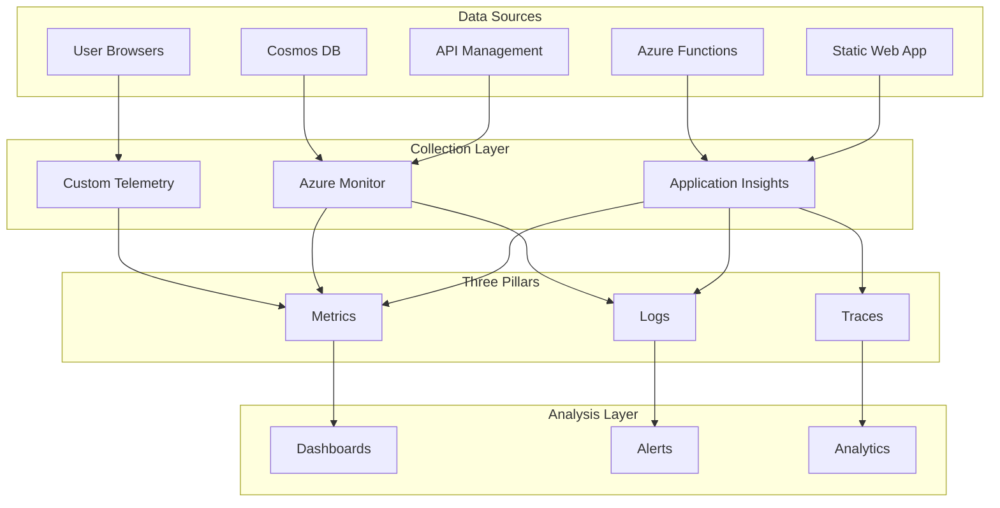

# PCPC Monitoring and Observability Documentation

## Overview

This document outlines the comprehensive monitoring and observability strategy for the Pokemon Card Price Checker (PCPC) application. The monitoring architecture follows the three pillars of observability (metrics, logs, and traces) to provide complete visibility into system health, performance, and user experience.

## Observability Strategy

### Three Pillars Architecture



### Monitoring Scope

| Component | Metrics | Logs | Traces | Tools |
|-----------|---------|------|--------|-------|
| **Frontend** | Core Web Vitals, User actions | Console errors, User events | User journeys | Application Insights, Browser SDK |
| **API Gateway** | Request rates, Response times | Access logs, Policy logs | Request flows | Azure Monitor, APIM Analytics |
| **Backend Functions** | Execution times, Memory usage | Function logs, Errors | Function traces | Application Insights |
| **Database** | RU consumption, Query performance | Query logs, Connection logs | Database operations | Cosmos DB Insights |
| **Infrastructure** | Resource utilization, Health | System events, Deployments | Service dependencies | Azure Monitor |

## Application Insights Implementation

### Frontend Monitoring

#### Web SDK Configuration

```javascript
import { ApplicationInsights } from '@microsoft/applicationinsights-web';

// Initialize Application Insights
const appInsights = new ApplicationInsights({
    config: {
        instrumentationKey: process.env.APPINSIGHTS_INSTRUMENTATION_KEY,
        enableAutoRouteTracking: true,
        enableCorsCorrelation: true,
        enableRequestHeaderTracking: true,
        enableResponseHeaderTracking: true,
        correlationHeaderExcludedDomains: ['*.queue.core.windows.net'],
        disableAjaxTracking: false,
        disableFetchTracking: false,
        enableUnhandledPromiseRejectionTracking: true,
        maxBatchInterval: 10000,
        maxBatchSizeInBytes: 1000000,
        enableDebug: process.env.NODE_ENV === 'development'
    }
});

appInsights.loadAppInsights();

// Track page views
appInsights.trackPageView({
    name: 'Pokemon Card Search',
    uri: window.location.pathname,
    properties: {
        userAgent: navigator.userAgent,
        language: navigator.language
    }
});

// Custom event tracking
export class TelemetryService {
    trackCardSearch(searchTerm, resultCount, responseTime) {
        appInsights.trackEvent({
            name: 'CardSearch',
            properties: {
                searchTerm: searchTerm,
                resultCount: resultCount.toString(),
                responseTime: responseTime.toString()
            },
            measurements: {
                responseTime: responseTime,
                resultCount: resultCount
            }
        });
    }
    
    trackPriceView(cardId, setId, priceType) {
        appInsights.trackEvent({
            name: 'PriceView',
            properties: {
                cardId: cardId,
                setId: setId,
                priceType: priceType
            }
        });
    }
    
    trackError(error, context) {
        appInsights.trackException({
            exception: error,
            properties: {
                context: context,
                timestamp: new Date().toISOString()
            }
        });
    }
}
```

#### Core Web Vitals Tracking

```javascript
// Enhanced performance monitoring
import { getCLS, getFID, getFCP, getLCP, getTTFB } from 'web-vitals';

class WebVitalsMonitor {
    constructor() {
        this.initializeWebVitals();
    }
    
    initializeWebVitals() {
        // Largest Contentful Paint
        getLCP((metric) => {
            appInsights.trackMetric({
                name: 'WebVitals.LCP',
                value: metric.value,
                properties: {
                    id: metric.id,
                    name: metric.name,
                    navigationType: metric.navigationType
                }
            });
        });
        
        // First Input Delay
        getFID((metric) => {
            appInsights.trackMetric({
                name: 'WebVitals.FID',
                value: metric.value,
                properties: {
                    id: metric.id,
                    name: metric.name,
                    eventType: metric.entries[0]?.name
                }
            });
        });
        
        // Cumulative Layout Shift
        getCLS((metric) => {
            appInsights.trackMetric({
                name: 'WebVitals.CLS',
                value: metric.value,
                properties: {
                    id: metric.id,
                    name: metric.name
                }
            });
        });
        
        // First Contentful Paint
        getFCP((metric) => {
            appInsights.trackMetric({
                name: 'WebVitals.FCP',
                value: metric.value
            });
        });
        
        // Time to First Byte
        getTTFB((metric) => {
            appInsights.trackMetric({
                name: 'WebVitals.TTFB',
                value: metric.value
            });
        });
    }
}

// Initialize monitoring
const webVitalsMonitor = new WebVitalsMonitor();
```

### Backend Function Monitoring

#### Function Instrumentation

```typescript
import { app, HttpRequest, HttpResponseInit, InvocationContext } from "@azure/functions";
import { TelemetryClient, SeverityLevel } from "applicationinsights";

// Initialize Application Insights client
const telemetryClient = new TelemetryClient();

// Monitoring wrapper for Azure Functions
export function withMonitoring<T extends any[]>(
    functionName: string,
    handler: (request: HttpRequest, context: InvocationContext, ...args: T) => Promise<HttpResponseInit>
) {
    return async (request: HttpRequest, context: InvocationContext, ...args: T): Promise<HttpResponseInit> => {
        const startTime = Date.now();
        const correlationId = context.invocationId;
        
        // Start operation tracking
        const operation = telemetryClient.startOperation(context, request);
        
        try {
            // Log function start
            context.log(`Function ${functionName} started`, {
                correlationId: correlationId,
                requestUrl: request.url,
                method: request.method
            });
            
            // Execute function
            const result = await handler(request, context, ...args);
            
            // Calculate execution metrics
            const executionTime = Date.now() - startTime;
            const statusCode = result.status || 200;
            
            // Track success metrics
            telemetryClient.trackMetric({
                name: `Function.${functionName}.ExecutionTime`,
                value: executionTime,
                properties: {
                    functionName: functionName,
                    statusCode: statusCode.toString(),
                    correlationId: correlationId
                }
            });
            
            telemetryClient.trackMetric({
                name: `Function.${functionName}.Success`,
                value: 1,
                properties: {
                    functionName: functionName,
                    statusCode: statusCode.toString()
                }
            });
            
            // Log successful completion
            context.log(`Function ${functionName} completed successfully`, {
                correlationId: correlationId,
                executionTime: `${executionTime}ms`,
                statusCode: statusCode
            });
            
            return result;
            
        } catch (error) {
            const executionTime = Date.now() - startTime;
            
            // Track error metrics
            telemetryClient.trackException({
                exception: error as Error,
                properties: {
                    functionName: functionName,
                    correlationId: correlationId,
                    executionTime: executionTime.toString()
                },
                severity: SeverityLevel.Error
            });
            
            telemetryClient.trackMetric({
                name: `Function.${functionName}.Error`,
                value: 1,
                properties: {
                    functionName: functionName,
                    errorType: error.constructor.name,
                    correlationId: correlationId
                }
            });
            
            // Log error
            context.log.error(`Function ${functionName} failed`, {
                correlationId: correlationId,
                error: error.message,
                stack: error.stack,
                executionTime: `${executionTime}ms`
            });
            
            throw error;
            
        } finally {
            // Complete operation tracking
            telemetryClient.completeOperation(operation);
        }
    };
}

// Usage example
export const getSetList = withMonitoring('GetSetList', async (request, context) => {
    // Function implementation
    const sets = await cardService.getAllSets();
    
    return {
        status: 200,
        jsonBody: { sets }
    };
});
```

#### Database Query Monitoring

```typescript
// Cosmos DB monitoring wrapper
export class MonitoredCosmosService {
    private telemetryClient = new TelemetryClient();
    
    async executeQuery<T>(
        containerName: string,
        query: SqlQuerySpec,
        options?: FeedOptions
    ): Promise<{ resources: T[], requestCharge: number }> {
        const startTime = Date.now();
        const operationName = `CosmosDB.${containerName}.Query`;
        
        try {
            const container = this.database.container(containerName);
            const queryIterator = container.items.query<T>(query, options);
            const response = await queryIterator.fetchNext();
            
            const executionTime = Date.now() - startTime;
            
            // Track query metrics
            this.telemetryClient.trackDependency({
                dependencyTypeName: 'Azure DocumentDB',
                name: operationName,
                data: query.query.substring(0, 100) + '...',
                duration: executionTime,
                success: true,
                properties: {
                    containerName: containerName,
                    requestCharge: response.requestCharge.toString(),
                    itemCount: response.resources.length.toString(),
                    partitionKey: options?.partitionKey?.toString()
                }
            });
            
            this.telemetryClient.trackMetric({
                name: 'CosmosDB.RequestCharge',
                value: response.requestCharge,
                properties: {
                    containerName: containerName,
                    queryType: this.categorizeQuery(query.query)
                }
            });
            
            // Log performance warnings
            if (response.requestCharge > 50) {
                this.telemetryClient.trackTrace({
                    message: `High RU consumption detected: ${response.requestCharge} RUs`,
                    severityLevel: SeverityLevel.Warning,
                    properties: {
                        containerName: containerName,
                        query: query.query,
                        requestCharge: response.requestCharge.toString()
                    }
                });
            }
            
            return {
                resources: response.resources,
                requestCharge: response.requestCharge
            };
            
        } catch (error) {
            const executionTime = Date.now() - startTime;
            
            this.telemetryClient.trackDependency({
                dependencyTypeName: 'Azure DocumentDB',
                name: operationName,
                data: query.query.substring(0, 100) + '...',
                duration: executionTime,
                success: false,
                properties: {
                    containerName: containerName,
                    error: error.message
                }
            });
            
            throw error;
        }
    }
    
    private categorizeQuery(query: string): string {
        if (query.includes('WHERE') && query.includes('ORDER BY')) return 'filtered_sorted';
        if (query.includes('WHERE')) return 'filtered';
        if (query.includes('ORDER BY')) return 'sorted';
        if (query.includes('TOP')) return 'limited';
        return 'basic';
    }
}
```

## Custom Dashboards

### System Health Dashboard

**Azure Monitor Workbook Configuration**:
```json
{
  "version": "Notebook/1.0",
  "items": [
    {
      "type": 3,
      "content": {
        "version": "KqlItem/1.0",
        "query": "requests\n| where timestamp > ago(24h)\n| summarize \n    TotalRequests = count(),\n    SuccessRequests = countif(success == true),\n    FailedRequests = countif(success == false),\n    AvgDuration = avg(duration)\n| extend SuccessRate = (SuccessRequests * 100.0) / TotalRequests",
        "size": 3,
        "title": "API Health Overview (24h)",
        "timeContextFromParameter": "TimeRange"
      }
    },
    {
      "type": 3,
      "content": {
        "version": "KqlItem/1.0",
        "query": "performanceCounters\n| where timestamp > ago(1h)\n| where name == \"Memory\\\\Available Bytes\"\n| summarize AvgMemory = avg(value) by bin(timestamp, 5m)\n| render timechart",
        "title": "Memory Usage Trend"
      }
    },
    {
      "type": 3,
      "content": {
        "version": "KqlItem/1.0",
        "query": "customMetrics\n| where name == \"CosmosDB.RequestCharge\"\n| where timestamp > ago(6h)\n| summarize \n    TotalRUs = sum(value),\n    AvgRUs = avg(value),\n    MaxRUs = max(value)\n    by bin(timestamp, 15m)\n| render timechart",
        "title": "Cosmos DB RU Consumption"
      }
    }
  ],
  "styleSettings": {},
  "$schema": "https://github.com/Microsoft/Application-Insights-Workbooks/blob/master/schema/workbook.json"
}
```

### User Experience Dashboard

**Key Performance Indicators**:
```kusto
// Page Load Performance
customMetrics
| where name in ("WebVitals.LCP", "WebVitals.FID", "WebVitals.CLS")
| where timestamp > ago(24h)
| summarize 
    P50 = percentile(value, 50),
    P90 = percentile(value, 90),
    P95 = percentile(value, 95)
    by name
| render table

// User Journey Analysis
customEvents
| where name in ("CardSearch", "PriceView", "SetBrowse")
| where timestamp > ago(24h)
| summarize EventCount = count() by name, bin(timestamp, 1h)
| render timechart

// Error Rate Tracking
exceptions
| where timestamp > ago(24h)
| summarize ErrorCount = count() by bin(timestamp, 15m)
| join kind=leftouter (
    requests
    | where timestamp > ago(24h)
    | summarize RequestCount = count() by bin(timestamp, 15m)
) on timestamp
| extend ErrorRate = (ErrorCount * 100.0) / RequestCount
| render timechart
```

## Alerting Strategy

### Critical Alerts (P0)

#### System Availability Alert

```json
{
  "name": "PCPC System Availability",
  "description": "Triggers when system availability drops below 99%",
  "severity": 0,
  "frequency": "PT5M",
  "timeWindow": "PT15M",
  "criteria": {
    "allOf": [
      {
        "query": "requests | where success == false | summarize FailureRate = (count() * 100.0) / toscalar(requests | count())",
        "timeAggregation": "Average",
        "operator": "GreaterThan",
        "threshold": 1.0
      }
    ]
  },
  "actions": [
    {
      "actionGroupId": "/subscriptions/{subscription}/resourceGroups/{rg}/providers/Microsoft.Insights/actionGroups/critical-alerts",
      "webHookProperties": {
        "severity": "P0",
        "system": "PCPC"
      }
    }
  ]
}
```

#### High Error Rate Alert

```json
{
  "name": "PCPC High Error Rate",
  "description": "Triggers when error rate exceeds 5% over 10 minutes",
  "severity": 1,
  "frequency": "PT1M",
  "timeWindow": "PT10M",
  "criteria": {
    "allOf": [
      {
        "query": "requests | summarize ErrorRate = (countif(success == false) * 100.0) / count()",
        "timeAggregation": "Average",
        "operator": "GreaterThan",
        "threshold": 5.0
      }
    ]
  }
}
```

### Performance Alerts (P1)

#### Response Time Alert

```json
{
  "name": "PCPC Slow Response Time",
  "description": "Triggers when average response time exceeds 2 seconds",
  "severity": 2,
  "frequency": "PT5M",
  "timeWindow": "PT10M",
  "criteria": {
    "allOf": [
      {
        "query": "requests | summarize AvgDuration = avg(duration)",
        "timeAggregation": "Average",
        "operator": "GreaterThan",
        "threshold": 2000
      }
    ]
  }
}
```

#### High Database RU Consumption

```json
{
  "name": "PCPC High RU Consumption",
  "description": "Triggers when average RU consumption exceeds threshold",
  "severity": 2,
  "frequency": "PT5M",
  "timeWindow": "PT15M",
  "criteria": {
    "allOf": [
      {
        "query": "customMetrics | where name == 'CosmosDB.RequestCharge' | summarize AvgRU = avg(value)",
        "timeAggregation": "Average",
        "operator": "GreaterThan",
        "threshold": 100
      }
    ]
  }
}
```

## Health Check Endpoints

### Application Health Checks

```typescript
// Comprehensive health check endpoint
export const healthCheck = async (request: HttpRequest, context: InvocationContext): Promise<HttpResponseInit> => {
    const healthReport = {
        status: 'healthy',
        timestamp: new Date().toISOString(),
        version: process.env.APP_VERSION || 'unknown',
        checks: {}
    };
    
    try {
        // Check Cosmos DB connectivity
        const dbHealth = await checkCosmosDbHealth();
        healthReport.checks.database = dbHealth;
        
        // Check external API connectivity
        const apiHealth = await checkExternalApiHealth();
        healthReport.checks.externalApis = apiHealth;
        
        // Check storage account connectivity
        const storageHealth = await checkStorageHealth();
        healthReport.checks.storage = storageHealth;
        
        // Determine overall health
        const allHealthy = Object.values(healthReport.checks).every(check => check.status === 'healthy');
        healthReport.status = allHealthy ? 'healthy' : 'unhealthy';
        
        return {
            status: allHealthy ? 200 : 503,
            headers: {
                'Content-Type': 'application/json',
                'Cache-Control': 'no-cache'
            },
            jsonBody: healthReport
        };
        
    } catch (error) {
        context.log.error('Health check failed', error);
        
        return {
            status: 503,
            jsonBody: {
                status: 'unhealthy',
                timestamp: new Date().toISOString(),
                error: error.message
            }
        };
    }
};

// Individual health check functions
async function checkCosmosDbHealth(): Promise<HealthCheckResult> {
    try {
        const startTime = Date.now();
        await cosmosClient.getDatabaseAccount();
        const responseTime = Date.now() - startTime;
        
        return {
            status: 'healthy',
            responseTime: responseTime,
            details: 'Cosmos DB connection successful'
        };
    } catch (error) {
        return {
            status: 'unhealthy',
            error: error.message,
            details: 'Cosmos DB connection failed'
        };
    }
}

async function checkExternalApiHealth(): Promise<HealthCheckResult> {
    try {
        const startTime = Date.now();
        const response = await fetch('https://api.pokemontcg.io/v2/sets?pageSize=1');
        const responseTime = Date.now() - startTime;
        
        if (response.ok) {
            return {
                status: 'healthy',
                responseTime: responseTime,
                details: 'External API connectivity verified'
            };
        } else {
            return {
                status: 'unhealthy',
                details: `External API returned status ${response.status}`
            };
        }
    } catch (error) {
        return {
            status: 'unhealthy',
            error: error.message,
            details: 'External API connectivity failed'
        };
    }
}

interface HealthCheckResult {
    status: 'healthy' | 'unhealthy';
    responseTime?: number;
    error?: string;
    details?: string;
}
```

## SLI/SLO Definition

### Service Level Indicators (SLIs)

| SLI | Definition | Target | Measurement |
|-----|------------|--------|-------------|
| **Availability** | Percentage of successful HTTP requests | 99.9% | `(successful_requests / total_requests) * 100` |
| **Latency** | 95th percentile response time | < 1000ms | `percentile(request_duration, 95)` |
| **Error Rate** | Percentage of requests resulting in errors | < 0.5% | `(error_requests / total_requests) * 100` |
| **Throughput** | Requests handled per second | > 100 RPS | `count(requests) / time_window_seconds` |

### Service Level Objectives (SLOs)

**Monthly SLO Targets**:
- **Availability**: 99.9% uptime (43 minutes downtime allowance per month)
- **Performance**: 95% of requests complete within 1 second
- **Error Budget**: 0.1% error rate (allowing ~750 errors per 750,000 requests)
- **Recovery Time**: System restored within 1 hour of incident detection

**SLO Monitoring Query**:
```kusto
// Monthly availability calculation
requests
| where timestamp > startofmonth(now())
| summarize 
    TotalRequests = count(),
    SuccessfulRequests = countif(success == true),
    FailedRequests = countif(success == false)
| extend 
    AvailabilityPercent = (SuccessfulRequests * 100.0) / TotalRequests,
    ErrorBudgetUsed = (FailedRequests * 100.0) / TotalRequests,
    ErrorBudgetRemaining = 0.1 - ((FailedRequests * 100.0) / TotalRequests)
```

## Monitoring Automation

### Synthetic Monitoring

```typescript
// Automated endpoint testing
import { chromium } from 'playwright';

export class SyntheticMonitoring {
    private telemetryClient = new TelemetryClient();
    
    async runHealthChecks(): Promise<void> {
        const browser = await chromium.launch();
        const page = await browser.newPage();
        
        try {
            // Test homepage loading
            await this.testHomepageLoad(page);
            
            // Test search functionality
            await this.testSearchFunctionality(page);
            
            // Test API endpoints
            await this.testApiEndpoints();
            
        } finally {
            await browser.close();
        }
    }
    
    private async testHomepageLoad(page): Promise<void> {
        const startTime = Date.now();
        
        try {
            await page.goto('https://pcpc.maber.io');
            await page.waitForLoadState('networkidle');
            
            const loadTime = Date.now() - startTime;
            
            this.telemetryClient.trackMetric({
                name: 'SyntheticTest.HomepageLoad',
                value: loadTime,
                properties: {
                    testType: 'synthetic',
                    endpoint: 'homepage'
                }
            });
            
        } catch (error) {
            this.telemetryClient.trackException({
                exception: error,
                properties: {
                    testType: 'synthetic',
                    testName: 'HomepageLoad'
                }
            });
        }
    }
    
    private async testApiEndpoints(): Promise<void> {
        const endpoints = [
            'https://pcpc-api.azure-api.net/api/sets',
            'https://pcpc-api.azure-api.net/api/sets/base1/cards'
        ];
        
        for (const endpoint of endpoints) {
            const startTime = Date.now();
            
            try {
                const response = await fetch(endpoint);
                const responseTime = Date.now() - startTime;
                
                this.telemetryClient.trackMetric({
                    name: 'SyntheticTest.APIResponse',
                    value: responseTime,
                    properties: {
                        endpoint: endpoint,
                        statusCode: response.status.toString(),
                        success: response.ok.toString()
                    }
                });
                
            } catch (error) {
                this.telemetryClient.trackException({
                    exception: error,
                    properties: {
                        testType: 'synthetic',
                        endpoint: endpoint
                    }
                });
            }
        }
    }
}
```

## Conclusion

The PCPC monitoring and observability architecture provides comprehensive visibility into system health, performance, and user experience. This monitoring strategy enables proactive issue detection, rapid incident response, and continuous performance optimization.

### Key Monitoring Achievements

- **Full-Stack Visibility**: Complete observability across frontend, backend, and infrastructure
- **Proactive Alerting**: Intelligent alerts based on SLIs and business impact
- **Performance Insights**: Real-time performance monitoring and optimization guidance
- **Automated Health Checks**: Continuous system validation and early issue detection
- **User Experience Tracking**: Core Web Vitals and user journey monitoring

### Next Steps

- Deploy synthetic monitoring across all critical user journeys
- Implement advanced analytics for predictive issue detection
- Establish comprehensive SLO tracking and error budget management
- Create automated runbooks for common incident scenarios
- Expand monitoring to include business metrics and user satisfaction scores
