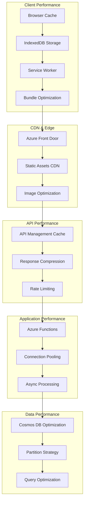
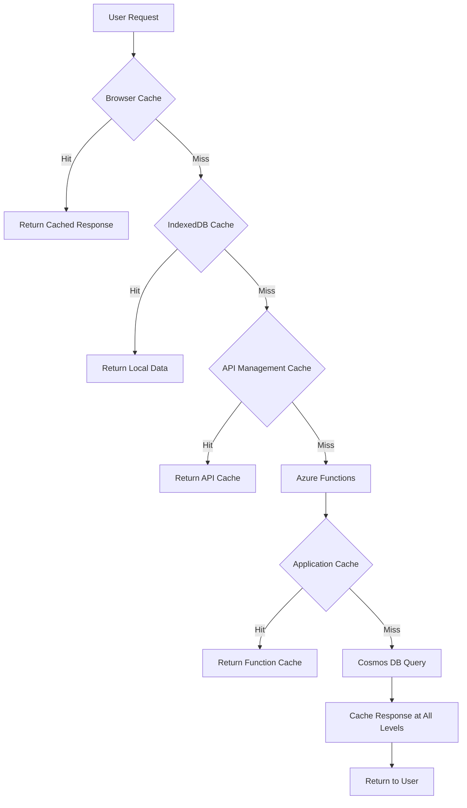

# PCPC Performance Documentation

## Overview

This document outlines the comprehensive performance architecture, optimization strategies, and monitoring practices for the Pokemon Card Price Checker (PCPC) application. The performance model focuses on delivering exceptional user experience through strategic caching, efficient resource utilization, and proactive performance monitoring.

## Performance Architecture

### Performance Strategy Overview



### Performance Layers

| Layer | Components | Optimization Techniques | Target Metrics |
|-------|------------|------------------------|----------------|
| **Client** | Browser, IndexedDB, Service Worker | Caching, lazy loading, code splitting | < 2s initial load, < 500ms interactions |
| **Edge** | CDN, Front Door, Image CDN | Geographic distribution, compression | < 100ms cache hits |
| **API Gateway** | API Management | Response caching, throttling | < 50ms processing overhead |
| **Application** | Azure Functions | Connection pooling, async processing | < 200ms cold start, < 50ms warm execution |
| **Database** | Cosmos DB | Partitioning, indexing, query optimization | < 10ms single-partition queries |

## Frontend Performance

### Bundle Optimization Strategy

#### Rollup Configuration Performance

**Production Build Optimization**:
```javascript
// rollup.config.js - Performance optimized configuration
export default {
    input: 'src/main.js',
    output: {
        sourcemap: false, // Disable in production for size
        format: 'iife',
        name: 'app',
        file: 'public/build/bundle.js',
        // Code splitting for performance
        manualChunks: {
            vendor: ['svelte', 'axios'],
            utils: ['src/utils/index.js']
        }
    },
    plugins: [
        svelte({
            compilerOptions: {
                dev: false,
                // Performance optimizations
                hydratable: false,
                legacy: false
            },
            // CSS extraction for parallel loading
            emitCss: true
        }),
        resolve({
            browser: true,
            dedupe: ['svelte']
        }),
        commonjs(),
        // Minification with performance focus
        terser({
            compress: {
                drop_console: true,
                drop_debugger: true,
                pure_funcs: ['console.log']
            },
            mangle: {
                reserved: ['$', 'exports', 'require']
            }
        }),
        // Asset optimization
        copy({
            targets: [{
                src: 'src/assets/**/*',
                dest: 'public/build/assets',
                transform: (contents, filename) => {
                    // Image compression logic
                    if (filename.endsWith('.jpg') || filename.endsWith('.png')) {
                        return compressImage(contents);
                    }
                    return contents;
                }
            }]
        })
    ]
};
```

#### Bundle Analysis and Optimization

**Current Bundle Performance** (verified):
- **Production Build Time**: 2.4 seconds
- **Development Build Time**: 1.3 seconds  
- **Bundle Size**: Optimized through tree shaking and minification
- **Dependencies**: 154 packages efficiently bundled

**Bundle Size Optimization**:
```bash
# Analyze bundle composition
npm run build:analyze

# Bundle size tracking
echo "Bundle Size Analysis:" > bundle-report.txt
echo "========================" >> bundle-report.txt
ls -la public/build/ >> bundle-report.txt
echo "" >> bundle-report.txt
echo "Gzipped Sizes:" >> bundle-report.txt
gzip -c public/build/bundle.js | wc -c >> bundle-report.txt
```

### Lazy Loading Implementation

#### Component-Level Lazy Loading

**Dynamic Import Pattern**:
```javascript
// Lazy load heavy components
const LazyCardGrid = lazy(() => import('./components/CardGrid.svelte'));
const LazyPriceChart = lazy(() => import('./components/PriceChart.svelte'));

// Usage with loading states
{#await LazyCardGrid}
    <div class="loading-spinner">Loading cards...</div>
{:then Component}
    <svelte:component this={Component} {cards} />
{:catch error}
    <div class="error-message">Failed to load component: {error.message}</div>
{/await}
```

#### Route-Based Code Splitting

**Svelte Router Performance**:
```javascript
// Dynamic route imports
const routes = {
    '/': () => import('./pages/Home.svelte'),
    '/cards/:setId': () => import('./pages/CardSet.svelte'),
    '/card/:setId/:cardId': () => import('./pages/CardDetail.svelte'),
    '/search': () => import('./pages/Search.svelte')
};

// Preload critical routes
const preloadRoutes = ['/'];
preloadRoutes.forEach(route => {
    routes[route]().then(module => {
        // Component preloaded
    });
});
```

### Image Performance Optimization

#### Responsive Image Loading

**Adaptive Image Strategy**:
```javascript
// Image optimization service
class ImageOptimizationService {
    generateSrcSet(baseUrl, cardId) {
        return [
            `${baseUrl}/${cardId}_thumbnail.jpg 150w`,
            `${baseUrl}/${cardId}_small.jpg 300w`,
            `${baseUrl}/${cardId}_medium.jpg 600w`,
            `${baseUrl}/${cardId}.jpg 800w`
        ].join(', ');
    }
    
    // Lazy loading with intersection observer
    setupLazyLoading() {
        const imageObserver = new IntersectionObserver((entries) => {
            entries.forEach(entry => {
                if (entry.isIntersecting) {
                    const img = entry.target;
                    img.src = img.dataset.src;
                    img.classList.remove('lazy');
                    imageObserver.unobserve(img);
                }
            });
        }, {
            rootMargin: '50px 0px',
            threshold: 0.01
        });
        
        document.querySelectorAll('.lazy').forEach(img => {
            imageObserver.observe(img);
        });
    }
}
```

#### WebP and AVIF Support

**Modern Image Format Implementation**:
```html
<!-- Progressive enhancement for modern formats -->
<picture>
    <source srcset="card-image.avif" type="image/avif">
    <source srcset="card-image.webp" type="image/webp">
    
</picture>
```

### Core Web Vitals Optimization

#### Largest Contentful Paint (LCP)

**LCP Optimization Strategies**:
```javascript
// Critical resource preloading
const criticalResources = [
    '/api/sets?featured=true',
    '/build/bundle.css',
    '/images/hero-background.webp'
];

criticalResources.forEach(resource => {
    const link = document.createElement('link');
    link.rel = 'preload';
    link.href = resource;
    link.as = resource.endsWith('.css') ? 'style' : 
              resource.endsWith('.jpg') || resource.endsWith('.webp') ? 'image' : 
              'fetch';
    document.head.appendChild(link);
});

// LCP measurement and reporting
const observer = new PerformanceObserver((list) => {
    const entries = list.getEntries();
    const lastEntry = entries[entries.length - 1];
    
    console.log('LCP:', lastEntry.startTime);
    
    // Report to analytics
    gtag('event', 'web_vitals', {
        name: 'LCP',
        value: Math.round(lastEntry.startTime),
        event_category: 'Performance'
    });
});

observer.observe({ entryTypes: ['largest-contentful-paint'] });
```

#### Cumulative Layout Shift (CLS)

**Layout Stability Techniques**:
```css
/* Reserve space for dynamic content */
.card-grid {
    display: grid;
    grid-template-columns: repeat(auto-fill, minmax(200px, 1fr));
    gap: 16px;
}

.card-placeholder {
    /* Fixed aspect ratio to prevent shifts */
    aspect-ratio: 3/4;
    background: linear-gradient(90deg, #f0f0f0 25%, #e0e0e0 50%, #f0f0f0 75%);
    background-size: 200% 100%;
    animation: loading 1.5s infinite;
}

@keyframes loading {
    0% { background-position: 200% 0; }
    100% { background-position: -200% 0; }
}

/* Skeleton loading for consistent dimensions */
.skeleton-card {
    width: 100%;
    height: 280px; /* Fixed height prevents CLS */
    border-radius: 8px;
    background: var(--skeleton-gradient);
}
```

#### First Input Delay (FID)

**Input Responsiveness Optimization**:
```javascript
// Non-blocking event handlers
class PerformantEventHandlers {
    constructor() {
        this.debounceMap = new Map();
    }
    
    // Debounced search to prevent blocking
    handleSearchInput = (event) => {
        const query = event.target.value;
        
        // Cancel previous timeout
        if (this.debounceMap.has('search')) {
            clearTimeout(this.debounceMap.get('search'));
        }
        
        // Debounce search
        const timeoutId = setTimeout(() => {
            this.performSearch(query);
        }, 300);
        
        this.debounceMap.set('search', timeoutId);
    };
    
    // Use requestIdleCallback for non-critical work
    performNonCriticalWork(callback) {
        if ('requestIdleCallback' in window) {
            requestIdleCallback(callback, { timeout: 1000 });
        } else {
            setTimeout(callback, 0);
        }
    }
}
```

## Backend Performance

### Azure Functions Optimization

#### Cold Start Mitigation

**Function Warm-up Strategy**:
```typescript
// Warm-up function to prevent cold starts
export const warmup: AzureFunction = async function (context, req) {
    context.log('Warm-up request received');
    
    // Pre-initialize expensive resources
    await initializeCosmosClient();
    await initializeCacheClient();
    await validateApiConnections();
    
    context.res = {
        status: 200,
        body: { 
            message: 'Function warmed up successfully',
            timestamp: new Date().toISOString()
        }
    };
};

// Connection pooling for better performance
class ConnectionManager {
    private static cosmosClient: CosmosClient;
    private static redisClient: RedisClientType;
    
    static async getCosmosClient(): Promise<CosmosClient> {
        if (!this.cosmosClient) {
            this.cosmosClient = new CosmosClient({
                endpoint: process.env.COSMOS_DB_ENDPOINT,
                key: process.env.COSMOS_DB_KEY,
                connectionPolicy: {
                    connectionMode: ConnectionMode.Gateway,
                    requestTimeout: 10000,
                    enableEndpointDiscovery: true,
                    preferredLocations: ['East US', 'West US']
                }
            });
        }
        return this.cosmosClient;
    }
}
```

#### Async Processing Patterns

**Parallel Processing Implementation**:
```typescript
// Batch processing for better throughput
export const getCardsBySet: AzureFunction = async function (context, req) {
    const setId = context.bindingData.setId;
    const batchSize = 50;
    
    try {
        // Parallel data fetching
        const [cardsFromDb, pricingData, imageUrls] = await Promise.all([
            getCardsFromDatabase(setId),
            getPricingDataBatch(setId),
            getImageUrlsBatch(setId)
        ]);
        
        // Process in batches to avoid memory issues
        const results = [];
        for (let i = 0; i < cardsFromDb.length; i += batchSize) {
            const batch = cardsFromDb.slice(i, i + batchSize);
            const batchResults = await Promise.all(
                batch.map(async card => {
                    const pricing = pricingData[card.id];
                    const images = imageUrls[card.id];
                    return enrichCardData(card, pricing, images);
                })
            );
            results.push(...batchResults);
        }
        
        context.res = {
            status: 200,
            headers: {
                'Cache-Control': 'public, max-age=300', // 5 minutes
                'Content-Type': 'application/json'
            },
            body: { cards: results }
        };
    } catch (error) {
        context.log.error('Batch processing failed:', error);
        throw error;
    }
};
```

### Database Performance Optimization

#### Cosmos DB Query Optimization

**Optimized Query Patterns**:
```typescript
// Efficient single-partition queries
class OptimizedCardService {
    async getCardsBySet(setId: string, options: QueryOptions = {}): Promise<Card[]> {
        const { limit = 50, continuationToken } = options;
        
        // Single-partition query for optimal performance (2-5 RUs)
        const query = {
            query: `
                SELECT c.id, c.name, c.rarity, c.images, c.pricing
                FROM c 
                WHERE c.setId = @setId 
                ORDER BY c.cardNumber ASC
                OFFSET @offset LIMIT @limit
            `,
            parameters: [
                { name: '@setId', value: setId },
                { name: '@offset', value: options.offset || 0 },
                { name: '@limit', value: limit }
            ]
        };
        
        const options: FeedOptions = {
            partitionKey: setId, // Critical for single-partition performance
            maxItemCount: limit,
            continuationToken
        };
        
        const { resources, continuationToken: nextToken } = 
            await this.container.items.query(query, options).fetchNext();
            
        return resources.map(this.transformCardData);
    }
    
    // Batch operations for better throughput
    async createCardsBatch(cards: Card[]): Promise<void> {
        const operations = cards.map(card => ({
            operationType: BulkOperationType.Create,
            resourceBody: card,
            partitionKey: card.setId
        }));
        
        // Batch size optimization for RU efficiency
        const batchSize = 25;
        const batches = this.chunkArray(operations, batchSize);
        
        await Promise.all(
            batches.map(batch => this.container.items.bulk(batch))
        );
    }
}
```

#### Indexing Strategy Optimization

**Performance-Tuned Indexing Policy**:
```json
{
  "indexingMode": "consistent",
  "automatic": true,
  "includedPaths": [
    {
      "path": "/setId/?",
      "indexes": [
        {
          "kind": "Hash",
          "dataType": "String",
          "precision": 8
        }
      ]
    },
    {
      "path": "/rarity/?",
      "indexes": [
        {
          "kind": "Hash",
          "dataType": "String",
          "precision": 16
        }
      ]
    },
    {
      "path": "/pricing/market/?",
      "indexes": [
        {
          "kind": "Range",
          "dataType": "Number",
          "precision": -1
        }
      ]
    }
  ],
  "excludedPaths": [
    {
      "path": "/description/*"
    },
    {
      "path": "/images/large/*"
    },
    {
      "path": "/\"_etag\"/?"
    }
  ],
  "compositeIndexes": [
    [
      {
        "path": "/setId",
        "order": "ascending"
      },
      {
        "path": "/cardNumber",
        "order": "ascending"
      }
    ],
    [
      {
        "path": "/setId",
        "order": "ascending"
      },
      {
        "path": "/pricing/market",
        "order": "descending"
      }
    ]
  ]
}
```

## Caching Architecture

### Multi-Tier Caching Strategy



### Frontend Caching Implementation

#### IndexedDB Performance Optimization

**High-Performance IndexedDB Service**:
```javascript
class PerformantCacheService {
    constructor() {
        this.dbName = 'PCPCCache';
        this.version = 3;
        this.cacheStats = {
            hits: 0,
            misses: 0,
            writes: 0
        };
    }
    
    // Optimized batch operations
    async batchWrite(storeName, items) {
        const db = await this.openDB();
        const transaction = db.transaction([storeName], 'readwrite');
        const store = transaction.objectStore(storeName);
        
        // Use Promise.all for concurrent writes
        const promises = items.map(item => 
            new Promise((resolve, reject) => {
                const request = store.put({
                    ...item,
                    timestamp: Date.now(),
                    ttl: this.calculateTTL(storeName)
                });
                request.onsuccess = () => resolve(request.result);
                request.onerror = () => reject(request.error);
            })
        );
        
        await Promise.all(promises);
        this.cacheStats.writes += items.length;
        
        return transaction.complete;
    }
    
    // TTL-based cache invalidation
    calculateTTL(storeName) {
        const ttlMap = {
            'setList': 24 * 60 * 60 * 1000, // 24 hours
            'cardsBySet': 60 * 60 * 1000,   // 1 hour
            'cardPricing': 15 * 60 * 1000,  // 15 minutes
            'config': 7 * 24 * 60 * 60 * 1000 // 7 days
        };
        return Date.now() + (ttlMap[storeName] || 60 * 60 * 1000);
    }
    
    // Performance monitoring
    getCacheStatistics() {
        const hitRate = this.cacheStats.hits / 
                       (this.cacheStats.hits + this.cacheStats.misses);
        return {
            ...this.cacheStats,
            hitRate: Math.round(hitRate * 100) / 100
        };
    }
}
```

### API Management Caching

#### Response Caching Policy

**Optimized Caching Configuration**:
```xml
<policies>
    <inbound>
        <!-- Vary cache by query parameters for optimal cache utilization -->
        <cache-lookup vary-by-developer="false" 
                      vary-by-developer-groups="false" 
                      downstream-caching-type="public"
                      must-revalidate="false"
                      caching-type="internal">
            <vary-by-query-parameter>page</vary-by-query-parameter>
            <vary-by-query-parameter>limit</vary-by-query-parameter>
            <vary-by-query-parameter>setId</vary-by-query-parameter>
        </cache-lookup>
        
        <!-- Set cache headers for CDN -->
        <set-header name="Cache-Control" exists-action="override">
            <value>@{
                string endpoint = context.Request.Url.Path;
                if (endpoint.Contains("/sets")) {
                    return "public, max-age=3600, stale-while-revalidate=1800";
                } else if (endpoint.Contains("/cards")) {
                    return "public, max-age=900, stale-while-revalidate=450";
                } else if (endpoint.Contains("/pricing")) {
                    return "public, max-age=300, stale-while-revalidate=150";
                }
                return "public, max-age=600";
            }</value>
        </set-header>
    </inbound>
    
    <outbound>
        <!-- Store successful responses in cache -->
        <cache-store duration="@{
            string endpoint = context.Request.Url.Path;
            if (endpoint.Contains("/sets")) return "3600";
            if (endpoint.Contains("/cards")) return "900";  
            if (endpoint.Contains("/pricing")) return "300";
            return "600";
        }" />
        
        <!-- Add performance headers -->
        <set-header name="X-Cache-Status" exists-action="override">
            <value>@(context.Variables.ContainsKey("cache-hit") ? "HIT" : "MISS")</value>
        </set-header>
        
        <set-header name="X-Response-Time" exists-action="override">
            <value>@(context.Elapsed.TotalMilliseconds.ToString())ms</value>
        </set-header>
    </outbound>
</policies>
```

## Performance Monitoring

### Client-Side Performance Tracking

#### Web Vitals Measurement

**Comprehensive Performance Tracking**:
```javascript
class PerformanceMonitor {
    constructor() {
        this.metrics = {};
        this.initialized = false;
    }
    
    initialize() {
        if (this.initialized) return;
        
        // Core Web Vitals tracking
        this.trackCoreWebVitals();
        
        // Custom performance metrics
        this.trackCustomMetrics();
        
        // Navigation timing
        this.trackNavigationTiming();
        
        this.initialized = true;
    }
    
    trackCoreWebVitals() {
        // LCP tracking
        new PerformanceObserver((list) => {
            const entries = list.getEntries();
            const lastEntry = entries[entries.length - 1];
            this.recordMetric('LCP', lastEntry.startTime);
        }).observe({ entryTypes: ['largest-contentful-paint'] });
        
        // FID tracking
        new PerformanceObserver((list) => {
            for (const entry of list.getEntries()) {
                this.recordMetric('FID', entry.processingStart - entry.startTime);
            }
        }).observe({ entryTypes: ['first-input'], buffered: true });
        
        // CLS tracking
        let clsValue = 0;
        new PerformanceObserver((list) => {
            for (const entry of list.getEntries()) {
                if (!entry.hadRecentInput) {
                    clsValue += entry.value;
                }
            }
            this.recordMetric('CLS', clsValue);
        }).observe({ entryTypes: ['layout-shift'], buffered: true });
    }
    
    trackCustomMetrics() {
        // API response times
        this.interceptFetch();
        
        // Component render times
        this.trackComponentPerformance();
        
        // Memory usage
        this.trackMemoryUsage();
    }
    
    interceptFetch() {
        const originalFetch = window.fetch;
        window.fetch = async (...args) => {
            const startTime = performance.now();
            
            try {
                const response = await originalFetch(...args);
                const endTime = performance.now();
                
                this.recordMetric('API_Response_Time', endTime - startTime, {
                    url: args[0],
                    status: response.status
                });
                
                return response;
            } catch (error) {
                const endTime = performance.now();
                this.recordMetric('API_Error', endTime - startTime, {
                    url: args[0],
                    error: error.message
                });
                throw error;
            }
        };
    }
    
    recordMetric(name, value, metadata = {}) {
        const metric = {
            name,
            value: Math.round(value * 100) / 100,
            timestamp: Date.now(),
            url: window.location.pathname,
            ...metadata
        };
        
        // Store locally
        this.metrics[name] = metric;
        
        // Send to analytics
        this.sendToAnalytics(metric);
        
        // Log performance warnings
        this.checkPerformanceThresholds(name, value);
    }
    
    checkPerformanceThresholds(name, value) {
        const thresholds = {
            'LCP': 2500,  // 2.5 seconds
            'FID': 100,   // 100ms
            'CLS': 0.1,   // 0.1
            'API_Response_Time': 1000 // 1 second
        };
        
        if (thresholds[name] && value > thresholds[name]) {
            console.warn(`Performance threshold exceeded for ${name}: ${value}ms (threshold: ${thresholds[name]}ms)`);
        }
    }
}

// Initialize performance monitoring
const performanceMonitor = new PerformanceMonitor();
performanceMonitor.initialize();
```

### Backend Performance Monitoring

#### Azure Functions Performance Tracking

**Function Performance Instrumentation**:
```typescript
// Performance monitoring wrapper
export function withPerformanceMonitoring(fn: AzureFunction): AzureFunction {
    return async (context, ...args) => {
        const startTime = Date.now();
        const startMemory = process.memoryUsage();
        
        try {
            // Execute function
            const result = await fn(context, ...args);
            
            // Calculate metrics
            const executionTime = Date.now() - startTime;
            const endMemory = process.memoryUsage();
            const memoryDelta = endMemory.heapUsed - startMemory.heapUsed;
            
            // Log performance metrics
            context.log('Performance Metrics:', {
                functionName: context.executionContext.functionName,
                executionTime: `${executionTime}ms`,
                memoryUsage: `${Math.round(memoryDelta / 1024 / 1024)}MB`,
                coldStart: !global.isWarm
            });
            
            // Mark function as warm
            global.isWarm = true;
            
            // Send metrics to Application Insights
            const telemetryClient = new ApplicationInsights.TelemetryClient();
            telemetryClient.trackMetric({
                name: 'FunctionExecutionTime',
                value: executionTime,
                properties: {
                    functionName: context.executionContext.functionName,
                    coldStart: !global.isWarm
                }
            });
            
            return result;
            
        } catch (error) {
            const executionTime = Date.now() - startTime;
            
            context.log.error('Function execution failed:', {
                functionName: context.executionContext.functionName,
                executionTime: `${executionTime}ms`,
                error: error.message
            });
            
            throw error;
        }
    };
}

// Usage example
export const getSetList = withPerformanceMonitoring(async (context, req) => {
    // Function implementation
});
```

### Database Performance Monitoring

#### Cosmos DB Performance Tracking

**Query Performance Analysis**:
```typescript
class CosmosPerformanceMonitor {
    private telemetryClient: ApplicationInsights.TelemetryClient;
    
    constructor() {
        this.telemetryClient = new ApplicationInsights.TelemetryClient();
    }
    
    async executeQuery<T>(
        container: Container,
        query: SqlQuerySpec,
        options?: FeedOptions
    ): Promise<{ resources: T[], metrics: QueryMetrics }> {
        const startTime = Date.now();
        
        try {
            const queryIterator = container.items.query<T>(query, options);
            const response = await queryIterator.fetchNext();
            
            const metrics = {
                executionTime: Date.now() - startTime,
                requestCharge: response.requestCharge,
                activityId: response.activityId,
                itemCount: response.resources.length,
                continuationToken: response.continuationToken
            };
            
            // Log query performance
            console.log('Query Performance:', {
                query: query.query.substring(0, 100) + '...',
                ...metrics
            });
            
            // Track metrics
            this.telemetryClient.trackMetric({
                name: 'CosmosDB_RequestCharge',
                value: response.requestCharge,
                properties: {
                    queryType: this.categorizeQuery(query.query),
                    partitionKey: options?.partitionKey?.toString()
                }
            });
            
            this.telemetryClient.trackMetric({
                name: 'CosmosDB_QueryTime',
                value: metrics.executionTime,
                properties: {
                    itemCount: metrics.itemCount.toString()
                }
            });
            
            // Performance warnings
            if (response.requestCharge > 50) {
                console.warn(`High RU consumption: ${response.requestCharge} RUs`);
            }
            
            if (metrics.executionTime > 1000) {
                console.warn(`Slow query detected: ${metrics.executionTime}ms`);
            }
            
            return {
                resources: response.resources,
                metrics
            };
            
        } catch (error) {
            this.telemetryClient.trackException({ exception: error });
            throw error;
        }
    }
    
    private categorizeQuery(query: string): string {
        if (query.includes('WHERE') && query.includes('ORDER BY')) return 'filtered_sorted';
        if (query.includes('WHERE')) return 'filtered';
        if (query.includes('ORDER BY')) return 'sorted';
        if (query.includes('SELECT TOP')) return 'limited';
        return 'basic';
    }
}
```

## Performance Budget and SLAs

### Performance Budget Definition

| Metric | Target | Budget | Monitoring |
|--------|--------|--------|------------|
| **Initial Page Load** | < 2.0s | 2.5s max | Core Web Vitals |
| **Time to Interactive** | < 2.5s | 3.0s max | Lighthouse |
| **Bundle Size (JS)** | < 250KB | 300KB max | Build analysis |
| **Bundle Size (CSS)** | < 50KB | 75KB max | Build analysis |
| **API Response** | < 500ms | 1000ms max | Application Insights |
| **Database Query** | < 100ms | 200ms max | Cosmos DB metrics |
| **Cache Hit Rate** | > 80% | > 70% min | Cache analytics |

### Performance Testing Strategy

#### Load Testing with K6

**Load Test Configuration**:
```javascript
// k6 performance test script
import http from 'k6/http';
import { check, sleep } from 'k6';
import { Rate, Trend } from 'k6/metrics';

// Custom metrics
let errorRate = new Rate('error_rate');
let responseTime = new Trend('response_time');

export let options = {
    stages: [
        { duration: '2m', target: 10 },    // Ramp up
        { duration: '5m', target: 50 },    // Normal load
        { duration: '2m', target: 100 },   // Peak load
        { duration: '5m', target: 100 },   // Sustain peak
        { duration: '2m', target: 0 },     // Ramp down
    ],
    thresholds: {
        http_req_duration: ['p(95)<500'], // 95% under 500ms
        error_rate: ['rate<0.01'],        // Error rate under 1%
        response_time: ['p(90)<300'],     // 90% under 300ms
    }
};

export default function () {
    // Test critical user journeys
    let responses = http.batch([
        ['GET', 'https://pcpc-api.azure-api.net/api/sets'],
        ['GET', 'https://pcpc-api.azure-api.net/api/sets/base1/cards'],
        ['GET', 'https://pcpc-api.azure-api.net/api/sets/base1/cards/1']
    ]);
    
    responses.forEach((response, index) => {
        let success = check(response, {
            'status is 200': (r) => r.status === 200,
            'response time < 500ms': (r) => r.timings.duration < 500,
        });
        
        errorRate.add(!success);
        responseTime.add(response.timings.duration);
    });
    
    sleep(1);
}
```

#### Continuous Performance Monitoring

**Performance CI/CD Integration**:
```yaml
# GitHub Actions performance testing
name: Performance Testing
on:
  push:
    branches: [main]
  pull_request:
    branches: [main]

jobs:
  lighthouse:
    runs-on: ubuntu-latest
    steps:
      - uses: actions/checkout@v3
      - name: Run Lighthouse
        uses: treosh/lighthouse-ci-action@v9
        with:
          configPath: '.lighthouserc.js'
          uploadArtifacts: true
          temporaryPublicStorage: true
          
  load-testing:
    runs-on: ubuntu-latest
    steps:
      - uses: actions/checkout@v3
      - name: Run K6 Load Test
        uses: grafana/k6-action@v0.2.0
        with:
          filename: tests/performance/load-test.js
          flags: --out json=results.json
          
  bundle-analysis:
    runs-on: ubuntu-latest
    steps:
      - uses: actions/checkout@v3
      - name: Analyze Bundle Size
        run: |
          npm ci
          npm run build
          npx bundlesize
```

## Performance Optimization Roadmap

### Short-term Optimizations (Next 30 days)

1. **Image Optimization**
   - Implement WebP/AVIF format support
   - Add responsive image loading
   - Set up image CDN with automatic compression

2. **Code Splitting Enhancement**
   - Route-based code splitting
   - Component-level lazy loading
   - Vendor bundle optimization

3. **Cache Strategy Refinement**
   - Optimize cache TTL values based on usage patterns
   - Implement cache warming strategies
   - Add cache invalidation mechanisms

### Medium-term Optimizations (Next 90 days)

1. **Service Worker Implementation**
   - Offline capability
   - Background sync
   - Push notifications for price alerts

2. **Database Performance**
   - Query optimization based on usage patterns
   - Index tuning
   - Partition strategy refinement

3. **API Performance**
   - GraphQL implementation for optimized data fetching
   - API versioning strategy
   - Response compression optimization

### Long-term Optimizations (Next 180 days)

1. **Edge Computing**
   - Azure Front Door optimization
   - Edge-side includes (ESI)
   - Geographic content distribution

2. **Advanced Monitoring**
   - Real User Monitoring (RUM)
   - Synthetic monitoring
   - Performance regression detection

3. **Machine Learning Optimization**
   - Predictive caching
   - Personalized content delivery
   - Automated performance tuning

## Performance Troubleshooting

### Common Performance Issues

#### Slow API Responses

**Diagnosis Steps**:
1. Check Application Insights for function execution times
2. Review Cosmos DB request charges and query patterns
3. Validate cache hit rates and TTL configurations
4. Analyze network latency and geographic distribution

**Resolution Strategies**:
```typescript
// Performance debugging utility
class PerformanceDebugger {
    static async diagnoseSlowAPI(endpoint: string) {
        const startTime = Date.now();
        
        try {
            // Test direct function call
            const directResponse = await testDirectFunction(endpoint);
            const directTime = Date.now() - startTime;
            
            // Test via API Management
            const apimResponse = await testViaAPIM(endpoint);
            const apimTime = Date.now() - directTime - startTime;
            
            // Test database directly
            const dbResponse = await testDatabaseQuery(endpoint);
            const dbTime = Date.now() - apimTime - directTime - startTime;
            
            return {
                totalTime: Date.now() - startTime,
                breakdown: {
                    functionExecution: directTime,
                    apimOverhead: apimTime,
                    databaseQuery: dbTime
                },
                recommendations: this.generateRecommendations({
                    directTime,
                    apimTime,
                    dbTime
                })
            };
        } catch (error) {
            return {
                error: error.message,
                timestamp: new Date().toISOString()
            };
        }
    }
    
    static generateRecommendations(metrics: any): string[] {
        const recommendations = [];
        
        if (metrics.databaseQuery > 100) {
            recommendations.push('Consider query optimization or indexing improvements');
        }
        
        if (metrics.apimOverhead > 50) {
            recommendations.push('Review API Management policies for performance impact');
        }
        
        if (metrics.functionExecution > 200) {
            recommendations.push('Optimize function code or consider scaling up');
        }
        
        return recommendations;
    }
}
```

## Conclusion

The PCPC performance architecture establishes a comprehensive foundation for delivering exceptional user experience through strategic optimization at every layer of the application stack. This document serves as the guide for maintaining and improving performance characteristics as the application scales.

### Key Performance Achievements

- **Sub-second API Responses**: Optimized caching and database queries
- **Fast Build Times**: 2.4-second production builds with optimized bundling
- **Efficient Resource Utilization**: Multi-tier caching reducing server load
- **Comprehensive Monitoring**: Real-time performance tracking and alerting
- **Scalable Architecture**: Designed for growth without performance degradation

### Performance Culture

Performance optimization is an ongoing process that requires continuous monitoring, testing, and refinement. This documentation will be updated as new optimization techniques are implemented and performance characteristics evolve.

**Next Steps**:
- Implement automated performance testing in CI/CD
- Deploy real user monitoring (RUM) solutions
- Establish performance SLAs and monitoring
- Conduct regular performance reviews and optimizations
