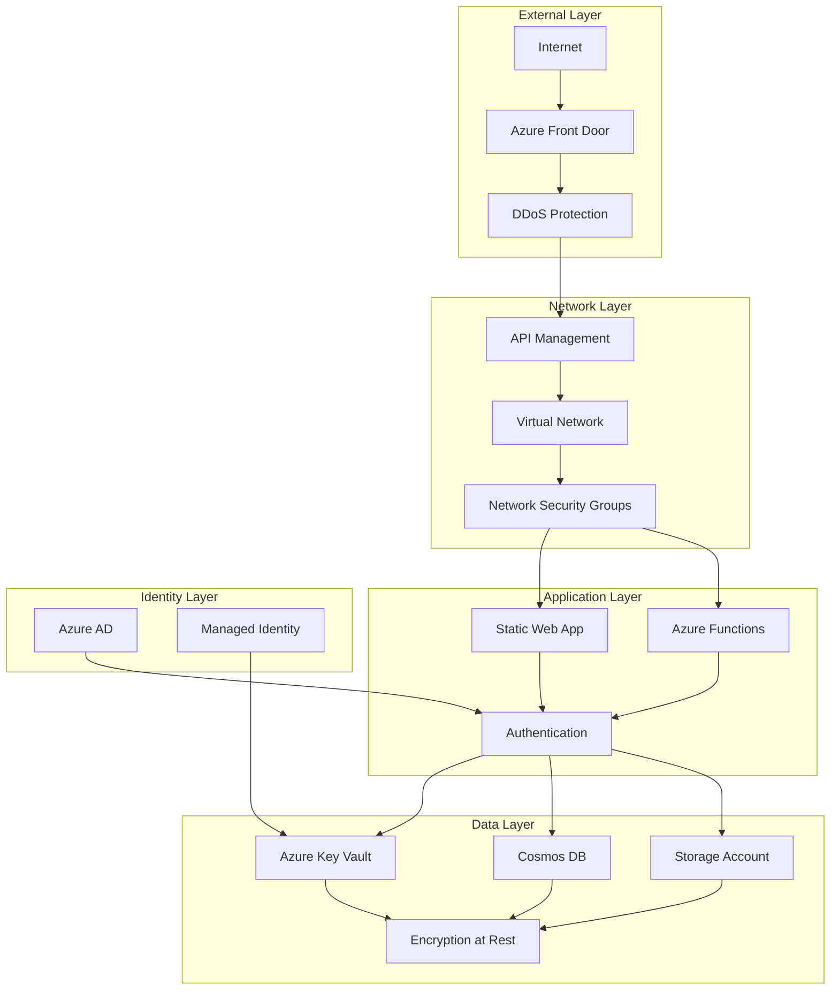
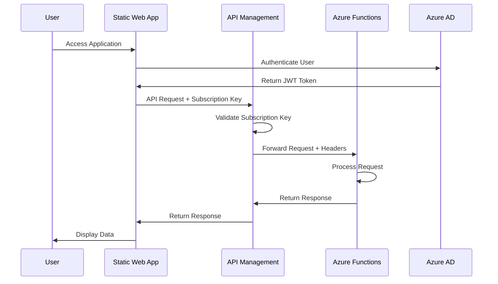
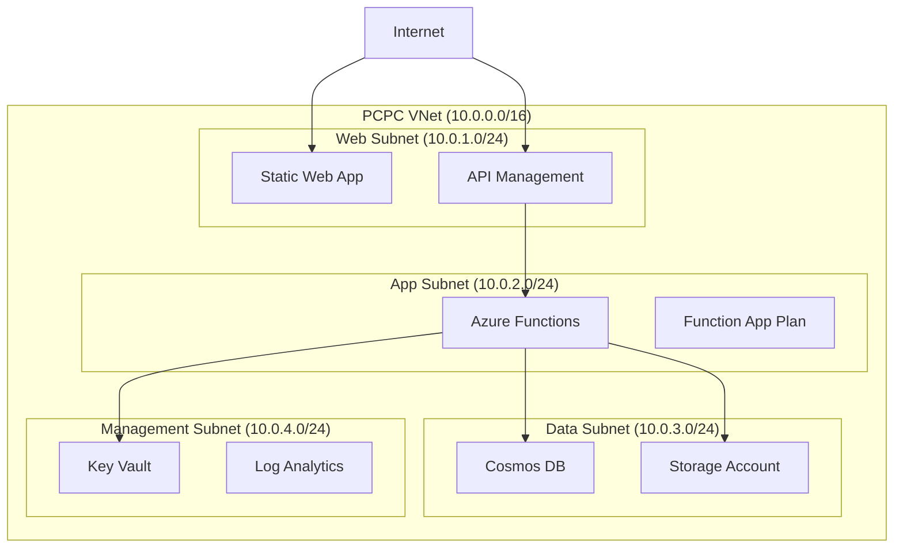
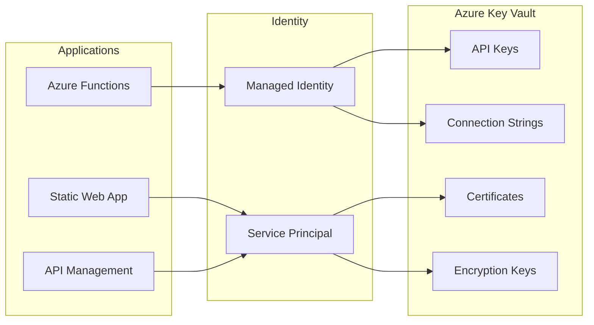

# PCPC Security Documentation

## Overview

This document outlines the comprehensive security architecture, policies, and procedures for the Pokemon Card Price Checker (PCPC) application. The security model follows enterprise-grade practices with defense-in-depth principles, ensuring data protection, system integrity, and compliance with industry standards.

## Security Architecture

### Defense-in-Depth Strategy



### Security Domains

| Domain | Components | Security Controls |
|--------|------------|------------------|
| **Network Security** | VNet, NSG, Front Door | Network isolation, DDoS protection, WAF |
| **Application Security** | APIM, Functions, SWA | Authentication, authorization, input validation |
| **Data Security** | Cosmos DB, Storage | Encryption, access control, audit logging |
| **Identity Security** | Azure AD, Managed Identity | Multi-factor authentication, RBAC |
| **Infrastructure Security** | Resource Groups, RBAC | Least privilege, resource isolation |

## Authentication and Authorization

### Authentication Flow



### API Management Security

#### Subscription-Based Authentication

**Implementation**:
```xml
<!-- API Management Policy -->
<policies>
    <inbound>
        <validate-headers specified-header-action="prevent" unspecified-header-action="pass-through" errors-variable-name="requestHeadersValidation">
            <header name="Ocp-Apim-Subscription-Key" match="required">
                <value>@(context.Subscription?.Key ?? "")</value>
            </header>
        </validate-headers>
        <rate-limit calls="300" renewal-period="60" />
        <quota calls="10000" renewal-period="3600" />
    </inbound>
</policies>
```

**Security Features**:
- **Subscription Keys**: Required for all API access
- **Rate Limiting**: 300 calls per minute, 10,000 calls per hour
- **Request Throttling**: Automatic throttling under high load
- **IP Filtering**: Configurable IP whitelist/blacklist
- **CORS Policy**: Restricted origin validation

#### Azure Functions Authorization

**Function-Level Security**:
```typescript
import { AuthorizationLevel } from '@azure/functions';

export const httpTrigger: AzureFunction = async function (context, req) {
    // Function configured with authLevel: 'function'
    // Requires x-functions-key header or code query parameter
    
    // Additional custom authorization logic
    if (!validateRequestOrigin(req)) {
        context.res = {
            status: 403,
            body: { error: "Forbidden: Invalid request origin" }
        };
        return;
    }
    
    // Process authorized request
};
```

### Azure Active Directory Integration

#### Planned Implementation

**Authentication Providers**:
- **Azure AD B2C**: Consumer identity management
- **Microsoft Identity Platform**: Enterprise integration
- **Social Logins**: Google, GitHub, Facebook integration

**Authorization Model**:
```json
{
  "roles": [
    {
      "name": "User",
      "permissions": ["read:cards", "read:sets", "read:pricing"]
    },
    {
      "name": "Premium",
      "permissions": ["read:cards", "read:sets", "read:pricing", "read:historical", "read:analytics"]
    },
    {
      "name": "Admin",
      "permissions": ["*"]
    }
  ]
}
```

## Data Protection

### Encryption Strategy

#### Encryption at Rest

**Azure Cosmos DB**:
- **Service-Managed Encryption**: Automatic encryption with Microsoft-managed keys
- **Customer-Managed Keys**: Optional integration with Azure Key Vault
- **Double Encryption**: Additional infrastructure-level encryption
- **Backup Encryption**: Encrypted backups with same key management

**Azure Storage Account**:
- **Storage Service Encryption (SSE)**: AES-256 encryption by default
- **Key Management**: Integration with Azure Key Vault for customer-managed keys
- **Blob Encryption**: Individual blob encryption with unique keys
- **Archive Encryption**: Long-term retention with encryption

**Configuration Example**:
```hcl
# Terraform configuration for encrypted storage
resource "azurerm_storage_account" "main" {
  name                     = var.storage_account_name
  resource_group_name      = var.resource_group_name
  location                 = var.location
  account_tier             = "Standard"
  account_replication_type = "LRS"
  
  # Encryption configuration
  encryption {
    services {
      blob {
        enabled = true
        key_type = "Account"
      }
      file {
        enabled = true
        key_type = "Account"
      }
    }
    source = "Microsoft.Storage"
  }
  
  # Advanced threat protection
  enable_advanced_threat_protection = true
}
```

#### Encryption in Transit

**HTTPS Enforcement**:
- **Static Web App**: Automatic HTTPS with managed certificates
- **API Management**: TLS 1.2+ enforced for all endpoints
- **Azure Functions**: HTTPS-only configuration
- **Cosmos DB**: TLS encryption for all database connections

**TLS Configuration**:
```hcl
resource "azurerm_function_app" "main" {
  name                = var.function_app_name
  location            = var.location
  resource_group_name = var.resource_group_name
  app_service_plan_id = azurerm_app_service_plan.main.id
  
  # HTTPS configuration
  https_only = true
  
  site_config {
    min_tls_version = "1.2"
    ftps_state     = "Disabled"
    
    # Security headers
    cors {
      allowed_origins     = var.allowed_origins
      allowed_methods     = ["GET", "POST", "OPTIONS"]
      allowed_headers     = ["Content-Type", "Authorization"]
      exposed_headers     = ["Content-Length"]
      max_age_in_seconds  = 3600
      support_credentials = false
    }
  }
}
```

### Data Classification and Handling

#### Data Classification Matrix

| Data Type | Classification | Encryption | Access Control | Retention |
|-----------|---------------|------------|----------------|-----------|
| **Card Pricing** | Internal | At Rest + Transit | Subscription Key | 30 days cache |
| **User Preferences** | Internal | At Rest + Transit | User-scoped | Account lifetime |
| **API Keys** | Confidential | Key Vault | Service Principal | Rotation policy |
| **Logs** | Internal | At Rest | RBAC | 90 days |
| **Metrics** | Internal | At Rest | RBAC | 1 year |

#### Sensitive Data Handling

**API Keys and Secrets**:
```typescript
// Environment variable access pattern
const getSecret = (secretName: string): string => {
    const secret = process.env[secretName];
    if (!secret) {
        throw new Error(`Missing required secret: ${secretName}`);
    }
    return secret;
};

// Usage example
const pokeDataApiKey = getSecret('POKEDATA_API_KEY');
const cosmosDbConnectionString = getSecret('COSMOS_DB_CONNECTION_STRING');
```

**Data Masking**:
```typescript
// Logging utility with data masking
const maskSensitiveData = (data: any): any => {
    const masked = { ...data };
    
    // Mask API keys
    if (masked.apiKey) {
        masked.apiKey = `${masked.apiKey.substring(0, 4)}****`;
    }
    
    // Mask connection strings
    if (masked.connectionString) {
        masked.connectionString = masked.connectionString.replace(
            /AccountKey=[^;]+/g, 
            'AccountKey=****'
        );
    }
    
    return masked;
};
```

## Network Security

### Virtual Network Architecture



### Network Security Groups (NSG)

#### Web Tier NSG Rules

```hcl
resource "azurerm_network_security_group" "web_tier" {
  name                = "pcpc-web-tier-nsg"
  location            = var.location
  resource_group_name = var.resource_group_name

  # Allow HTTPS inbound
  security_rule {
    name                       = "AllowHTTPS"
    priority                   = 100
    direction                  = "Inbound"
    access                     = "Allow"
    protocol                   = "Tcp"
    source_port_range          = "*"
    destination_port_range     = "443"
    source_address_prefix      = "*"
    destination_address_prefix = "*"
  }
  
  # Allow HTTP redirect
  security_rule {
    name                       = "AllowHTTPRedirect"
    priority                   = 110
    direction                  = "Inbound"
    access                     = "Allow"
    protocol                   = "Tcp"
    source_port_range          = "*"
    destination_port_range     = "80"
    source_address_prefix      = "*"
    destination_address_prefix = "*"
  }
  
  # Deny all other inbound
  security_rule {
    name                       = "DenyAllInbound"
    priority                   = 4096
    direction                  = "Inbound"
    access                     = "Deny"
    protocol                   = "*"
    source_port_range          = "*"
    destination_port_range     = "*"
    source_address_prefix      = "*"
    destination_address_prefix = "*"
  }
}
```

### DDoS Protection

**Azure DDoS Protection Standard**:
- **Network Layer Protection**: L3/L4 DDoS mitigation
- **Application Layer Protection**: L7 protection via API Management
- **Automatic Scaling**: Automatic traffic absorption
- **Real-time Monitoring**: Attack metrics and alerting

**Configuration**:
```hcl
resource "azurerm_ddos_protection_plan" "main" {
  name                = "pcpc-ddos-protection"
  location            = var.location
  resource_group_name = var.resource_group_name
}

resource "azurerm_virtual_network" "main" {
  name                = "pcpc-vnet"
  location            = var.location
  resource_group_name = var.resource_group_name
  address_space       = ["10.0.0.0/16"]
  
  ddos_protection_plan {
    id     = azurerm_ddos_protection_plan.main.id
    enable = true
  }
}
```

## Secrets Management

### Azure Key Vault Integration

#### Key Vault Architecture



#### Secrets Organization

**Naming Convention**:
```
{environment}-{service}-{secret-type}-{description}
```

**Examples**:
- `dev-functions-apikey-pokedata`
- `prod-cosmos-connectionstring-primary`
- `dev-storage-key-images`

#### Terraform Configuration

```hcl
resource "azurerm_key_vault" "main" {
  name                = var.key_vault_name
  location            = var.location
  resource_group_name = var.resource_group_name
  tenant_id           = data.azurerm_client_config.current.tenant_id
  
  sku_name = "standard"
  
  # Network access rules
  network_acls {
    default_action = "Deny"
    bypass         = "AzureServices"
    
    virtual_network_subnet_ids = [
      azurerm_subnet.app_subnet.id,
      azurerm_subnet.management_subnet.id
    ]
  }
  
  # Soft delete and purge protection
  soft_delete_retention_days = 90
  purge_protection_enabled   = true
}

# Managed identity for Functions
resource "azurerm_user_assigned_identity" "functions" {
  name                = "pcpc-functions-identity"
  location            = var.location
  resource_group_name = var.resource_group_name
}

# Key vault access policy
resource "azurerm_key_vault_access_policy" "functions" {
  key_vault_id = azurerm_key_vault.main.id
  tenant_id    = data.azurerm_client_config.current.tenant_id
  object_id    = azurerm_user_assigned_identity.functions.principal_id
  
  secret_permissions = [
    "Get",
    "List"
  ]
}
```

### Secret Rotation Strategy

#### Automated Rotation

**PokeData API Key Rotation**:
```typescript
// Azure Function for API key rotation
export const rotateApiKeys: AzureFunction = async function (context, myTimer) {
    try {
        // Get current key from Key Vault
        const currentKey = await getSecret('POKEDATA_API_KEY');
        
        // Generate new key via PokeData API
        const newKey = await generateNewApiKey();
        
        // Update Key Vault with new key
        await updateSecret('POKEDATA_API_KEY', newKey);
        
        // Update Application Settings
        await updateFunctionAppSettings({
            'POKEDATA_API_KEY': `@Microsoft.KeyVault(SecretUri=${keyVaultUri})`
        });
        
        // Test new key
        const testResult = await testApiKey(newKey);
        if (!testResult.success) {
            throw new Error('New API key validation failed');
        }
        
        // Revoke old key after grace period
        setTimeout(() => revokeApiKey(currentKey), 300000); // 5 minutes
        
        context.log('API key rotation completed successfully');
    } catch (error) {
        context.log.error('API key rotation failed:', error);
        throw error;
    }
};
```

#### Manual Rotation Procedures

**Quarterly Rotation Checklist**:
- [ ] Generate new API keys for all external services
- [ ] Update Key Vault with new secrets
- [ ] Update Application Settings references
- [ ] Test all API integrations
- [ ] Revoke old API keys
- [ ] Update documentation and runbooks
- [ ] Notify team of rotation completion

## Security Scanning Integration

### Dependency Scanning

#### npm audit Integration

**Package.json Scripts**:
```json
{
  "scripts": {
    "security:audit": "npm audit",
    "security:audit-fix": "npm audit fix",
    "security:audit-prod": "npm audit --production",
    "security:check": "npm audit --audit-level moderate"
  }
}
```

**CI/CD Integration**:
```yaml
# GitHub Actions workflow
- name: Security Audit
  run: |
    npm audit --audit-level high
    if [ $? -ne 0 ]; then
      echo "Security vulnerabilities found"
      npm audit --json > audit-results.json
      exit 1
    fi
```

#### Snyk Integration

**Configuration**:
```yaml
# .snyk file
version: v1.0.0
ignore:
  SNYK-JS-LODASH-567746:
    - '*':
        reason: False positive for development dependency
        expires: '2025-12-31T23:59:59.999Z'

patch: {}
```

**Makefile Integration**:
```makefile
security-scan:
	@echo "Running security scans..."
	npm audit --audit-level moderate
	snyk test --severity-threshold=high
	snyk monitor

security-fix:
	@echo "Fixing security issues..."
	npm audit fix
	snyk wizard
```

### OWASP ZAP Integration

#### Automated Security Testing

**ZAP Baseline Scan**:
```yaml
# Docker-based ZAP scan
security-test:
	docker run -t owasp/zap2docker-stable zap-baseline.py \
		-t https://pcpc-dev.azurewebsites.net \
		-r zap-baseline-report.html \
		-x zap-baseline-report.xml
```

**Custom ZAP Configuration**:
```xml
<!-- zap-config.xml -->
<config>
  <scanner>
    <level>MEDIUM</level>
    <strength>MEDIUM</strength>
  </scanner>
  <spider>
    <maxDepth>5</maxDepth>
    <threadCount>10</threadCount>
  </spider>
  <rules>
    <rule id="10049" level="MEDIUM"/> <!-- Storable XSS -->
    <rule id="40018" level="HIGH"/>  <!-- SQL Injection -->
    <rule id="90019" level="MEDIUM"/> <!-- Server Side Include -->
  </rules>
</config>
```

### Infrastructure Security Scanning

#### Terraform Security with Checkov

**Configuration**:
```yaml
# .checkov.yml
framework:
  - terraform
  - dockerfile
  - secrets

skip-check:
  - CKV_AZURE_35  # Allow storage account access from all networks (dev only)

output: json
quiet: true
```

**CI/CD Integration**:
```bash
# Security scan in pipeline
checkov -d . --framework terraform --check CKV_AZURE --output json
```

## Compliance and Standards

### Compliance Framework Alignment

#### GDPR Compliance

**Data Protection Measures**:
- **Data Minimization**: Collect only necessary Pokemon card data
- **Purpose Limitation**: Data used only for specified purposes
- **Retention Limits**: Automatic data purging after retention period
- **User Rights**: Data access, rectification, and deletion capabilities

**Implementation**:
```typescript
// GDPR data handling service
class GdprDataService {
    async getUserData(userId: string): Promise<UserData> {
        // Right to data portability
        return await this.dataRepository.getUserData(userId);
    }
    
    async deleteUserData(userId: string): Promise<void> {
        // Right to be forgotten
        await this.dataRepository.deleteUserData(userId);
        await this.cacheService.clearUserData(userId);
        await this.logService.logDataDeletion(userId);
    }
    
    async anonymizeUserData(userId: string): Promise<void> {
        // Data anonymization for analytics
        await this.dataRepository.anonymizeUserData(userId);
    }
}
```

#### SOC 2 Type II Alignment

**Control Categories**:

| Category | Implementation | Monitoring |
|----------|---------------|------------|
| **Security** | Multi-factor auth, encryption, access controls | Security metrics, incident tracking |
| **Availability** | 99.9% uptime SLA, load balancing, failover | Uptime monitoring, performance metrics |
| **Processing Integrity** | Input validation, error handling, logging | Data integrity checks, audit trails |
| **Confidentiality** | Encryption, access controls, data classification | Access logging, data leak detection |
| **Privacy** | GDPR compliance, data minimization, user rights | Privacy impact assessments |

### Security Policies

#### Acceptable Use Policy

**Development Environment**:
- Use of approved development tools and frameworks only
- Secure coding practices and code review requirements  
- No storage of production credentials in development environments
- Regular security training and awareness updates

#### Incident Response Policy

**Severity Classification**:

| Severity | Definition | Response Time | Escalation |
|----------|------------|---------------|------------|
| **Critical** | Data breach, system compromise | 15 minutes | CISO, Legal |
| **High** | Service disruption, security vulnerability | 1 hour | Security Team |
| **Medium** | Performance degradation, minor security issue | 4 hours | Development Team |
| **Low** | Cosmetic issues, enhancement requests | 24 hours | Product Team |

## Security Monitoring and Alerting

### Security Event Monitoring

#### Azure Security Center Integration

```hcl
resource "azurerm_security_center_subscription_pricing" "main" {
  tier          = "Standard"
  resource_type = "VirtualMachines"
}

resource "azurerm_security_center_contact" "main" {
  email               = var.security_contact_email
  phone               = var.security_contact_phone
  alert_notifications = true
  alerts_to_admins    = true
}
```

#### Custom Security Alerts

**Kusto Query for Suspicious Activity**:
```kusto
// Detect unusual API access patterns
FunctionAppLogs
| where TimeGenerated > ago(1h)
| where Message contains "authentication failure"
| summarize FailureCount = count() by ClientIP, bin(TimeGenerated, 5m)
| where FailureCount > 10
| project TimeGenerated, ClientIP, FailureCount
```

**Alert Configuration**:
```hcl
resource "azurerm_monitor_metric_alert" "security_alert" {
  name                = "pcpc-security-alert"
  resource_group_name = var.resource_group_name
  scopes              = [azurerm_function_app.main.id]
  
  criteria {
    metric_namespace = "Microsoft.Web/sites"
    metric_name      = "Http4xx"
    aggregation      = "Count"
    operator         = "GreaterThan"
    threshold        = 50
  }
  
  action {
    action_group_id = azurerm_monitor_action_group.security.id
  }
}
```

### Audit Logging

#### Comprehensive Audit Trail

**Application Logging**:
```typescript
// Structured security logging
class SecurityLogger {
    logAuthenticationAttempt(result: 'success' | 'failure', context: any): void {
        const logEntry = {
            timestamp: new Date().toISOString(),
            event: 'authentication_attempt',
            result,
            clientIp: context.req.headers['x-forwarded-for'],
            userAgent: context.req.headers['user-agent'],
            sessionId: context.req.headers['x-session-id'],
            correlationId: context.invocationId
        };
        
        console.log(JSON.stringify(logEntry));
        
        if (result === 'failure') {
            this.alertSecurityTeam(logEntry);
        }
    }
    
    logDataAccess(userId: string, resource: string, operation: string): void {
        const logEntry = {
            timestamp: new Date().toISOString(),
            event: 'data_access',
            userId,
            resource,
            operation,
            ipAddress: this.getClientIp()
        };
        
        console.log(JSON.stringify(logEntry));
    }
}
```

## Security Testing and Validation

### Penetration Testing

#### Annual Security Assessment

**Testing Scope**:
- Web application security (OWASP Top 10)
- API security and authentication
- Infrastructure security controls
- Network security and segmentation
- Social engineering and phishing resistance

**Testing Methodology**:
1. **Reconnaissance** - Information gathering and attack surface mapping
2. **Vulnerability Assessment** - Automated and manual vulnerability identification
3. **Exploitation** - Controlled exploitation of identified vulnerabilities
4. **Post-Exploitation** - Privilege escalation and lateral movement testing
5. **Reporting** - Detailed findings with remediation recommendations

#### Continuous Security Validation

**Red Team Exercises**:
- Quarterly simulated attacks
- Social engineering assessments
- Physical security evaluations
- Incident response testing

## Security Training and Awareness

### Developer Security Training

#### Secure Coding Practices

**Required Training Topics**:
- OWASP Top 10 vulnerabilities
- Input validation and sanitization
- Authentication and session management
- Cryptography and key management
- Error handling and logging
- Secure API design

**Training Schedule**:
- Initial training for new team members
- Annual refresher training for all developers
- Quarterly security updates and threat briefings
- Ad-hoc training for new technologies or threats

#### Security Champions Program

**Program Structure**:
- Designated security champions in each development team
- Monthly security champion meetings
- Security-focused code reviews
- Security tool evaluation and adoption
- Incident response participation

## Incident Response Procedures

### Security Incident Classification

#### Incident Types and Response

| Incident Type | Examples | Initial Response | Investigation Lead |
|---------------|----------|------------------|-------------------|
| **Data Breach** | Unauthorized data access, data exfiltration | Isolate affected systems, notify stakeholders | CISO |
| **System Compromise** | Malware, unauthorized access | Disconnect from network, preserve evidence | Security Team |
| **Denial of Service** | DDoS attack, service disruption | Activate DDoS protection, scale resources | Operations Team |
| **Insider Threat** | Malicious employee activity | Disable access, HR notification | CISO + HR |

### Incident Response Playbook

#### Phase 1: Detection and Analysis

1. **Initial Detection**
   - Automated alerting systems
   - User reports
   - Third-party notifications

2. **Incident Classification**
   - Severity assessment
   - Impact analysis
   - Stakeholder identification

3. **Evidence Preservation**
   - System snapshots
   - Log collection
   - Network traffic capture

#### Phase 2: Containment and Eradication

1. **Short-term Containment**
   - Isolate affected systems
   - Prevent further damage
   - Maintain business operations

2. **Long-term Containment**  
   - Apply security patches
   - Remove malicious artifacts
   - Strengthen security controls

#### Phase 3: Recovery and Post-Incident

1. **System Recovery**
   - Restore from clean backups
   - Implement additional monitoring
   - Gradual service restoration

2. **Lessons Learned**
   - Post-incident review meeting
   - Documentation updates
   - Security control improvements

## Conclusion

The PCPC security architecture provides comprehensive protection through multiple layers of security controls, monitoring, and response capabilities. This document serves as the foundation for maintaining a secure, compliant, and resilient Pokemon Card Price Checker application.

### Key Security Achievements

- **Multi-layered Defense**: Comprehensive security controls across all system layers
- **Automated Monitoring**: Continuous security monitoring with real-time alerting
- **Compliance Ready**: GDPR and SOC 2 alignment with audit trails
- **Incident Response**: Well-defined procedures for security incident handling
- **Security Culture**: Developer training and security champion program

### Continuous Improvement

Security is an ongoing process that requires regular updates, testing, and refinement. This documentation will be updated as new threats emerge, technologies evolve, and security controls mature.

**Next Steps**:
- Implement automated security testing in CI/CD pipelines
- Deploy advanced threat protection solutions
- Establish security metrics and KPIs
- Conduct regular security assessments and updates
