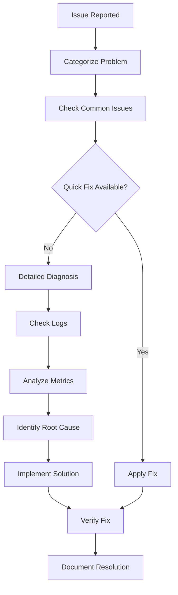

# PCPC Troubleshooting Guide

## Table of Contents

- [Overview](#overview)
- [Common Issues](#common-issues)
- [Development Environment](#development-environment)
- [Infrastructure Problems](#infrastructure-problems)
- [Application Issues](#application-issues)
- [Performance Issues](#performance-issues)
- [Security Issues](#security-issues)
- [Monitoring and Logging](#monitoring-and-logging)
- [Emergency Procedures](#emergency-procedures)

## Overview

This troubleshooting guide provides comprehensive solutions for common issues encountered in the PCPC (Pokemon Card Price Checker) project. It covers development environment problems, infrastructure issues, application bugs, performance problems, and emergency procedures.

### How to Use This Guide

1. **Identify the Problem Category**: Use the table of contents to find the relevant section
2. **Check Common Issues First**: Many problems have simple solutions in the Common Issues section
3. **Follow Diagnostic Steps**: Each section provides systematic diagnostic procedures
4. **Use Logging and Monitoring**: Leverage Application Insights and logs for detailed analysis
5. **Escalate When Needed**: Follow emergency procedures for critical issues

### Diagnostic Methodology



## Common Issues

### Quick Reference

| Issue                         | Symptoms                 | Quick Fix                            |
| ----------------------------- | ------------------------ | ------------------------------------ |
| DevContainer won't start      | Container fails to build | `docker system prune -a`             |
| Frontend build fails          | Rollup errors            | `rm -rf node_modules && npm install` |
| Backend functions not working | 500 errors               | Check `local.settings.json`          |
| API calls failing             | CORS errors              | Verify APIM CORS policy              |
| Database connection issues    | Cosmos DB errors         | Check connection string              |
| Tests failing                 | Jest/Playwright errors   | `npm run test:clean && npm test`     |

### Most Frequent Issues

#### 1. DevContainer Startup Failures

**Symptoms**:

- Container fails to start
- "Failed to connect" errors
- Long startup times (>5 minutes)

**Diagnosis**:

```bash
# Check Docker status
docker ps -a

# Check container logs
docker logs pcpc-devcontainer

# Check port conflicts
netstat -tulpn | grep -E "(3000|7071|8081|10000)"
```

**Solutions**:

```bash
# Clean Docker system
docker system prune -a

# Rebuild container
docker-compose -f .devcontainer/docker-compose.yml down
docker-compose -f .devcontainer/docker-compose.yml up --build

# Reset to ACR image
docker-compose -f .devcontainer/docker-compose.yml pull
docker-compose -f .devcontainer/docker-compose.yml up -d
```

#### 2. Package Installation Issues

**Symptoms**:

- `npm install` fails
- Dependency conflicts
- Module not found errors

**Diagnosis**:

```bash
# Check Node.js version
node --version  # Should be 22.19.0+

# Check npm version
npm --version

# Check package-lock.json
ls -la package-lock.json
```

**Solutions**:

```bash
# Clear npm cache
npm cache clean --force

# Remove node_modules and reinstall
rm -rf node_modules package-lock.json
npm install

# Use specific npm version
npm install -g npm@latest
```

#### 3. Build Process Failures

**Symptoms**:

- Frontend build fails with Rollup errors
- Backend TypeScript compilation errors
- Missing dependencies

**Diagnosis**:

```bash
# Frontend build diagnosis
cd app/frontend
npm run build 2>&1 | tee build.log

# Backend build diagnosis
cd app/backend
npm run build 2>&1 | tee build.log

# Check for missing files
find . -name "*.js" -o -name "*.ts" | head -10
```

**Solutions**:

```bash
# Frontend build fix
cd app/frontend
rm -rf node_modules public/build
npm install
npm run build

# Backend build fix
cd app/backend
rm -rf node_modules dist
npm install
npm run build

# Check TypeScript configuration
npx tsc --noEmit
```

## Development Environment

### DevContainer Issues

#### Container Build Problems

**Issue**: DevContainer fails to build or takes too long

**Symptoms**:

- Build process hangs
- "Failed to build" errors
- Timeout during container creation

**Diagnostic Steps**:

```bash
# Check Docker resources
docker system df

# Check available disk space
df -h

# Check Docker daemon status
docker version
docker info
```

**Solutions**:

1. **Clean Docker System**:

```bash
# Remove unused containers and images
docker system prune -a

# Remove unused volumes
docker volume prune

# Restart Docker Desktop
# Windows: Restart Docker Desktop application
# Linux: sudo systemctl restart docker
```

2. **Use ACR Pre-built Image**:

```bash
# Pull from Azure Container Registry
az acr login --name maberdevcontainerregistry
docker pull maberdevcontainerregistry-ccedhvhwfndwetdp.azurecr.io/pcpc-devcontainer:latest

# Update docker-compose to use ACR image
# Edit .devcontainer/docker-compose.yml
```

3. **Increase Docker Resources**:

- Docker Desktop → Settings → Resources
- Increase Memory to 8GB+
- Increase CPU to 4+ cores
- Increase Disk space to 100GB+

#### Port Conflicts

**Issue**: Ports already in use preventing service startup

**Symptoms**:

- "Port already in use" errors
- Services fail to start
- Connection refused errors

**Diagnostic Steps**:

```bash
# Check port usage
netstat -tulpn | grep -E "(3000|7071|8081|10000|10001|10002)"

# Windows specific
netstat -ano | findstr -E "(3000|7071|8081|10000)"

# Find process using port
lsof -i :3000  # Linux/Mac
netstat -ano | findstr :3000  # Windows
```

**Solutions**:

```bash
# Kill processes using ports
# Linux/Mac
sudo kill -9 $(lsof -t -i:3000)

# Windows
taskkill /PID <PID> /F

# Stop all containers and restart
docker-compose -f .devcontainer/docker-compose.yml down
docker-compose -f .devcontainer/docker-compose.yml up -d
```

#### VS Code Extension Issues

**Issue**: Extensions not loading or working incorrectly

**Symptoms**:

- IntelliSense not working
- Syntax highlighting missing
- Extension errors in output

**Diagnostic Steps**:

```bash
# Check extension status in VS Code
# View → Output → Dev Containers

# Check container extension installation
code --list-extensions --show-versions
```

**Solutions**:

```bash
# Rebuild container with extensions
# Command Palette → Dev Containers: Rebuild Container

# Reset VS Code settings
# Command Palette → Dev Containers: Rebuild Container Without Cache

# Use ACR image with pre-installed extensions
# Update .devcontainer/devcontainer.json to use ACR image
```

### Local Development Issues

#### Frontend Development Problems

**Issue**: Svelte development server issues

**Symptoms**:

- Hot reload not working
- Build errors with Rollup
- Component rendering issues

**Diagnostic Steps**:

```bash
cd app/frontend

# Check development server
npm run dev

# Check build process
npm run build

# Check component syntax
npx svelte-check
```

**Solutions**:

```bash
# Fix hot reload
# Check rollup.config.cjs livereload configuration
# Ensure port 35729 is available

# Fix build errors
rm -rf public/build
npm run build

# Fix component issues
# Check for syntax errors in .svelte files
# Verify import paths are correct
```

#### Backend Development Problems

**Issue**: Azure Functions local runtime issues

**Symptoms**:

- Functions not starting
- HTTP triggers not responding
- Timer functions not executing

**Diagnostic Steps**:

```bash
cd app/backend

# Check Functions runtime
func --version  # Should be 4.x

# Check function configuration
func init --help

# Check local settings
cat local.settings.json
```

**Solutions**:

```bash
# Fix Functions runtime
npm install -g azure-functions-core-tools@4

# Fix function configuration
# Verify host.json configuration
# Check function.json files

# Fix local settings
# Copy from .env.example
# Verify all required environment variables
```

## Infrastructure Problems

### Terraform Issues

#### State Management Problems

**Issue**: Terraform state corruption or conflicts

**Symptoms**:

- "Resource already exists" errors
- State lock conflicts
- Inconsistent state warnings

**Diagnostic Steps**:

```bash
# Check state status
terraform state list

# Check for locks
terraform force-unlock <lock-id>

# Validate state
terraform plan
```

**Solutions**:

```bash
# Import existing resources
terraform import azurerm_resource_group.main /subscriptions/sub-id/resourceGroups/rg-name

# Refresh state
terraform refresh

# Remove corrupted resources from state
terraform state rm azurerm_resource_group.main

# Restore from backup
terraform state pull > current-state.json
# Restore previous state file
```

#### Provider Version Conflicts

**Issue**: Terraform provider version incompatibilities

**Symptoms**:

- Provider initialization failures
- Version constraint errors
- Resource configuration errors

**Diagnostic Steps**:

```bash
# Check provider versions
terraform version

# Check required versions
cat versions.tf

# Check provider lock file
cat .terraform.lock.hcl
```

**Solutions**:

```bash
# Update providers
terraform init -upgrade

# Lock specific versions
terraform providers lock -platform=windows_amd64 -platform=darwin_amd64 -platform=linux_amd64

# Reset provider cache
rm -rf .terraform
terraform init
```

### Azure Resource Issues

#### Resource Creation Failures

**Issue**: Azure resources fail to create

**Symptoms**:

- Terraform apply failures
- Azure CLI errors
- Resource quota exceeded

**Diagnostic Steps**:

```bash
# Check Azure CLI authentication
az account show

# Check resource quotas
az vm list-usage --location "East US"

# Check resource group
az group show --name "pokedata-dev-rg"
```

**Solutions**:

```bash
# Fix authentication
az login --use-device-code

# Request quota increase
az support tickets create \
  --ticket-name "Quota Increase Request" \
  --issue-type "quota" \
  --severity "minimal"

# Use different region
# Update terraform.tfvars with alternative location
```

#### Network Connectivity Issues

**Issue**: Network connectivity between Azure resources

**Symptoms**:

- Function App can't connect to Cosmos DB
- API Management can't reach backend
- Storage access denied

**Diagnostic Steps**:

```bash
# Test connectivity from Function App
az functionapp log tail --name "pokedata-func-dev" --resource-group "pokedata-dev-rg"

# Check network security groups
az network nsg list --resource-group "pokedata-dev-rg"

# Check firewall rules
az cosmosdb firewall-rule list --account-name "pokedata-cosmos-dev" --resource-group "pokedata-dev-rg"
```

**Solutions**:

```bash
# Add Function App IP to Cosmos DB firewall
az cosmosdb firewall-rule create \
  --account-name "pokedata-cosmos-dev" \
  --resource-group "pokedata-dev-rg" \
  --name "function-app-access" \
  --start-ip-address "0.0.0.0" \
  --end-ip-address "255.255.255.255"

# Enable service endpoints
az network vnet subnet update \
  --resource-group "pokedata-dev-rg" \
  --vnet-name "pokedata-vnet" \
  --name "function-subnet" \
  --service-endpoints "Microsoft.AzureCosmosDB"
```

## Application Issues

### Frontend Application Problems

#### Component Rendering Issues

**Issue**: Svelte components not rendering correctly

**Symptoms**:

- Blank pages
- Component errors in console
- Styling issues

**Diagnostic Steps**:

```javascript
// Check browser console for errors
console.log("Component debug info:", {
  props: $$props,
  state: $$restProps,
});

// Check component lifecycle
import { onMount, onDestroy } from "svelte";

onMount(() => {
  console.log("Component mounted");
});

onDestroy(() => {
  console.log("Component destroyed");
});
```

**Solutions**:

```javascript
// Fix component props
// Ensure all required props are provided
export let requiredProp; // Will throw error if not provided
export let optionalProp = "default"; // Has default value

// Fix reactive statements
$: console.log("Reactive update:", { prop1, prop2 });

// Fix event handling
function handleClick(event) {
  event.preventDefault();
  // Handle click
}
```

#### API Integration Problems

**Issue**: Frontend can't communicate with backend

**Symptoms**:

- CORS errors
- 404 Not Found errors
- Authentication failures

**Diagnostic Steps**:

```javascript
// Debug API calls
async function debugApiCall(url, options = {}) {
  console.log("API Call:", { url, options });

  try {
    const response = await fetch(url, options);
    console.log("API Response:", {
      status: response.status,
      headers: Object.fromEntries(response.headers.entries()),
    });

    if (!response.ok) {
      const errorText = await response.text();
      console.error("API Error:", errorText);
    }

    return response;
  } catch (error) {
    console.error("API Call Failed:", error);
    throw error;
  }
}
```

**Solutions**:

```javascript
// Fix CORS issues
// Update APIM CORS policy
// Verify allowed origins include frontend domain

// Fix authentication
// Verify APIM subscription key
// Check API Management policies

// Fix API endpoints
// Verify backend function URLs
// Check function app deployment status
```

### Backend Application Problems

#### Azure Functions Issues

**Issue**: Functions not executing or returning errors

**Symptoms**:

- 500 Internal Server Error
- Function timeout errors
- Cold start issues

**Diagnostic Steps**:

```bash
# Check function logs
az functionapp log tail --name "pokedata-func-dev" --resource-group "pokedata-dev-rg"

# Check function status
az functionapp function show \
  --resource-group "pokedata-dev-rg" \
  --name "pokedata-func-dev" \
  --function-name "GetSetList"

# Test function locally
cd app/backend
func start --typescript
```

**Solutions**:

```typescript
// Add comprehensive error handling
export async function GetSetList(request: HttpRequest, context: InvocationContext): Promise<HttpResponseInit> {
  try {
    context.log('Function started', { requestId: context.invocationId });

    // Function logic here
    const result = await processRequest(request);

    context.log('Function completed', {
      requestId: context.invocationId,
      resultCount: result.data.length
    });

    return { status: 200, jsonBody: result };
  } catch (error) {
    context.log.error('Function failed', {
      requestId: context.invocationId,
      error: error.message,
      stack: error.stack
    });

    return {
      status: 500,
      jsonBody: {
        error: 'Internal server error',
        requestId: context.invocationId
      }
    };
  }
}

// Fix timeout issues
// Increase function timeout in host.json
{
  "version": "2.0",
  "functionTimeout": "00:05:00",
  "extensions": {
    "http": {
      "routePrefix": "api"
    }
  }
}
```

#### Database Connection Issues

**Issue**: Cosmos DB connection failures

**Symptoms**:

- Database timeout errors
- Authentication failures
- Query execution errors

**Diagnostic Steps**:

```typescript
// Test database connectivity
import { CosmosClient } from "@azure/cosmos";

async function testDatabaseConnection() {
  try {
    const client = new CosmosClient({
      endpoint: process.env.COSMOS_DB_ENDPOINT,
      key: process.env.COSMOS_DB_KEY,
    });

    const { database } = await client.databases.createIfNotExists({
      id: "PokeData",
    });

    console.log("Database connection successful");
    return true;
  } catch (error) {
    console.error("Database connection failed:", error);
    return false;
  }
}
```

**Solutions**:

```typescript
// Fix connection string
// Verify environment variables
const connectionString = process.env.COSMOS_DB_CONNECTION_STRING;
if (!connectionString) {
  throw new Error("COSMOS_DB_CONNECTION_STRING not configured");
}

// Add retry logic
async function withRetry<T>(
  operation: () => Promise<T>,
  maxRetries = 3
): Promise<T> {
  for (let i = 0; i < maxRetries; i++) {
    try {
      return await operation();
    } catch (error) {
      if (i === maxRetries - 1) throw error;
      await new Promise((resolve) =>
        setTimeout(resolve, 1000 * Math.pow(2, i))
      );
    }
  }
  throw new Error("Max retries exceeded");
}

// Optimize connection settings
const client = new CosmosClient({
  endpoint: process.env.COSMOS_DB_ENDPOINT,
  key: process.env.COSMOS_DB_KEY,
  connectionPolicy: {
    connectionMode: ConnectionMode.Gateway,
    requestTimeout: 10000,
    enableEndpointDiscovery: false,
    preferredLocations: ["East US"],
  },
});
```

## Performance Issues

### Frontend Performance Problems

#### Slow Page Load Times

**Issue**: Frontend application loads slowly

**Symptoms**:

- Long initial load times
- Slow component rendering
- Large bundle sizes

**Diagnostic Steps**:

```javascript
// Measure performance
performance.mark('app-start');
// ... app initialization
performance.mark('app-ready');
performance.measure('app-load-time', 'app-start', 'app-ready');

// Check bundle size
npm run build
ls -lh public/build/

// Analyze bundle composition
npm install -g webpack-bundle-analyzer
npx webpack-bundle-analyzer public/build/bundle.js
```

**Solutions**:

```javascript
// Implement code splitting
// Use dynamic imports for large components
const HeavyComponent = lazy(() => import("./HeavyComponent.svelte"));

// Optimize images
// Use WebP format
// Implement lazy loading
// Add responsive images

// Minimize bundle size
// Remove unused dependencies
// Use tree shaking
// Enable compression
```

#### Memory Leaks

**Issue**: Frontend application memory usage increases over time

**Symptoms**:

- Browser becomes slow
- Tab crashes
- High memory usage in DevTools

**Diagnostic Steps**:

```javascript
// Monitor memory usage
function checkMemoryUsage() {
  if (performance.memory) {
    console.log("Memory usage:", {
      used: Math.round(performance.memory.usedJSHeapSize / 1048576) + " MB",
      total: Math.round(performance.memory.totalJSHeapSize / 1048576) + " MB",
      limit: Math.round(performance.memory.jsHeapSizeLimit / 1048576) + " MB",
    });
  }
}

setInterval(checkMemoryUsage, 10000);
```

**Solutions**:

```javascript
// Fix event listener leaks
import { onDestroy } from "svelte";

let unsubscribe;

onMount(() => {
  unsubscribe = someStore.subscribe((value) => {
    // Handle value
  });
});

onDestroy(() => {
  if (unsubscribe) {
    unsubscribe();
  }
});

// Fix timer leaks
let intervalId;

onMount(() => {
  intervalId = setInterval(() => {
    // Do something
  }, 1000);
});

onDestroy(() => {
  if (intervalId) {
    clearInterval(intervalId);
  }
});
```

### Backend Performance Problems

#### Function Cold Start Issues

**Issue**: Azure Functions have long cold start times

**Symptoms**:

- First request takes >5 seconds
- Intermittent slow responses
- Timeout errors

**Diagnostic Steps**:

```bash
# Check function execution times
az monitor metrics list \
  --resource "/subscriptions/sub-id/resourceGroups/pokedata-dev-rg/providers/Microsoft.Web/sites/pokedata-func-dev" \
  --metric "FunctionExecutionUnits" \
  --interval PT1M

# Check cold start frequency
az monitor metrics list \
  --resource "/subscriptions/sub-id/resourceGroups/pokedata-dev-rg/providers/Microsoft.Web/sites/pokedata-func-dev" \
  --metric "FunctionExecutionCount" \
  --interval PT1H
```

**Solutions**:

```typescript
// Optimize function initialization
// Move expensive operations outside handler
const cosmosClient = new CosmosClient(connectionString);
const blobServiceClient = new BlobServiceClient(storageConnectionString);

export async function GetSetList(
  request: HttpRequest,
  context: InvocationContext
): Promise<HttpResponseInit> {
  // Use pre-initialized clients
  const container = cosmosClient.database("PokeData").container("sets");
  // ... function logic
}

// Use Premium plan for production
// Update terraform.tfvars:
// function_app_plan_sku = "EP1"

// Implement keep-alive
// Add timer function to keep functions warm
export async function KeepAlive(
  myTimer: Timer,
  context: InvocationContext
): Promise<void> {
  context.log("Keep-alive ping");
}
```

#### Database Query Performance

**Issue**: Cosmos DB queries are slow or expensive

**Symptoms**:

- High RU consumption
- Query timeouts
- Slow response times

**Diagnostic Steps**:

```typescript
// Enable query metrics
const querySpec = {
  query: "SELECT * FROM c WHERE c.setId = @setId",
  parameters: [{ name: "@setId", value: setId }],
};

const { resources, requestCharge } = await container.items
  .query(querySpec, { enableCrossPartitionQuery: false })
  .fetchAll();

console.log("Query RU cost:", requestCharge);
```

**Solutions**:

```typescript
// Optimize queries
// Always use partition key
const querySpec = {
  query: "SELECT * FROM c WHERE c.setId = @setId",
  parameters: [{ name: "@setId", value: setId }],
};

// Use proper indexing
// Ensure indexed properties are used in WHERE clauses

// Implement pagination
const querySpec = {
  query:
    "SELECT * FROM c WHERE c.setId = @setId ORDER BY c.name OFFSET @offset LIMIT @limit",
  parameters: [
    { name: "@setId", value: setId },
    { name: "@offset", value: page * pageSize },
    { name: "@limit", value: pageSize },
  ],
};

// Use caching
const cacheKey = `cards:${setId}:${page}`;
let result = await cache.get(cacheKey);

if (!result) {
  result = await container.items.query(querySpec).fetchAll();
  await cache.set(cacheKey, result, 3600); // 1 hour TTL
}
```

## Security Issues

### Authentication Problems

**Issue**: API authentication failures

**Symptoms**:

- 401 Unauthorized errors
- Invalid subscription key errors
- Access denied messages

**Diagnostic Steps**:

```bash
# Test API Management authentication
curl -X GET "https://pokedata-apim-dev.azure-api.net/api/sets" \
  -H "Ocp-Apim-Subscription-Key: your-key" \
  -v

# Check subscription key status
az apim subscription show \
  --resource-group "pokedata-dev-rg" \
  --service-name "pokedata-apim-dev" \
  --subscription-id "your-subscription-id"
```

**Solutions**:

```bash
# Regenerate subscription key
az apim subscription regenerate-key \
  --resource-group "pokedata-dev-rg" \
  --service-name "pokedata-apim-dev" \
  --subscription-id "your-subscription-id" \
  --key-type primary

# Update CORS policy
# Check APIM CORS policy allows frontend domain

# Verify Key Vault access
az keyvault secret show \
  --vault-name "pokedata-kv-dev" \
  --name "pokedata-api-key"
```

### SSL/TLS Issues

**Issue**: SSL certificate problems

**Symptoms**:

- SSL handshake failures
- Certificate validation errors
- HTTPS connection issues

**Diagnostic Steps**:

```bash
# Test SSL connectivity
openssl s_client -connect pokedata-cosmos-dev.documents.azure.com:443

# Check certificate validity
curl -I https://pokedata.maber.io

# Check Function App SSL
curl -I https://pokedata-func-dev.azurewebsites.net
```

**Solutions**:

```bash
# Fix Cosmos DB SSL issues
# Add to local.settings.json:
"AZURE_COSMOS_EMULATOR_IP_ADDRESS_OVERRIDE": "127.0.0.1"

# Update SSL certificates
# Azure automatically manages SSL for most services

# Fix custom domain SSL
az staticwebapp hostname set \
  --name "pokedata-dev" \
  --hostname "pokedata.maber.io"
```

## Monitoring and Logging

### Application Insights Issues

**Issue**: Missing telemetry or incorrect metrics

**Symptoms**:

- No data in Application Insights
- Incorrect performance metrics
- Missing custom events

**Diagnostic Steps**:

```bash
# Check Application Insights configuration
az monitor app-insights component show \
  --resource-group "pokedata-dev-rg" \
  --app "pokedata-insights-dev"

# Test telemetry
curl -X POST "https://dc.services.visualstudio.com/v2/track" \
  -H "Content-Type: application/json" \
  -d '{"name":"Microsoft.ApplicationInsights.Event","time":"2025-09-28T21:00:00.000Z","iKey":"your-instrumentation-key","data":{"baseType":"EventData","baseData":{"name":"TestEvent"}}}'
```

**Solutions**:

```typescript
// Fix Application Insights integration
import { ApplicationInsights } from "@azure/applicationinsights-web";

const appInsights = new ApplicationInsights({
  config: {
    instrumentationKey: process.env.APPINSIGHTS_INSTRUMENTATIONKEY,
    enableAutoRouteTracking: true,
    enableCorsCorrelation: true,
    enableRequestHeaderTracking: true,
    enableResponseHeaderTracking: true,
  },
});

appInsights.loadAppInsights();

// Add custom telemetry
appInsights.trackEvent({
  name: "CardSearch",
  properties: {
    searchTerm: searchTerm,
    resultCount: results.length,
  },
});

// Fix backend telemetry
// Ensure APPINSIGHTS_INSTRUMENTATIONKEY is set
// Verify Application Insights SDK is installed
```

### Log Analysis

#### Missing or Incomplete Logs

**Issue**: Logs are missing or don't contain enough information

**Symptoms**:

- Empty log streams
- Insufficient error details
- Missing correlation IDs

**Diagnostic Steps**:

```bash
# Check log configuration
az functionapp config appsettings list \
  --resource-group "pokedata-dev-rg" \
  --name "pokedata-func-dev"

# Check log level
grep -r "LOG_LEVEL" app/backend/

# Test logging
az functionapp log tail --name "pokedata-func-dev" --resource-group "pokedata-dev-rg"
```

**Solutions**:

```typescript
// Implement structured logging
interface LogContext {
  requestId: string;
  userId?: string;
  operation: string;
  timestamp: string;
}

function createLogger(context: InvocationContext) {
  const logContext: LogContext = {
    requestId: context.invocationId,
    operation: context.functionName,
    timestamp: new Date().toISOString(),
  };

  return {
    info: (message: string, data?: any) => {
      context.log(message, { ...logContext, ...data });
    },
    error: (message: string, error?: Error, data?: any) => {
      context.log.error(message, {
        ...logContext,
        error: error?.message,
        stack: error?.stack,
        ...data,
      });
    },
  };
}

// Use correlation IDs
const correlationId =
  request.headers.get("x-correlation-id") || crypto.randomUUID();
context.log("Request started", { correlationId });
```

## Emergency Procedures

### Critical System Failures

#### Complete System Outage

**Issue**: Entire PCPC system is unavailable

**Immediate Actions**:

1. **Assess Impact**: Determine scope of outage
2. **Check Status Page**: Update status page if available
3. **Notify Stakeholders**: Send outage notification
4. **Begin Investigation**: Start systematic diagnosis

**Investigation Steps**:

```bash
# Check all Azure services
az resource list --resource-group "pokedata-prod-rg" --query "[].{Name:name,Type:type,Status:properties.provisioningState}"

# Check Application Insights
az monitor app-insights events show \
  --resource-group "pokedata-prod-rg" \
  --app "pokedata-insights-prod" \
  --event-type "exceptions" \
  --start-time "2025-09-28T20:00:00Z"

# Check service health
curl -X GET "https://pokedata-apim-prod.azure-api.net/api/health" \
  -H "Ocp-Apim-Subscription-Key: your-key"
```

**Recovery Actions**:

```bash
# Restart Function App
az functionapp restart \
  --resource-group "pokedata-prod-rg" \
  --name "pokedata-func-prod"

# Clear API Management cache
az apim cache remove \
  --resource-group "pokedata-prod-rg" \
  --service-name "pokedata-apim-prod"

# Rollback to previous deployment
# See Rollback Procedures section
```

#### Database Corruption

**Issue**: Cosmos DB data corruption or loss

**Immediate Actions**:

1. **Stop Write Operations**: Disable functions that write to database
2. **Assess Damage**: Determine extent of corruption
3. **Initiate Recovery**: Begin point-in-time restore process

**Recovery Steps**:

```bash
# Disable write functions
az functionapp function disable \
  --resource-group "pokedata-prod-rg" \
  --name "pokedata-func-prod" \
  --function-name "RefreshData"

# Check backup availability
az cosmosdb sql database backup show \
  --resource-group "pokedata-prod-rg" \
  --account-name "pokedata-cosmos-prod" \
  --database-name "PokeData"

# Restore from backup
az cosmosdb sql database restore \
  --resource-group "pokedata-prod-rg" \
  --account-name "pokedata-cosmos-prod" \
  --database-name "PokeData" \
  --restore-timestamp "2025-09-28T19:00:00Z"
```

### Security Incidents

#### API Key Compromise

**Issue**: API keys have been compromised

**Immediate Actions**:

1. **Rotate Keys**: Immediately regenerate all compromised keys
2. **Revoke Access**: Disable compromised subscription keys
3. **Audit Access**: Review access logs for unauthorized usage
4. **Update Applications**: Deploy new keys to all environments

**Recovery Steps**:

```bash
# Rotate APIM subscription keys
az apim subscription regenerate-key \
  --resource-group "pokedata-prod-rg" \
  --service-name "pokedata-apim-prod" \
  --subscription-id "compromised-subscription-id" \
  --key-type primary

az apim subscription regenerate-key \
  --resource-group "pokedata-prod-rg" \
  --service-name "pokedata-apim-prod" \
  --subscription-id "compromised-subscription-id" \
  --key-type secondary

# Update Key Vault secrets
az keyvault secret set \
  --vault-name "pokedata-kv-prod" \
  --name "pokedata-api-key" \
  --value "new-secure-api-key"

az keyvault secret set \
  --vault-name "pokedata-kv-prod" \
  --name "pokemon-tcg-api-key" \
  --value "new-secure-tcg-key"

# Update Function App settings
az functionapp config appsettings set \
  --resource-group "pokedata-prod-rg" \
  --name "pokedata-func-prod" \
  --settings "POKEDATA_API_KEY=@Microsoft.KeyVault(SecretUri=https://pokedata-kv-prod.vault.azure.net/secrets/pokedata-api-key/)"

# Update frontend environment variables
# Deploy new build with updated subscription keys
```

#### Data Breach Response

**Issue**: Unauthorized access to sensitive data

**Immediate Actions**:

1. **Isolate Systems**: Disconnect affected resources
2. **Preserve Evidence**: Capture logs and forensic data
3. **Notify Authorities**: Follow legal and compliance requirements
4. **Begin Investigation**: Start forensic analysis

**Investigation Steps**:

```bash
# Check access logs
az monitor activity-log list \
  --resource-group "pokedata-prod-rg" \
  --start-time "2025-09-28T00:00:00Z" \
  --end-time "2025-09-28T23:59:59Z"

# Check Application Insights for suspicious activity
az monitor app-insights query \
  --resource-group "pokedata-prod-rg" \
  --app "pokedata-insights-prod" \
  --analytics-query "requests | where timestamp > ago(24h) | where resultCode >= 400"

# Check Cosmos DB access patterns
az cosmosdb sql database throughput show \
  --resource-group "pokedata-prod-rg" \
  --account-name "pokedata-cosmos-prod" \
  --name "PokeData"
```

### Performance Degradation

#### System-Wide Slowdown

**Issue**: Entire system experiencing performance degradation

**Symptoms**:

- Increased response times across all endpoints
- High resource utilization
- User complaints about slow performance

**Diagnostic Steps**:

```bash
# Check overall system metrics
az monitor metrics list \
  --resource "/subscriptions/sub-id/resourceGroups/pokedata-prod-rg/providers/Microsoft.Web/sites/pokedata-func-prod" \
  --metric "CpuPercentage,MemoryPercentage,Http5xx" \
  --interval PT5M

# Check database performance
az cosmosdb sql database throughput show \
  --resource-group "pokedata-prod-rg" \
  --account-name "pokedata-cosmos-prod" \
  --name "PokeData"

# Check API Management throttling
az apim api list \
  --resource-group "pokedata-prod-rg" \
  --service-name "pokedata-apim-prod"
```

**Solutions**:

```bash
# Scale up Function App
az functionapp plan update \
  --resource-group "pokedata-prod-rg" \
  --name "pokedata-plan-prod" \
  --sku "EP2"

# Increase Cosmos DB throughput
az cosmosdb sql database throughput update \
  --resource-group "pokedata-prod-rg" \
  --account-name "pokedata-cosmos-prod" \
  --name "PokeData" \
  --throughput 10000

# Clear caches
az apim cache remove \
  --resource-group "pokedata-prod-rg" \
  --service-name "pokedata-apim-prod"
```

### Escalation Procedures

#### When to Escalate

**Level 1 - Development Team**:

- Build failures
- Test failures
- Development environment issues
- Non-critical bugs

**Level 2 - DevOps Team**:

- Infrastructure deployment issues
- CI/CD pipeline failures
- Performance degradation
- Security vulnerabilities

**Level 3 - Management**:

- Complete system outages
- Data breaches
- Critical security incidents
- Customer-impacting issues

#### Escalation Contacts

```yaml
# Emergency contact information
contacts:
  development:
    primary: "dev-team@pcpc.dev"
    secondary: "lead-developer@pcpc.dev"

  devops:
    primary: "devops-team@pcpc.dev"
    secondary: "infrastructure-lead@pcpc.dev"

  management:
    primary: "engineering-manager@pcpc.dev"
    secondary: "cto@pcpc.dev"

  external:
    azure_support: "+1-800-MICROSOFT"
    security_team: "security@company.com"
```

#### Communication Templates

**Incident Notification Template**:

```
Subject: [INCIDENT] PCPC System Issue - [SEVERITY]

Incident Details:
- Time: [TIMESTAMP]
- Severity: [HIGH/MEDIUM/LOW]
- Impact: [DESCRIPTION]
- Affected Components: [LIST]
- Current Status: [INVESTIGATING/MITIGATING/RESOLVED]

Actions Taken:
- [ACTION 1]
- [ACTION 2]

Next Steps:
- [NEXT STEP 1]
- [NEXT STEP 2]

ETA for Resolution: [ESTIMATE]

Contact: [YOUR NAME] - [YOUR EMAIL]
```

**Resolution Notification Template**:

```
Subject: [RESOLVED] PCPC System Issue - [ORIGINAL SUBJECT]

Resolution Summary:
- Issue Duration: [START TIME] - [END TIME]
- Root Cause: [DESCRIPTION]
- Resolution: [DESCRIPTION]
- Impact: [DESCRIPTION]

Preventive Measures:
- [MEASURE 1]
- [MEASURE 2]

Post-Incident Actions:
- [ ] Update monitoring alerts
- [ ] Update documentation
- [ ] Conduct post-mortem review
- [ ] Implement preventive measures

Contact: [YOUR NAME] - [YOUR EMAIL]
```

---

## Summary

This troubleshooting guide provides comprehensive coverage of common issues and emergency procedures for the PCPC system. Key highlights include:

- **Systematic Diagnosis**: Step-by-step diagnostic procedures for all issue categories
- **Quick Reference**: Fast solutions for the most common problems
- **Emergency Procedures**: Critical incident response and recovery procedures
- **Performance Optimization**: Solutions for common performance issues
- **Security Response**: Comprehensive security incident handling
- **Escalation Procedures**: Clear escalation paths and communication templates

### Key Troubleshooting Resources

- **Application Insights**: Primary source for application telemetry and error analysis
- **Azure CLI**: Command-line tools for resource management and diagnostics
- **DevContainer Logs**: Container-specific issues and environment problems
- **Function App Logs**: Backend application issues and performance problems
- **Browser DevTools**: Frontend application debugging and performance analysis

### Best Practices for Issue Resolution

1. **Document Everything**: Keep detailed records of issues and resolutions
2. **Use Systematic Approach**: Follow diagnostic methodology consistently
3. **Leverage Monitoring**: Use Application Insights and logs for analysis
4. **Test Thoroughly**: Verify fixes in development before production
5. **Update Documentation**: Keep troubleshooting guide current with new issues
6. **Share Knowledge**: Document solutions for team learning

### Preventive Measures

- **Regular Health Checks**: Implement automated health monitoring
- **Performance Monitoring**: Set up alerts for performance degradation
- **Security Scanning**: Regular security audits and vulnerability assessments
- **Backup Validation**: Regular backup and restore testing
- **Documentation Updates**: Keep troubleshooting procedures current

For additional support, refer to the [Development Guide](./development-guide.md) for development workflows, [Deployment Guide](./deployment-guide.md) for infrastructure procedures, and [Architecture Documentation](./architecture.md) for system design details.

**Emergency Contact**: For critical issues requiring immediate attention, follow the escalation procedures outlined in this guide and contact the appropriate team based on issue severity and impact.
